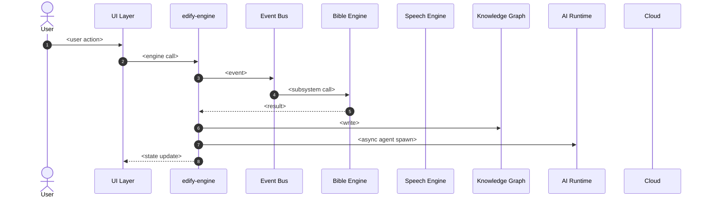

# <Flow Name>

> Pure Mermaid sequence diagram for the engine behavior of one runtime trace. No prose around the diagram — annotations live on the arrows.

## Annotations

Use arrow annotations to capture:
- Data flowing across each arrow (parameter shapes if non-obvious)
- Failure modes (return values, exception types)
- Timeout budgets for time-sensitive calls
- Whether a call is sync or async
- Whether a call is local or crosses a trust boundary

## Failure branches

If a failure branch is non-trivial, show it as an `alt` / `else` block in the diagram itself.

## References

- Capability spec: `README.md`
- Lifecycle: `lifecycle.md`
- Workflow: `workflow.md`
