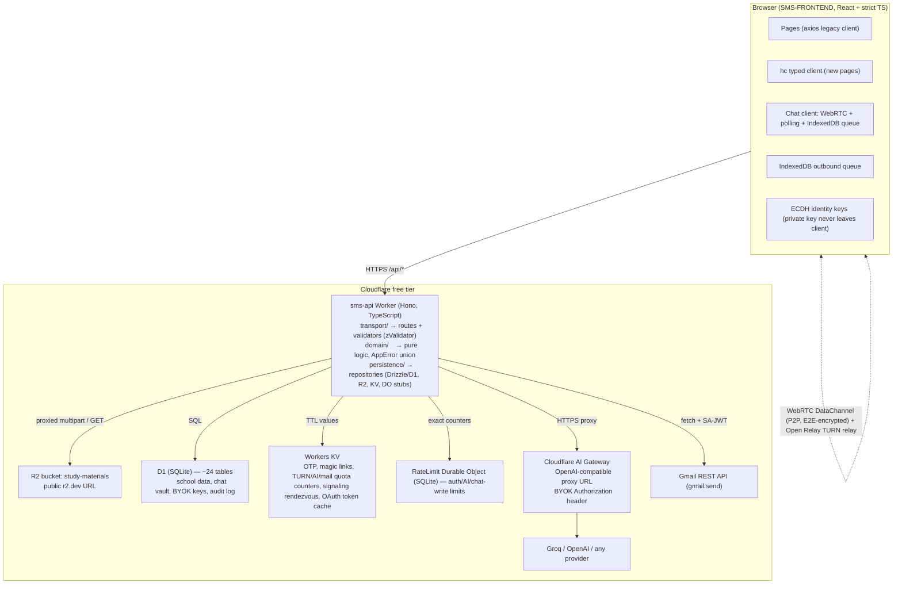

# SMS — Cloudflare Workers Migration Plan

**Project:** Bronotek School Management System (SMS)
**Source:** `SMS/SMS-BACKEND` (Node.js 18+/Express 4, CommonJS, port 5000, MongoDB/Mongoose 7, Socket.io 4, multer disk storage, Groq SDK, Nodemailer, JWT, bcryptjs, express-rate-limit) + `SMS/SMS-FRONTEND` (Vite 5, React 18, TypeScript non-strict, axios, socket.io-client)
**Target:** Hono on Cloudflare Workers (free tier), D1, R2, KV, one SQLite Durable Object, Cloudflare AI Gateway (BYOK), Gmail API via Service Account JWT (Strategy B — locked in)
**Plan author:** architecture/planning agent, per the mandate in `ENHANCED_PROMPT.md`
**Status:** FINAL — all user decisions locked (see §0.3)

---

## Table of Contents

- [0. Preliminaries](#0-preliminaries)
  - [0.1 Research Provenance](#01-research-provenance)
  - [0.2 Hard Constraints Honored](#02-hard-constraints-honored)
  - [0.3 Locked User Decisions](#03-locked-user-decisions)
  - [0.4 Deviations from Brief Recommendations (Authorized, with Justification)](#04-deviations-from-brief-recommendations-authorized-with-justification)
- [1. Executive Summary](#1-executive-summary)
  - [1.1 Type-Safety Posture](#11-type-safety-posture-how-2-is-satisfied)
- [2. Architecture Overview](#2-architecture-overview)
- [3. Compatibility Snapshot](#3-compatibility-snapshot)
  - [3.1 Response & Error Envelope Contract](#31-response--error-envelope-contract)
  - [3.2 Auth Flow](#32-auth-flow)
  - [3.3 Chat Subsystem (Primary-Source Findings)](#33-chat-subsystem-primary-source-findings)
  - [3.4 File Uploads](#34-file-uploads)
  - [3.5 AI Subsystem](#35-ai-subsystem)
  - [3.6 Email Subsystem](#36-email-subsystem)
  - [3.7 Dual Legacy/New Model Pairs](#37-dual-legacynew-model-pairs)
  - [3.8 Dead Code & Unused Dependencies](#38-dead-code--unused-dependencies)
  - [3.9 Business Rules Inventory (Non-Chat)](#39-business-rules-inventory-non-chat)
- [4. Established Patterns Survey (Reuse Before Write)](#4-established-patterns-survey-reuse-before-write)
- [5. Type System Architecture](#5-type-system-architecture)
  - [5.1 Workspace Layout](#51-workspace-layout)
  - [5.2 Compiler Configuration](#52-compiler-configuration)
  - [5.3 ESLint Rule Set (CI-Failing Floor)](#53-eslint-rule-set-ci-failing-floor)
  - [5.4 Branded Types & ID Convention](#54-branded-types--id-convention)
  - [5.5 `AppError` Discriminated Union & Hono Error Handler](#55-apperror-discriminated-union--hono-error-handler)
  - [5.6 `env.ts` — Runtime-Validated Bindings](#56-envts--runtime-validated-bindings)
  - [5.7 Type Generation Pipeline (Single Source of Truth)](#57-type-generation-pipeline-single-source-of-truth)
  - [5.8 Boundary Validation Map (§2.3 Exhaustive)](#58-boundary-validation-map-23-exhaustive)
  - [5.9 Layered Architecture Enforcement](#59-layered-architecture-enforcement)
  - [5.10 CI Type Verification](#510-ci-type-verification)
  - [5.11 Forbidden Compromises (§2.12)](#511-forbidden-compromises-212)
  - [5.12 Worked Example: Homework Entity End-to-End](#512-worked-example-homework-entity-end-to-end)
- [6. Data Architecture — Mongoose → D1](#6-data-architecture--mongoose--d1)
  - [6.1 Table Definitions](#61-table-definitions)
  - [6.2 Polymorphism → Discriminator Columns (§2.7 Rule)](#62-polymorphism--discriminator-columns-27-rule)
  - [6.3 Human-Coded IDs: Atomic Sequence Tables](#63-human-coded-ids-atomic-sequence-tables)
  - [6.4 `school` Scoping Convention](#64-school-scoping-convention)
  - [6.5 Mongo → D1 Migration Script](#65-mongo--d1-migration-script)
- [7. Subsystem Designs](#7-subsystem-designs)
  - [7.1 Auth & Middleware](#71-auth--middleware)
  - [7.2 Rate Limiting & Ephemeral State (KV + DO)](#72-rate-limiting--ephemeral-state-kv--do)
  - [7.3 AI Gateway + BYOK](#73-ai-gateway--byok)
  - [7.4 Email — Gmail API via Service Account JWT](#74-email--gmail-api-via-service-account-jwt-strategy-b)
- [8. Real-Time Chat — Hybrid P2P + D1 History Vault](#8-real-time-chat--hybrid-p2p--d1-history-vault)
  - [8.1 Topology](#81-topology)
  - [8.2 Signaling Plane (KV Rendezvous)](#82-signaling-plane-kv-rendezvous)
  - [8.3 Data Plane (WebRTC DataChannel + E2E Encryption)](#83-data-plane-webrtc-datachannel--e2e-encryption)
  - [8.4 History Vault (D1)](#84-history-vault-d1)
  - [8.5 Polling-Mode Fallback](#85-polling-mode-fallback)
  - [8.6 Presence & Typing](#86-presence--typing)
  - [8.7 Unread Counts & Mark-Read](#87-unread-counts--mark-read)
  - [8.8 Onboarding: Magic-Link Delivery for Cold-Start Recipients](#88-onboarding-magic-link-delivery-for-cold-start-recipients)
  - [8.9 Moderation](#89-moderation)
  - [8.10 TURN Quota Caps (Free-Tier Safety)](#810-turn-quota-caps-free-tier-safety)
  - [8.11 Frontend Chat Client & Migration Items](#811-frontend-chat-client--migration-items)
  - [8.12 Early-User Safety Net Mapping (Brief §4)](#812-early-user-safety-net-mapping-brief-4)
- [9. File Uploads — multer → R2](#9-file-uploads--multer--r2)
- [10. Frontend Cutover](#10-frontend-cutover)
- [11. Free-Tier Budget (Verified Numbers)](#11-free-tier-budget-verified-numbers)
- [12. Environment & Secrets Inventory](#12-environment--secrets-inventory)
  - [12.1 `wrangler.jsonc` (Full)](#121-wranglerjsonc-full)
  - [12.2 `.env` → Worker Config Mapping (Exhaustive, §3.12a)](#122-env--worker-config-mapping-exhaustive-312a)
  - [12.3 Rollout Items for Compromised Secrets](#123-rollout-items-for-compromised-secrets)
- [13. Phased Delivery Plan](#13-phased-delivery-plan)
  - [Phase 1 — Scaffolding](#phase-1--scaffolding)
  - [Phase 2 — Schema, Migrations & Type Pipeline](#phase-2--schema-migrations--type-pipeline)
  - [Phase 3 — Auth + Middleware](#phase-3--auth--middleware)
  - [Phase 4 — Route Porting](#phase-4--route-porting)
  - [Phase 5 — AI Gateway + BYOK](#phase-5--ai-gateway--byok)
  - [Phase 6 — Chat](#phase-6--chat)
  - [Phase 7 — File Uploads (R2)](#phase-7--file-uploads-r2)
  - [Phase 8 — Email (Gmail API)](#phase-8--email-gmail-api)
  - [Phase 9 — Frontend Cutover](#phase-9--frontend-cutover)
  - [Phase 10 — Verification & Rollout](#phase-10--verification--rollout)
- [14. Per-File Change Inventory](#14-per-file-change-inventory)
- [15. Verification Plan](#15-verification-plan)
- [16. Rollout Plan](#16-rollout-plan)
- [17. Open Questions](#17-open-questions)

---

# 0. Preliminaries

## 0.1 Research Provenance

Per brief §1.2, all findings below were written from primary-source reads of the two roots. The plan is reproducible from this file set:

**Backend (`SMS-BACKEND/`)** — read in full (every line of every source file):
`server.js` (90 L), `wipe-db.js` (30 L), `package.json`, `package-lock.json`+`pnpm-lock.yaml` (presence), `.env` (keys only; values treated as compromised, see §12.3), `.env.example`, `README.md` (171 L), `CHAT_API_DOCS.md` (172 L), `.gitignore`, `uploads/study-materials/` (layout).
`src/config/connectdb.js`, `src/config/cloudinary.js`; `src/middleware/auth.js`; all 26 files of `src/models/`; all 26 files of `src/routes/`; all 26 files of `src/controllers/`; `src/services/mailService.js`; `src/socket/chatSocket.js`; `src/utils/helpers.js`.

**Frontend (`SMS-FRONTEND/`)** — read: `package.json`, `vite.config.ts`, `tsconfig.json` + `tsconfig.app.json` + `tsconfig.node.json`, `tailwind.config.ts`, `src/main.tsx`, `src/App.tsx`, `src/lib/api.ts`, `src/lib/mock-data.ts`, `src/contexts/AuthContext.tsx`, `src/contexts/PermissionsContext.tsx`, `src/hooks/useChat.ts`, `src/components/DashboardLayout.tsx`, `src/components/AppSidebar.tsx`, `src/components/TopNavbar.tsx`, `src/pages/CommunicationPage.tsx` (514 L, chat UI), `src/pages/Login.tsx`, `src/pages/AiPage.tsx` (1049 L), plus structural reads of all pages/components to enumerate the ~90 REST endpoints consumed (Students, Teachers, Classes, Attendance, Fees, ParentFeesPage, Homework, Notices, Timetable, TestExamPage, StudentExamsPage, ParentResultsPage, ParentAttendancePage, Exams, Reports, ProgressPage, LibraryPage, RolesPermissions, SubjectClassAssignment, SettingsPage, dashboards).

**Documentation (fetched current, 2026)**:
- Workers pricing & limits — `developers.cloudflare.com/workers/platform/pricing/`, `.../workers/platform/limits/`
- D1 pricing — `developers.cloudflare.com/d1/platform/pricing/`
- R2 pricing — `developers.cloudflare.com/r2/pricing/`
- KV pricing — `developers.cloudflare.com/kv/platform/pricing/`
- Durable Objects pricing — `developers.cloudflare.com/durable-objects/platform/pricing/`
- AI Gateway overview — `developers.cloudflare.com/ai-gateway/` (AI Gateway is available on all plans; no per-request gateway surcharge)
- Email Service pricing & limits — `developers.cloudflare.com/email-service/platform/pricing/`, `.../platform/limits/`
- Open Relay Project (TURN) — `www.metered.ca/tools/openrelay/` (20 GB/month free TURN; static-auth endpoint `staticauth.openrelay.metered.ca`, shared secret `openrelayprojectsecret`)

## 0.2 Hard Constraints Honored

| Constraint (brief §1.4) | Status |
|---|---|
| Hono framework | Adopted throughout (§5, §13) |
| Free-tier only, no paid products in critical path | Every design choice budgeted against §11; paid options appear only as documented future options |
| AI Gateway as AI routing layer, OpenAI-compatible endpoint, BYOK provider keys, API key-management endpoints | §7.3 |
| Type safety as foundation, no improvisation | §5 (all of §2 mapped in §1.1) |

## 0.3 Locked User Decisions

| # | Decision | Choice | Consequence in this plan |
|---|---|---|---|
| D1 | Chat topology | **Hybrid P2P** (WebRTC DataChannel + D1 vault + polling fallback) per brief default | §8 |
| D2 | Password migration (bcrypt exceeds Workers Free 10 ms CPU) | **Force password reset** — no bcrypt import, no LegacyAuthDO | §7.1; rollout item §16 |
| D3 | `Student.canUseAI` gate (stored + admin UI, never enforced) | **Enforce now** | §7.3; wire-compat note in §3.5 |
| D4 | Document location | `SMS/MIGRATION_PLAN.md` | This file |
| D5 | Frontend client strategy | **Keep axios for the ~90 legacy call sites** (env-driven baseURL), typed `hc<AppType>()` client for the new AI Settings / Chat Settings pages; full-hc migration documented as a follow-up item | §10 |

## 0.4 Deviations from Brief Recommendations (Authorized, with Justification)

All of the following were authorized by brief §1.3 (verify, propose alternatives, document deviations). None touch the §1.4 hard constraints or the §2 type-safety mandate.

| # | Brief recommendation | This plan | Why (risk mitigated / budget saved) |
|---|---|---|---|
| V1 | §3.6: "KV-backed rate limiter (or DO counter if justified)" | **Hybrid limiter: in-isolate approximate limiter for global coverage + a single SQLite Durable Object counter for auth/AI/chat-write endpoints.** KV is used only for OTP/quotas/TTL-state, never for per-request limiter counters | Verified KV free tier = **1,000 writes/day** (`kv/platform/pricing`). A KV limiter would cap the whole API at ~1,000 authenticated requests/day — unusable. DO free tier = 100,000 req/day, 13,000 GB-s/day, and its per-key counter storage is SQLite (billed like D1), so a single `RateLimitDO` gives exact per-IP+route counting at zero marginal cost. The in-isolate map handles the global 200/15 min legacy envelope for free |
| V2 | §3.5: "short-lived access + refresh if justified; or document why single-token design retained" | **Retain the current single-token design (7-day JWT)**, but wire `JWT_EXPIRES_IN` as an env-validated duration (fixing the dead var) and add KV-based optional revocation later | Frontend stores token in localStorage and has zero refresh logic (401 → hard redirect to `/login`, `api.ts:11-25`). Adding refresh tokens would be a frontend-breaking change with no free-tier benefit; the brief allows retention with documentation. `JWT_EXPIRES_IN` becomes a real validated var with default `"7d"` |
| V3 | §3.3 recommended starting point: Yjs for larger rooms | **No Yjs/CRDT in phase 1 of the chat build.** Chat is strictly 1:1 (verified — every code path assumes exactly two participants), so a full mesh of 2 = 1 DataChannel; CRDT machinery is unnecessary complexity | Scope reduction faithful to the Compatibility Snapshot (§3.3). If group chat is ever added, Yjs is the documented extension path (§17) |
| V4 | §3.4: "decide presigned vs proxied" | **Proxied multipart uploads through the Worker** (no presign) | Presigning requires S3 API credentials + SigV4 signing in the Worker and a signed-URL helper on read; for one upload route with ≤20 MB files and modest volume (single existing endpoint), the proxied path is simpler, one code path, and comfortably inside free budgets (§11). R2 subrequests don't count toward the 100k/day Worker request limit |
| V5 | Legacy models "must both continue to work" (§3.9, dual Attendance/Timetable pairs) | **Attendance: both tables exist and both route groups work, exactly as today (writes to the legacy path stay visible only to legacy readers — the existing behavior, preserved).** Timetable: legacy model/table is imported **data-only**; the dead legacy controller is not ported (it is unreachable today) | Faithful parity without inventing synchronization the current system does not have. Consolidation is a documented post-cutover item (§17) |
| V6 | §3.7 drop `groq-sdk` → "plain fetch" | Confirmed — dropped. **Plus**: all 11 legacy `/api/ai/*` endpoints are preserved (wire-compatible) but internally rewritten to call the AI Gateway via a shared typed client, so the platform-default fallback and BYOK apply uniformly | Prevents two AI code paths; the 4 frontend-consumed shapes (§3.5) are the compatibility contract |
| V7 | (Brief silent) `changePassword` endpoint | **Fixed during port** (currently broken — see §3.2) with an explicit wire note | It cannot get more broken; the fix is a controller-level re-fetch of the password hash. Listed as behavior-preserving-or-better |
| V8 | §3.6 ephemeral state "all in KV" | Presence/typing/polling cursors are **not** KV writes on the hot path: presence is a DO counter heartbeat (amortized), typing stays P2P-end-to-end, polling cursors are D1-derived (no counter writes) | KV write budget is 1,000/day — reserved for OTPs, magic links, TURN quota counters, AI token caps, mail quota (all low-frequency). See §8.6/§8.10 |

---

# 1. Executive Summary

## What is being migrated

The entire SMS-BACKEND — 25 route groups, 26 controllers (~4,800 lines), 26 Mongoose models (30 models total), a Socket.io chat subsystem, one file-upload route, a Nodemailer email service with 4 templates, and 11 Groq-powered AI endpoints — is re-platformed onto **one Cloudflare Worker** written in TypeScript with **Hono**. The React frontend is cut over with minimal disruption: an env-driven API base URL, a chat client swap (socket.io-client → typed WebRTC/polling client), and two new admin pages (AI Settings, Chat Settings).

## What changes

- **Runtime**: Express/Node → Hono on Workers (ESM, `wrangler dev`/`deploy`). All 26 route groups port with **route-for-route parity** (§3.9 inventory is the acceptance checklist).
- **Database**: MongoDB/Mongoose → **D1 (SQLite) via Drizzle ORM**, ~24 tables, generated migrations, typed row→Zod pipeline (§5.7). Mongoose pre-save hooks (school-code/student-id/receipt/grade computation) become Drizzle transactions, sequence tables, and pure domain functions.
- **Auth**: identical JWT claims (`{ id, role, schoolId }`, 7-day expiry) minted/verified with `jose`. The `"SECRET_KEY"` fallback is removed at all three sites and replaced with a boot-time Zod validation that fails closed. **Passwords are not migrated** (bcrypt does not fit in 10 ms CPU): users are force-reset via the existing OTP flow / re-issued temp passwords (D2).
- **Real-time chat**: Socket.io → **hybrid P2P**: WebRTC DataChannel with application-layer E2E encryption, KV-rendezvous signaling, D1 history vault, and a polling fallback whose response shape matches the realtime event shape. All current socket events and REST envelopes are preserved or explicitly mapped (§8.11).
- **Files**: multer disk storage → **R2** via proxied multipart upload; `fileUrl` becomes an absolute R2 URL (the frontend uses stored URLs verbatim — verified), fixing today's host-dependent URL bug.
- **AI**: Groq SDK (single tenant-wide key) → **Cloudflare AI Gateway** OpenAI-compatible proxy with **BYOK per-school keys** encrypted at rest in D1, full key-management endpoints, plus a platform-default Groq key as cutover fallback with per-school daily token caps. `canUseAI` is enforced (D3).
- **Email**: Nodemailer SMTP → **Gmail REST API via Service Account JWT (RS256 via Web Crypto)**, preserving the existing Gmail sender identity, with per-school daily send-quota guards in KV. All 8 call sites port 1:1 to the 4 typed templates (§3.6).
- **Rate limiting**: express-rate-limit global 200/15 min → hybrid in-isolate + Durable Object limiter (V1), now returning the JSON error envelope (today's 429 is HTML text — a quiet improvement, listed as compatible-or-better).

## What is kept (carried forward verbatim per §3.15)

Response envelopes `{ success, message?, ... }`; error envelope `{ success: false, message }` with `statusCode` mapping; all route paths; the role system (`schooladmin|teacher|student|parent`) and the 18-key teacher permission matrix; the contact graph and every chat business rule (who may chat with whom, unread logic, mark-read, 2000-char cap, 1:1-only); gamification point rules (attendance +2, homework +3/+1, fee-paid +5, results +20/+10, challenge +N, badge awards); the 33% pass rule and grade bands; fee virtual-structure merging; library fine ₹2/day; the AI prompt semantics and response keys; email template content.

## What is fixed, not ported (defects — each is a rollout/verification item)

1. `JWT_SECRET || "SECRET_KEY"` fallback (3 sites) — removed, fail-closed.
2. Compromised secrets in source-controlled `.env` (`GROQ_API_KEY`, `EMAIL_PASS` app password) — rotated/revoked before ship (§12.3).
3. `changePassword` broken (password excluded by `protect`'s `.select("-password")`) — fixed.
4. `canUseAI` never enforced — now enforced (D3).
5. Race-prone `countDocuments` ID generators → atomic sequence tables (§6.3).
6. Host-dependent `fileUrl` → storage-bound R2 URL.
7. Non-JSON 429 responses → typed JSON envelope.
8. Dual unsynchronized attendance models — behavior preserved (V5), consolidation documented as future work.

## 1.1 Type-Safety Posture (How §2 Is Satisfied)

| Brief § | Requirement | Where satisfied |
|---|---|---|
| 2.1 | Strict tsconfig set | §5.2 — full config shown; every flag from the brief plus `verbatimModuleSyntax` |
| 2.2 | ESLint fails CI on forbidden patterns | §5.3 — `@typescript-eslint` strict-type-checked + `no-floating-promises` + ban rules; exact config |
| 2.3 | Runtime validation at every boundary | §5.8 — exhaustive boundary map (HTTP, env, D1 rows, KV, R2, JWT, WebRTC DataChannel, polling, IndexedDB, magic links, Gmail responses, AI Gateway responses) |
| 2.4 | Schema → types → validators, no duplicates | §5.7 — Drizzle schema → `InferSelectModel` → drizzle-zod → Hono `zValidator` → `hc<AppType>`; CI staleness check |
| 2.5 | Domain layer, no I/O imports | §5.9 — `src/domain/` pure; enforced by ESLint `no-restricted-imports` |
| 2.6 | Errors as typed values | §5.5 — `AppErrorKind` discriminated union + `onError` pattern match; HTTP mapping preserved |
| 2.7 | Typed polymorphism | §6.2 — every Mongoose `refPath` case mapped to discriminator column + typed union |
| 2.8 | Typed WS/DataChannel/polling envelopes | §8.2–§8.5 — shared package `packages/shared/src/chat.ts` Zod schemas consumed by both sides |
| 2.9 | AI Gateway typed contract + branded key types | §7.3 — OpenAI SDK types as wire contract; `ProviderKeyPlaintext` vs `ProviderKeyCiphertext` branded distinct |
| 2.10 | Frontend strict TS, generated API types | §10 — `tsconfig.app.json` strict; `hc<AppType>` for new pages; Zod forms |
| 2.11 | CI type verification | §5.10 — workflow file; `tsc --noEmit` × 3 projects, ESLint, staleness, vitest |
| 2.12 | Forbidden compromises enumerated | §5.11 |
| 2.13 | Concrete deliverables | §5.2 (tsconfigs), §5.3 (ESLint), §13 Phase 1 (package.json scripts), §5.6 (env.ts), §5.4 (branded IDs), §5.5 (AppError + handler), §5.12 (Homework worked example), §5.10 (CI) |

---

# 2. Architecture Overview



**Type boundaries (validation at every edge, §2.3):**

1. Browser → Worker HTTP: Hono `zValidator` on body/query/path/headers of every route.
2. Worker `env`: `env.ts` Zod parse at boot (bindings, vars, secrets).
3. Worker ↔ D1: Drizzle inferred row types + per-table Zod schemas on read at trust boundaries (raw SQL only in repositories).
4. Worker ↔ KV: every value Zod-parsed on read (`kv.read(schema, key)` helper — §7.2).
5. Worker ↔ R2: branded object keys; metadata Zod-parsed.
6. JWT: `jose` verify + Zod parse of claims before use (both REST and signaling).
7. Worker ↔ AI Gateway: response parsed with OpenAI SDK types (`ChatCompletion` Zod mirror); streaming bodies piped untouched (byte-transparent, no re-validation of chunks by design — documented in §7.3).
8. Worker ↔ Gmail: Zod-parsed response envelope (§7.4).
9. WebRTC DataChannel ↔ frontend: shared envelope schemas in `packages/shared`, validated on both ends (§8.3).
10. Polling endpoint ↔ frontend: same envelope schemas as realtime (§8.5).
11. IndexedDB ↔ frontend: generic `ZodSchema`-typed queue wrapper (§8.11).
12. Magic-link tokens: branded `MagicLinkToken` + Zod parse of the KV payload (§8.8).
13. Mongo→D1 migration script: every row Zod-validated before insert (§6.5).

---

# 3. Compatibility Snapshot

Written entirely from the agent's own primary-source reads (§0.1). File:line references point at the **current** codebase.

## 3.1 Response & Error Envelope Contract

- **Success**: `{ success: true, message?, data?, count?, ...topLevelExtras }`. Observed extras: `token`+`user` (auth), `tempPassword` (teacher/student/parent creation), `rank`/`points`/`streakDays` (`/api/gamification/my-rank`), `isCorrect`/`pointsEarned` (challenge answer), `fine`+`overdueCount` (library), `totalMarks`/`sourceTitle` (`/api/exams/class/:classId/entry-data`), AI keys (`answer`, `questions`, `summary`, `tips`, `comment`, `lessonPlan`, `notice`, `prediction`, `atRiskCount`, `atRisk`, `insights`, `healthScore`, `assessment`), `permissions` (`/api/teachers/permissions`).
- **Chat endpoints use top-level keys, not `data`**: `contacts`, `conversations`, `messages`, `unread` (array!), `conversationId`, `conversation`. **Preserved verbatim.**
- **Error**: always `{ success: false, message }`. Global handler `server.js:80-83`: `res.status(err.statusCode || 500).json({ success: false, message: err.message || "Internal server error" })`. The only `err.statusCode` reader. 404 handler: `{ success: false, message: "Route not found" }` (`server.js:79`).
- `AppError` class exists (`src/utils/helpers.js:11-16`, `class AppError extends Error { constructor(message, statusCode) }`) but is **never thrown** — controllers catch locally and respond directly. The new backend makes it the typed union (§5.5) while preserving the same HTTP statuses and message strings.
- Health root: `GET /` → `{ success: true, message: "School Management API Running" }` — preserved.
- Rate limiter 429: express-rate-limit default **text/HTML** — replaced by typed JSON envelope (compatible-or-better, no consumer reads it today).

## 3.2 Auth Flow

- **JWT payload**: `{ id, role, schoolId }`; signed `jwt.sign(..., JWT_SECRET || "SECRET_KEY", { expiresIn: "7d" })` (`helpers.js:4-5` — `"7d"` hardcoded; `JWT_EXPIRES_IN` never read).
- **`schoolId` semantics** (critical): Admin → `admin._id` (the school identity *is* the Admin row); Teacher/Student → their `school` ref; Parent → `parent.school` (nullable — parents may have `school: undefined`, in which case `protect` falls back to `user._id`, a latent bug preserved-and-documented; parents created via `admin.controller.createStudent` always get `school` set).
- **`protect` middleware** (`src/middleware/auth.js:9-28`): Bearer token → `jwt.verify` (same fallback secret, line 15) → role→model map `{ schooladmin: Admin, teacher: Teacher, student: Student, parent: Parent }` → `Model.findById(decoded.id).select("-password")` → 401 "User not found." / 403 "Account deactivated." when `!user.isActive` → sets `req.user`, `req.userRole`, `req.schoolId = decoded.schoolId || user.school || user._id`. Any failure → 401 "Invalid token."
- **`restrictTo(...roles)`** (`auth.js:30-34`): 403 `"Access denied. Required: " + roles.join(", ")`.
- **`checkPermission(key)`** (`auth.js:36-41`): schooladmin always passes; else `req.user.permissions[key]`; 403 `"Permission denied: " + key`.
- **Logins** (`auth.controller.js`): 4 role endpoints; admin checks `isVerified` + `isActive`; student logs in **by `studentId` code** (not email) and may have no password set ("Password not set. Contact admin."); parent needs no verification. Token + `user` payload (role-specific extras: teacher `permissions`; student `points/streakDays/badges/canUseAI`; parent populated `students`).
- **OTP flows**: signup OTP (5-min expiry), resend, forgot-password (role-branching across 4 models), reset (bcrypt 12-round hash), change-password (**currently broken** — `user.password` is undefined after `.select("-password")`, so `bcrypt.compare(old, "")` always fails; fixed in port, V7).
- **Frontend auth**: token in `localStorage.eduflow_token`, user blob in `eduflow_user`; axios interceptor 401 → clear + redirect `/login` (exempting `/auth/` URLs); role guessing tries all 4 endpoints in order if role tab mismatch (`AuthContext.tsx:91-103`); `schooladmin` → `school_admin` normalization.

## 3.3 Chat Subsystem (Primary-Source Findings)

Read in full: `src/socket/chatSocket.js` (218 L), `src/controllers/chat.controller.js` (451 L), `src/routes/chat.routes.js` (38 L), `src/models/Message.js` (17 L), `src/models/Conversation.js` (23 L), `CHAT_API_DOCS.md`, frontend `src/hooks/useChat.ts` (87 L), `src/pages/CommunicationPage.tsx` (514 L).

### 3.3.1 Persistence layer

- **`Conversation`** (`Conversation.js:11-17`, timestamps): `school` (Admin ref, required), `participants[]` embedded (`_id: false`): `{ userId: ObjectId (no ref), role: enum 4, name: String, unread: Number default 0 }` — **strictly 2 participants in practice** (all logic finds "the other participant" singular); `lastMessage: ""`, `lastMessageAt: Date.now`, `lastSenderId: ObjectId|null`. Indexes `{school, "participants.userId"}` and `{school, lastMessageAt:-1}`. **No unique pair constraint** — get-or-create is a racy `findOne`+`create`.
- **`Message`** (`Message.js:3-12`, timestamps): `conversation` (ref, required), `sender` (ObjectId, no ref), `senderRole` (enum 4), `senderName`, `text` (**required, trim, maxlength 2000**), `read` (bool, default false), `readAt` (Date|null), `school` (required). Indexes `{conversation, createdAt}` and `{school}`. Read status is a per-message boolean (single-reader semantics — valid because conversations are 1:1).
- No hooks, no virtuals, no media fields (text only).

### 3.3.2 Socket layer (`chatSocket.js`)

- **Attach**: `new Server(httpServer, { cors: { origin: CLIENT_URL || "*", credentials: true }, pingTimeout: 60000, pingInterval: 25000 })` (`server.js:15-23`); `chatSocket(io)` (`server.js:24`). Default namespace only.
- **Auth middleware** (`:17-36`): token from `handshake.auth.token || handshake.query.token`; `jwt.verify` with the same `"SECRET_KEY"` fallback; same role→model map; `Model.findById(...).select("-password")`; rejects `!user || !user.isActive` with "User not found or inactive"; sets `socket.user/userRole/schoolId` (`decoded.schoolId || user.school || user._id`, stringified).
- **Presence**: module-level `onlineUsers: Map<userId, Set<socketId>>` (`:12`); join `school:${schoolId}` + `user:${userId}` rooms on connect; broadcast `user:online {userId}` to the school room; on last-socket disconnect, `user:offline {userId}` to the school room.
- **Events handled**:
  - `chat:join {conversationId}` (`:58-71`): membership check only (no school scoping) → `socket.join("conv:"+id)` → `chat:joined {conversationId}` to self. Error: `error {message: "Conversation not found"}`.
  - `chat:leave {conversationId}` (`:74-76`): no validation, no ack.
  - `chat:send {conversationId, text}` + ack (`:79-166`): empty-text ack `{success:false, error:"Empty message"}`; school-scoped participant check; `Message.create`; conversation `$set lastMessage/lastMessageAt/lastSenderId`; **unread increment only if the other participant has zero live sockets anywhere** (`:124-129`); emits `chat:message` to `conv:` room and **`chat:notification` to the other user's `user:` room unconditionally**; ack `{success:true, message:<chat:message payload>}` or `{success:false, error}`.
  - `chat:typing` / `chat:stopTyping {conversationId}` (`:169-182`): no validation; `socket.to(conv:)` emits `chat:typing {conversationId, userId, name}` / `chat:stopTyping {conversationId, userId}`.
  - `chat:markRead {conversationId}` (`:185-200`): **no membership/school validation** (security gap — not preserved; see §8.7); bulk `Message.updateMany(read:true, readAt)` for others' unread messages; conversation unread reset; emits `chat:read {conversationId, readBy}` to conv room; errors swallowed.
- **Exact server→client payloads** (wire contract):

| Event | Payload | Target |
|---|---|---|
| `user:online` | `{ userId }` | `school:{schoolId}` |
| `user:offline` | `{ userId }` | `school:{schoolId}` |
| `chat:joined` | `{ conversationId }` | joining socket |
| `error` | `{ message }` | offending socket |
| `chat:message` | `{ id, conversationId, sender, senderRole, senderName, text, read:false, createdAt }` | `conv:{id}` (includes sender) |
| `chat:notification` | `{ conversationId, fromUserId, from, fromRole, text, time }` | `user:{otherId}` — **always** |
| `chat:typing` | `{ conversationId, userId, name }` | others in `conv:` |
| `chat:stopTyping` | `{ conversationId, userId }` | others in `conv:` |
| `chat:read` | `{ conversationId, readBy }` | `conv:{id}` |

- Dead code: `io.getOnlineUsers` (`:217`) never called; `req.io` injection (`server.js:25`) never used by controllers.

### 3.3.3 REST endpoints (all `protect`, no `restrictTo`)

1. `GET /api/chat/contacts` (`chat.controller.js:40-217`) — role-graphed contact list: student → admin + own-class teachers (+ direct classTeacher); teacher → admin + own students; schooladmin → all active teachers + all students; parent → admin + children's classTeachers. Each contact enriched with `conversationId/lastMessage/time/unread`. Response `{ success, contacts: [{id,name,role,subtitle,avatar,conversationId|null,lastMessage,time|null,unread}] }`. **No pagination.**
2. `GET /api/chat/conversations` (`:295-324`) — list `{id, conversationId, name, role, lastMessage, time, unread, targetUserId, targetRole}`. **Never called by the frontend** (functional dead code; preserved anyway).
3. `POST /api/chat/conversations` `{targetUserId, targetRole}` (`:220-292`) — the **only server-side pairing rule**: a student may only open a conversation with a teacher assigned to their class or their direct classTeacher, else 403 `"You can only chat with teachers assigned to your class."`. Get-or-create; response `{ success, conversationId, conversation }`.
4. `GET /api/chat/conversations/:conversationId/messages?page=1&limit=50` (`:327-361`) — participant check (no school scoping); newest-window pagination then reversed (page 1 = 50 newest, oldest-first order); **auto-mark-read side effect** (messages + conversation unread reset, **no socket broadcast**); response `{ success, messages: [raw docs with _id] }`.
5. `POST /api/chat/conversations/:conversationId/messages` `{text}` (`:364-411`) — REST fallback; unconditional unread increment; **no socket emit**. **Never called by the frontend.**
6. `GET /api/chat/unread` (`:414-435`) — response `{ success, unread: [{conversationId, count}] }` (only >0 entries). **Note: `CHAT_API_DOCS.md:97` wrongly documents a scalar — the array form is the real contract.**
7. `DELETE /api/chat/messages/:messageId` (`:438-451`) — own-messages-only hard delete; no broadcast; no tombstone. **No frontend UI calls it.**

### 3.3.4 Frontend chat consumers

- `useChat.ts`: `io("http://localhost:5000", { auth: { token }, transports: ["websocket"] })` — **hardcoded URL**; listens to `chat:message` (expects `id`, not `_id`), `chat:typing`, `chat:stopTyping`, `chat:read`, `user:online`, `user:offline`, `chat:notification`; emits `chat:join`, `chat:send` (with ack callback), `chat:typing`, `chat:stopTyping`, `chat:markRead`; **never** `chat:leave`; **never re-joins `conv:` rooms after reconnect**; no listeners for `connect`/`disconnect`/`connect_error`/`error`/`chat:joined`.
- `CommunicationPage.tsx`: local state only (no store); conversations list keyed by contact userId until first open creates the conversation (temp-id heuristic `id !== targetUserId`); optimistic bubble `"opt-" + Date.now()` replaced on ack (orphaned silently on failure — no REST fallback); typing debounce 1000 ms; unread from 3 sources reconciled; dedupe by message id; notification ignored for active conversation; auto-scroll; first 50 messages only (no pagination UI); no media sending (paperclip button is decorative — no onClick); no message deletion UI; no presence UI (online/offline events are no-ops in the page).

### 3.3.5 Chat business rules (encoded)

1. Pairing rule: the student→teacher class restriction above; all other contact-graph pairings allowed; parents never appear as targets.
2. 1:1 conversations only (two participants).
3. Unread: per-participant counter on Conversation; socket path increments only if recipient has no live socket; REST path always increments; reset on markRead socket event or REST messages fetch.
4. Mark-read: socket (broadcasts `chat:read`) and implicit-on-fetch (no broadcast).
5. Persistence: Message create then Conversation update — no transaction.
6. Ordering: `createdAt` asc; page 1 = newest 50.
7. Text only, ≤2000 chars.
8. Deletion: own hard delete via REST, no broadcast.
9. Moderation: none.
10. Presence: in-memory, lost on restart.
11. Typing: fire-and-forget; client sends stop after 1 s idle.

**Quirks the replacement must decide (replicate vs fix) — decisions in §8:** unconditional `chat:notification` (replicated — polling/history covers it); missing school scoping on join/markRead/typing (**fixed** — participant+school checks everywhere); unread increment by global presence (replicated semantics via vault read state); REST mark-read without broadcast (replicated in polling mode); frontend never re-joins rooms (moot in new client); orphaned optimistic bubbles (fixed via IndexedDB queue, §8.11).

## 3.4 File Uploads

- **Exactly one upload endpoint**: `POST /api/study-materials`, field **`file`**, `upload.single("file")` (`studymaterial.routes.js:11`).
- **Storage**: multer disk → `uploads/study-materials/`, filename `${Date.now()}-${random1e6}${ext}` (`config/cloudinary.js:13-16`); **20 MB limit** (`:21`); **extension whitelist** `.pdf .doc .docx .ppt .pptx .xls .xlsx .txt` — **no MIME check** (`:9,22-26`). The `cloudinary` import is a no-op stub kept so the controller import doesn't break.
- **URL shape**: `fileUrl = ${req.protocol}://${req.get("host")}/uploads/study-materials/${filename}` (`studymaterial.controller.js:70-71`) — **absolute and request-host-dependent** (broken behind proxies); `filePublicId` stores the local filename (misnomer), used by `fs.unlinkSync` on delete (`:120-125`).
- **Serving**: `app.use("/uploads", express.static(...))` (`server.js:33`).
- **Frontend**: uses `mat.fileUrl` **verbatim** (`LibraryPage.tsx:154,302` — `window.open(fileUrl)`); no URL concatenation anywhere. → R2 absolute URLs are a drop-in (§9).
- `Homework.attachments` array exists in the model but **no route ever populates it** — not ported as an upload path.
- Photo/logo fields are plain strings set via JSON body (no avatar upload endpoints).

## 3.5 AI Subsystem

- **Client**: lazy `new Groq({ apiKey: process.env.GROQ_API_KEY })` (`ai.controller.js:9-22`); model hardcoded `llama-3.3-70b-versatile`; non-streaming `chat(messages, maxTokens)` helper; throws "GROQ_API_KEY not set in .env".
- **11 endpoints** (roles: `POST /api/ai/study-assistant|generate-quiz|summarize|study-tips|lesson-plan|report-card-comment|generate-notice`, `GET /api/ai/class-health|risk-analysis|fee-prediction|school-context|parent-summary/:studentId`):
  - `studyAssistant` `{question, subject, conversationHistory?, schoolContext?}` → `{success, answer, subject}` — special-cases `subject === "school management"` (admin prompt, 2000 tokens).
  - `generateQuiz` `{subject, topic, class, count}` → `{success, questions}` — raw-JSON MCQ prompt, strips ```json fences, JSON.parse fallback to raw string.
  - `generateSummary` `{text (sliced 3000), subject}` → `{success, summary}`.
  - `getStudyTips` `{subject, examDate, studentClass}` → `{success, tips}` (student-only).
  - `generateLessonPlan` `{subject, topic, class, duration, objectives}` → `{success, lessonPlan}`.
  - `generateReportCardComment` `{studentName, class, avgPercentage, attendance, subjects, behaviour}` → `{success, comment}`.
  - `getClassHealthScore` `?class=` → `{success, class, healthScore, avgMarks, attendancePct, assessment}` — health = `round(avgMarks*0.6 + attendancePct*0.4)`.
  - `generateNotice` `{topic, category, schoolName, details}` → `{success, notice}`.
  - `getStudentRiskAnalysis` (DB: Student+Result+Attendance legacy; at-risk = avgMarks<40 or attendance<75) → `{success, atRiskCount, atRisk, insights}`.
  - `predictFeeDefaults` (DB: FeePayment pending/overdue) → `{success, pendingCount, prediction}`.
  - `generateParentSummary` `:studentId` (Hindi-English mix prompt) → `{success, summary, student:{name,class}}`.
  - `getSchoolContext` — **no AI call**; big aggregation (Student, Teacher, AttendanceRecord month, FeePayment, published Result) → `{success, data:{...}}` (frontend serializes it into prompts client-side, `AiPage.tsx:131-200`).
- **`canUseAI`**: stored on Student (default true), toggled by `PATCH /api/admin/students/:id/ai-permission` (`admin.controller.js:316-326`), returned at student login — **never enforced by any AI endpoint**. Decision D3: the new backend enforces it on student-role AI routes with a typed 403 (wire-compatible-or-better; flagged as a behavior note).
- **Frontend consumption**: 4 endpoints only (`school-context`, `study-assistant`, `generate-quiz`, `generate-notice`); no streaming anywhere; no SDK; no admin settings page exists.

## 3.6 Email Subsystem

- **Transport** (`mailService.js:3-12`): Nodemailer SMTP, `host: EMAIL_HOST || "smtp.gmail.com"`, **port 587 hardcoded** (`EMAIL_PORT` never read), auth `EMAIL_USER`/`EMAIL_PASS`; `from: '"School SMS" <EMAIL_USER>'`; **silent no-op when EMAIL_USER unset** ("[Mail skipped]").
- **4 templates** (all inline HTML, `to, subject, html` via `sendMail`):
  1. `sendOTPMail(to, otp)` — "OTP Verification", letter-spaced `<h1>`, "Valid 5 minutes."
  2. `sendCredentialsMail(to, {name, userId, email, password})` — "Your Account Credentials", **plaintext password**, "Change password after login."
  3. `sendPasswordResetMail(to, otp)` — "Password Reset OTP" (same OTP layout).
  4. `sendAbsentAlertMail(to, name, date)` — `"Absence Alert - " + name`, "Your child **{name}** was absent on **{date}**."
- **All 8 call sites** (grep-verified):

| Caller | Template | Inputs |
|---|---|---|
| `auth.controller.js:28` (schoolSignup) | OTP | (email, otp) |
| `auth.controller.js:213` (resendOTP) | OTP | (email, otp) |
| `auth.controller.js:154` (forgotPassword) | Reset | (email, otp) |
| `attendance.controller.js:60` (markAttendance) | AbsentAlert | (parent.email, student.name, date.toLocaleDateString()) |
| `attendance.controller.js:245` (bulkAttendance) | AbsentAlert | (parent.email, student.name, date.toLocaleDateString()) |
| `admin.controller.js:56` (createTeacher) | Credentials | {name, userId: teacherId, email, password: raw} |
| `admin.controller.js:196` (createStudent → new parent) | Credentials | {name, userId: "PARENT", email, password} |
| `admin.controller.js:208` (createStudent → student w/ email) | Credentials | {name, userId: studentId, email, password} |

  All calls individually try/caught — **mail failure is non-fatal** (preserved). `teacher.controller createStudentByTeacher` does not email (preserved).

## 3.7 Dual Legacy/New Model Pairs

- **Attendance**: `Attendance` (one doc per school+class+date, embedded `records[]`, statuses include holiday/leave, keyed by class **name strings**) vs `AttendanceRecord` (one per student+day, keyed by classId+studentId, statuses present/absent/late, markedBy admin|teacher subdoc). **Writers of legacy**: `POST /mark`, `GET /` (by-date), `GET /student/me` + `/student/:id`, `/today-absentees`, plus `studentDashboard`, `ai.controller` risk/health. **Writers of new**: `/bulk`, `/single`, `/history/:id`, `/class/:id`, `/monthly`, plus admin/teacher/parent dashboards, `getSchoolContext`, progress. **The two stores are NOT synchronized** — data written via `/mark` is invisible to `/history` and vice versa. **Frontend uses only the new paths** (bulk/class/history/monthly) + legacy `/mark` is NOT called by the FE; student dashboard reads legacy month stats. → Port both tables and both behaviors (V5); no invented synchronization.
- **Timetable**: `Timetable` (per class+section+day with `periods[]`) vs `TimetableEntry` (per class+day+period cell). **All `/api/timetable` routes use the Entry controller** (`timetable.routes.js:3`); the legacy `timetable.controller.js` (42 L) is **unreachable dead code**. → Table imported data-only; legacy controller not ported (V5).

## 3.8 Dead Code & Unused Dependencies

Removed in migration (with line evidence): `timetable.controller.js` (dead), `Timetable` model routes (dead — table still imported), `req.io` injection (`server.js:25`, unused), `io.getOnlineUsers` (`chatSocket.js:217`, unused), `express-validator` (declared, zero imports), `cloudinary` + `multer-storage-cloudinary` (declared; `cloudinary.js` is a multer stub), `CLOUDINARY_*` env keys (never read), `JWT_EXPIRES_IN` + `EMAIL_PORT` env keys (never read — the former becomes live per V2, the latter removed). `wipe-db.js` replaced by a typed D1 reset script. Mongoose pre-save hooks replaced per §6.

## 3.9 Business Rules Inventory (Non-Chat)

- **ID generation**: `schoolCode "SCH-YYYY-NNNN"`, `studentId "STU-YYYY-NNNN"`, `teacherId "TCH-YYYY-NNNN"` (countDocuments race-prone — replaced atomically, §6.3); `receiptNo "RCP-<Date.now>-NNNN"` (FeePayment pre-save + duplicate `genReceipt` helper in `fee.controller.js:6-9`); `generateOTP()` 6-digit; `generatePassword()` 9-char `Math.random().toString(36).slice(-6) + "A1!"`.
- **Password hashing**: bcryptjs 12 rounds — **replaced** (D2): new hashes are PBKDF2-SHA256 via Web Crypto (§7.1); legacy hashes dropped, all users forced reset.
- **Gamification**: attendance present `+2 pts` + streak++, absent streak=0, 30-day streak badge "30-Day Streak" +50; homework on-time `+3`/late `+1`; fee paid `+5` (student); result ≥90% `+20` + "Top Scorer" badge, ≥75% `+10`; challenge correct `+pointsEarned` (default 5); badge award adds badge name + points; mood check-in returns +1 **but never persists it** (quirk preserved).
- **Grades**: Result pre-save `percentage = round(m/t*100)`, pass = `m >= 33%`, bands A+ ≥90, A ≥80, B+ ≥70, B ≥60, C ≥50, D ≥33, else F. `progress.controller` `calcGrade` has **no D band** (A+ ≥90 … C ≥50, else F) — preserved per-site.
- **Fees**: structure create auto-creates pending payments for every active student in class (overdue if past due); virtual-structure merge for unlinked fees; `studentSelfPay`/`parentPayFee` (no gateway — records only, paymentMode "online"); receipts only when status paid.
- **Library**: fine = `max(0, floor((now − dueDate)/day)) × ₹2`; copies decrement/increment.
- **Notices**: role targeting (all/teacher/student/parent + targetClass), pinned/urgent sort, expiry filter, views counter.
- **Homework**: one submission per student; late = submitted after due; teacher restricted to assigned classes; delete own-only (teachers).
- **Permissions**: 18 boolean keys on Teacher subdoc + standalone `Permission` array doc (duplicated system — both preserved; the standalone doc is the admin-facing store).
- **CORS**: `CLIENT_URL || "*"` with `credentials: true` — tightened to explicit allowlist (env), `credentials: true` preserved (§10).
- **Body limit**: `express.json({ limit: "10mb" })` — preserved for `/api/ai/*` (§7.3); other routes keep a sane default (`1mb`) since only AI sends large bodies (verified: no other endpoint receives >1 MB).

---

# 4. Established Patterns Survey (Reuse Before Write)

Per brief §3.15, this survey is the justification baseline for every new module. Rule: **no new module may introduce a parallel pattern to one listed here without an explicit §0.4-style justification.**

## 4.1 Backend conventions (carried forward)

| Pattern (current) | New-code equivalent (ported, semantically identical) |
|---|---|
| Directory layout `src/{controllers,routes,models,middleware,services,socket,utils,config}` | `src/{transport, domain, persistence, shared}` — one file per resource, `<resource>.<role>.ts` (e.g. `homework.controller.ts`, `homework.routes.ts`, `homework.repo.ts`, `homework.domain.ts`, `homework.schema.ts`). Justification (§3.15 #4): Express's controller/routes/middleware/services split maps to Hono as transport/domain/persistence; the resource-first naming and one-file-per-resource rule are preserved verbatim |
| Controller shape: `exports.<action> = async (req, res) => { try { … } catch (err) { res.status(500).json({success:false, message: err.message}) } }` with `req.user/userRole/schoolId` | Hono handlers of shape `async (c) => { ... }` receiving a typed context (`Variables` = `{ user: AuthedUser; userRole: Role; schoolId: SchoolId }`); local try/catch replaced by throwing typed `AppError` handled by `onError` (§5.5) — the same JSON result, centralizing what every controller currently repeats |
| Route pattern: `router.<method>(path, middleware, handler)`; `module.exports = router` | Hono `const r = new Hono<{Variables: AuthVars}>()`; `r.<method>(path, middleware…, handler)`; `export default r` — same composition order (auth → role → permission → validator → handler) |
| Response envelope `{success, message?, data?/extras}` | Kept verbatim — `ok(c, {data, message, …extras})` helper in `transport/http.ts` is the single composer; **forbidden** to invent a new envelope |
| `AppError(message, statusCode)` | Becomes the `AppErrorKind` union (§5.5) preserving message strings + statusCode mapping |
| `helpers.js`: `generateToken`, `generateOTP`, `hashPassword`, `generatePassword`, `AppError` | `domain/identity.ts` ports all five (hashPassword → PBKDF2 per D2; generateToken → jose). **No new date/OTP/password utilities may be written elsewhere** |
| Auth middleware trio `protect/restrictTo/checkPermission` | `transport/middleware/auth.ts` — same names, same order, same error messages/statuses, Hono-native factories |
| Service pattern (`services/mailService.js` exports 4 template senders) | `services/email/` keeps the 4 sender functions with identical names and inputs (§7.4) |
| Multer upload middleware (`upload.single("file")` + limits + filter) | `transport/middleware/upload.ts` — same field name, 20 MB cap, same extension whitelist, backed by R2 (§9) |
| Socket factory `(io) => {…}` with role-model map | Replaced wholesale by §8 (justified: platform change); the JWT claim shape, room naming (`conv:`), and event names are carried forward wherever the new planes make them meaningful |

## 4.2 Frontend conventions (carried forward)

- **API client**: single axios instance (`lib/api.ts`) + interceptors — kept; only `baseURL` becomes `import.meta.env.VITE_API_URL` (D5). The 401-redirect-with-`/auth/`-exemption behavior is preserved exactly.
- **State**: two contexts (Auth, Permissions) + local `useState` per page — new pages follow the same shape (no new store introduced for AI/Chat settings).
- **Forms**: controlled `useState` + hand validation for legacy pages (unchanged); **new admin pages** (AI Settings, Chat Settings) use react-hook-form + zodResolver — deps already present (`react-hook-form ^7.61.1`, `zod ^3.25.76`, `@hookform/resolvers`), so this is reuse of installed-but-dormant patterns, not a parallel introduction. Backend schemas are mirrored via `packages/shared` types.
- **Pages**: default-exported page in `src/pages/`, wrapped in `DashboardLayout`, shadcn/ui primitives, sonner toasts — the two new pages follow this exactly.
- **Routing**: `ProtectedRoute` + sidebar `navByRole` — new admin routes added to `navByRole.school_admin` only.
- **API envelope reads**: the defensive `res.data?.data || res.data` chains stay as-is for ported pages; the typed `hc` client is used only where new code is written.

## 4.3 Reuse-before-write ledger (samples; full per-file justification in §14)

Every new file in §14 lists which pattern it reuses. Notable: `ok()` helper (reuses envelope); `kv.read/write` (new — justified: no existing typed-KV pattern exists to reuse; single generic implementation replaces what would be dozens of ad-hoc reads); sequence tables (replaces Mongoose pre-saves — same codes, atomic); `crypto/` modules (§7.4 — the brief mandates them; placed in `services/email/crypto/` next to the module they serve, consistent with `src/services/` conventions).

---

# 5. Type System Architecture

## 5.1 Workspace Layout

Single pnpm workspace at repo root (`SMS/`):

```
SMS/
├── package.json                 # workspace root, scripts: typecheck/lint/test/coverage
├── pnpm-workspace.yaml
├── MIGRATION_PLAN.md             # this document
├── packages/
│   └── shared/                  # @sms/shared — wire types + Zod schemas shared FE/BE
│       └── src/{chat.ts, ai.ts, ids.ts, env-schemas.ts, …}
├── sms-backend/                 # → becomes the Worker (Hono, Drizzle, TS)
│   ├── wrangler.jsonc
│   ├── tsconfig.json
│   ├── src/
│   │   ├── index.ts             # Worker entry (default export fetch)
│   │   ├── env.ts               # runtime-validated Env
│   │   ├── transport/           # Hono: routes, controllers, middleware, validators
│   │   ├── domain/              # pure: AppError, identity, sequences logic, grade calc…
│   │   ├── persistence/         # Drizzle schema + repos, R2, KV, DO stubs
│   │   └── services/            # email/, ai/ (gateway client), chat/ (vault, signaling)
│   ├── drizzle/                 # generated SQL migrations
│   └── test/                    # vitest (workers pool)
└── sms-frontend/                # existing app, strict-mode upgraded
```

**Placement rule (stated once, applied everywhere, per §3.14):** one file per resource named `<resource>.<role>.ts`; `transport/` holds `*.routes.ts` + `*.controller.ts` + `middleware/`; `persistence/` holds `*.schema.ts` + `*.repo.ts`; `domain/` holds `<resource>.domain.ts` pure logic; `services/` holds cross-resource clients (`email/`, `ai/`, `chat/`). The old `SMS-BACKEND` directory is retired at Phase 10 (§16) after dual-write.

## 5.2 Compiler Configuration

`sms-backend/tsconfig.json`:

```jsonc
{
  "compilerOptions": {
    "target": "ES2022",
    "module": "ESNext",
    "moduleResolution": "Bundler",
    "lib": ["ES2022"],
    "types": ["@cloudflare/workers-types", "vitest/globals"],
    "strict": true,                          // enables the whole strict family
    "noUncheckedIndexedAccess": true,
    "exactOptionalPropertyTypes": true,
    "useUnknownInCatchVariables": true,
    "noImplicitOverride": true,
    "noFallthroughCasesInSwitch": true,
    "noUnusedLocals": true,
    "noUnusedParameters": true,
    "noImplicitReturns": true,
    "noPropertyAccessFromIndexSignature": true,
    "forceConsistentCasingInFileNames": true,
    "verbatimModuleSyntax": true,
    "isolatedModules": true,
    "skipLibCheck": true
  },
  "include": ["src", "test", "drizzle.config.ts"],
  "exclude": ["node_modules"]
}
```

Deviations from the brief's minimum set: none — all mandated flags present, plus `verbatimModuleSyntax` (forbids type-only import elision mistakes) and `isolatedModules` (wrangler/esbuild safety). `skipLibCheck: true` is retained only to avoid third-party `.d.ts` noise; our own code is fully checked. Test config reuses this file (vitest workers pool runs the same TS); `sms-frontend/tsconfig.app.json` gets the identical strict block (types swapped for `vite/client`); `packages/shared` uses the same strict block with `lib: ["ES2022", "DOM"]` (shared code touches Web Crypto in browser and Worker). Scripts config: a `tsconfig.scripts.json` for the Mongo→D1 migration runner (types: `node`).

## 5.3 ESLint Rule Set (CI-Failing Floor)

`sms-backend/eslint.config.mjs` (flat config; `sms-frontend` mirrors it with React rules):

```js
// @ts-check
import tseslint from "typescript-eslint";

export default tseslint.config(
  { ignores: ["drizzle/", "dist/"] },
  tseslint.configs.strictTypeChecked,       // bans unsafe casts/any by default
  {
    languageOptions: { parserOptions: { projectService: true, tsconfigRootDir: import.meta.dirname } },
    rules: {
      // §2.2 mandated floor
      "@typescript-eslint/no-explicit-any": "error",
      "@typescript-eslint/ban-ts-comment": ["error",
        { "ts-expect-error": "allowWithDescription", "ts-ignore": true, "ts-nocheck": true }],
      "@typescript-eslint/no-unsafe-assignment": "error",
      "@typescript-eslint/no-unsafe-member-access": "error",
      "@typescript-eslint/no-unsafe-call": "error",
      "@typescript-eslint/no-unsafe-argument": "error",
      "@typescript-eslint/no-unsafe-return": "error",
      "@typescript-eslint/no-non-null-assertion": "error",
      "@typescript-eslint/no-floating-promises": "error",
      "@typescript-eslint/no-misused-promises": "error",
      "eqeqeq": ["error", "always"],
      "@typescript-eslint/no-unused-vars": ["error", { argsIgnorePattern: "^_" }],
      // exported functions must declare return types (§2.2)
      "@typescript-eslint/explicit-module-boundary-types": "error",
      "@typescript-eslint/explicit-function-return-type": ["error", { allowExpressions: false }],
      // §5.9 layer enforcement — domain/ may not import I/O
      "no-restricted-imports": ["error",
        { paths: [{ name: "hono", message: "domain/ is pure — no transport imports" }] }],
      // catch must narrow unknown (§2.2)
      "@typescript-eslint/use-unknown-in-catch": "error"
    }
  },
  {
    files: ["src/domain/**"],
    rules: { "no-restricted-imports": ["error",
      { patterns: [{ group: ["hono", "drizzle-orm", "@cloudflare/workers-types"], message: "domain layer is I/O-free" }] }] }
  }
);
```

Justification of the floor: `strictTypeChecked` catches every unsafe-cast class the brief bans; `no-floating-promises` is critical in a Workers runtime where a dropped promise is silently canceled; `eqeqeq` eliminates coercion-based auth bugs; the ban on `@ts-ignore`/`@ts-nocheck` is absolute, `@ts-expect-error` only with a description (reviewable, and CI fails if the suppression becomes unnecessary). Non-null assertions are banned at lint so validated boundaries (Zod parse) are the only narrowing tool.

## 5.4 Branded Types & ID Convention

`packages/shared/src/ids.ts` — the only place brands are created:

```ts
declare const brand: unique symbol;
type Brand<T, B extends string> = T & { readonly [brand]: B };

export type SchoolId  = Brand<string, "SchoolId">;   // Admin row id (school identity)
export type UserId    = Brand<string, "UserId">;     // any role row id
export type StudentId = Brand<string, "StudentId">;
export type TeacherId = Brand<string, "TeacherId">;
export type ParentId  = Brand<string, "ParentId">;
export type ConversationId = Brand<string, "ConversationId">;
export type MessageId     = Brand<string, "MessageId">;
export type HomeworkId    = Brand<string, "HomeworkId">;
export type R2ObjectKey   = Brand<string, "R2ObjectKey">;            // §3.4
export type ProviderKeyPlaintext  = Brand<string, "ProviderKeyPlaintext">;   // §2.9
export type ProviderKeyCiphertext = Brand<string, "ProviderKeyCiphertext">; // §2.9
export type JwtString     = Brand<string, "JwtString">;              // §3.8a
export type MagicLinkToken = Brand<string, "MagicLinkToken">;        // §8.8

export const asSchoolId = (v: string): SchoolId => v as SchoolId;
// … one constructor per brand; constructors are the ONLY sanctioned casts,
// each documented as the validated boundary that admits the value.
```

**Convention:** every function that accepts or returns an ID accepts the branded type, never raw `string`. Raw strings may only enter through a Zod schema declared in the same module that validates the shape first (e.g. `z.string().uuid()` then `asConversationId`). Exceptions (documented, per §2.3's allowance): display-only strings copied from validated rows (names, subtitles) do not warrant branding; JWT `sub`-style claims are parsed by the auth schema before branding.

## 5.5 `AppError` Discriminated Union & Hono Error Handler

`src/domain/errors.ts` — preserves every existing HTTP status + message string from the current `AppError`/global-handler usage:

```ts
export type AppErrorKind =
  | { kind: "bad_request";    message: string }                     // 400
  | { kind: "unauthorized";    message: string }                     // 401
  | { kind: "forbidden";      message: string }                     // 403
  | { kind: "not_found";      message: string }                     // 404
  | { kind: "conflict";       message: string }                     // 409 (new: dup email/code)
  | { kind: "payload_too_large"; message: string }                  // 413 (upload cap)
  | { kind: "rate_limited";   message: string; retryAfterMs: number } // 429 (mail quota, limiter)
  | { kind: "ai_access_revoked"; message: string }                   // 403 (canUseAI, D3)
  | { kind: "provider_error"; message: string; upstream: number }   // 502 (AI Gateway/Gmail 5xx)
  | { kind: "internal";       message: string };                    // 500

export class AppError extends Error {
  constructor(readonly detail: AppErrorKind) { super(detail.message); }
  get statusCode(): number { /* exhaustive switch on detail.kind */ }
}
export const err = (detail: AppErrorKind): AppError => new AppError(detail);
```

`src/index.ts` wiring — the response is byte-identical to today's global handler:

```ts
app.onError((error, c) => {
  if (error instanceof AppError) {
    if (error.detail.kind === "rate_limited")
      c.header("Retry-After", String(Math.ceil(error.detail.retryAfterMs / 1000)));
    return c.json({ success: false, message: error.detail.message }, error.statusCode);
  }
  console.error("Error:", error instanceof Error ? error.message : error);
  return c.json({ success: false, message: "Internal server error" }, 500);
});
app.notFound((c) => c.json({ success: false, message: "Route not found" }, 404));
```

Any code path that today reads `err.statusCode` (the old global handler) is satisfied by `error.statusCode` — the property name survives, so any ported logic type-checks unchanged (§3.9 requirement).

## 5.6 `env.ts` — Runtime-Validated Bindings

`src/env.ts` (called once at the top of the fetch handler; parse failure = boot failure — fail closed, per §1.4/V2):

```ts
import { z } from "zod";
import type { RateLimitDO } from "./persistence/do/ratelimit.do";

const Env = z.object({
  // bindings
  DB: z.custom<D1Database>(),                    // wrangler types refinement below
  KV: z.custom<KVNamespace>(),
  BUCKET: z.custom<R2Bucket>(),
  RATE_LIMIT: z.custom<DurableObjectNamespace<RateLimitDO>>(),
  // vars
  CLIENT_URL: z.string().url(),
  PUBLIC_R2_BASE: z.string().url(),
  JWT_EXPIRES_IN: z.string().default("7d"),      // V2 — dead var becomes live
  GMAIL_SENDER_EMAIL: z.string().email(),
  CF_ACCOUNT_ID: z.string().min(1),              // §3.7 AI Gateway proxy URL construction
  // secrets
  JWT_SECRET: z.string().min(32),                // no "SECRET_KEY" fallback — boot fails if absent
  MASTER_ENCRYPTION_KEY: z.string().min(32),     // BYOK AES-GCM (§7.3)
  GOOGLE_SERVICE_ACCOUNT_JSON: z.string(),       // parsed by parseServiceAccountJson (§7.4)
  PLATFORM_DEFAULT_GROQ_KEY: z.string().optional(), // §3.7 cutover fallback
});
export type Env = z.infer<typeof Env>;
```

`wrangler types` generates `worker-configuration.d.ts` (committed); `env.ts` narrows it with the Zod schema — the two compose: generated types describe the binding surface; Zod validates values and presence at runtime. Password-reset users also flip a D1 flag, not an env var (D2).

## 5.7 Type Generation Pipeline (Single Source of Truth)

```
Drizzle table defs (persistence/*.schema.ts)
  ├─ drizzle-kit generate → drizzle/*.sql migrations          (schema → SQL)
  ├─ $inferSelect / InferSelectModel → row types              (schema → TS types)
  ├─ drizzle-zod (createSelectZodSchema + tuned insert/update) (row type → Zod)
  │    └─ imported by transport validators (zValidator)        (Zod → HTTP)
  │    └─ imported by Mongo→D1 script for row parsing          (Zod → migration)
  └─ Hono route type (typeof app)
       └─ rpc: hc<AppType> in frontend (new pages only, D5)
packages/shared: wire-only types (chat envelopes, AI) defined once as
Zod schemas → both sides import @sms/shared                    (no duplicates anywhere)
```

There is exactly one hand-written definition per concept (the Drizzle table or the shared Zod schema); everything else is inferred or generated. **CI staleness check:** `pnpm --filter sms-backend exec drizzle-kit generate --check` (fails on diff) + `git diff --exit-code drizzle/ worker-configuration.d.ts` after `wrangler types` in CI — generated artifacts may never be stale (§2.4).

## 5.8 Boundary Validation Map (§2.3 Exhaustive)

| Boundary | Validator |
|---|---|
| HTTP body | `zValidator` schema per route (`transport/validators/`) |
| HTTP query | `zValidator("query", …)` — every paginated/filter route |
| HTTP path params | `zValidator("param", …)` with branded-ID schemas |
| HTTP headers (auth) | Bearer parse + `jose` verify + `JwtClaims` Zod parse |
| Worker `env` | `env.ts` (§5.6) |
| D1 row reads | Drizzle typed queries (compile-time) + `createSelectZodSchema` re-parse at repository trust boundaries where raw SQL/`batch` is used |
| R2 metadata | `StudyMaterialMeta` Zod schema on write/read |
| KV values | `kv.read(Schema, key)` generic — Zod-parsed on **every** read (§7.2) |
| JWT payloads | `JwtClaims = z.object({ id: UserId, role: Role, schoolId: SchoolId })` |
| AI Gateway responses (non-streaming) | `ChatCompletion` mirror Zod schema (§7.3) |
| AI Gateway responses (streaming SSE) | piped byte-transparent (no server parse, by design — the OpenAI SDK owns client-side parse; documented deviation from "parse everything" — the Worker never needs stream content) |
| Gmail API responses | `SendResponse = z.object({ id, threadId })` + typed error mapping (§7.4) |
| WebRTC DataChannel messages | `@sms/shared` `ChatEnvelope` Zod, validated both ends (§8.3) |
| Polling responses | same envelope schemas (§8.5) |
| IndexedDB reads | generic `TypedQueue<Schema>` (§8.11) |
| Inbound WebSocket (signaling fallback) | not applicable — signaling is HTTP+KV in this design (§8.2) |
| Magic-link tokens | `MagicLinkPayload` Zod + branded token (§8.8) |
| Mongo→D1 rows | per-table Zod schemas, every row parsed before insert (§6.5) |

## 5.9 Layered Architecture Enforcement

- `domain/` — pure: no imports of `hono`, `drizzle-orm`, `@cloudflare/workers-types`, KV/D1/R2/DO (ESLint `no-restricted-imports` per-directory rule, §5.3). Holds `AppError`, identity/token logic, grade calculators, sequence formatting, contact-graph rules, prompt builders (pure string functions).
- `persistence/` — `*.schema.ts` (Drizzle), `*.repo.ts` (the only modules issuing SQL; **return domain entities — row shapes never leak upward**; every repo maps row → entity via a `toDomain` function), `r2/`, `kv/`, `do/`.
- `transport/` — Hono routes + middleware + `zValidator`; controllers may call repositories and domain services; **controllers never touch D1/KV/R2 directly** (repo-only rule, enforced in review + lint `no-restricted-imports` for `transport/**` banning `drizzle-orm` imports outside `persistence/`).
- `services/` — outbound clients (email, AI gateway, chat vault/signaling helpers) that may use `persistence` primitives.

Justification vs. the brief's suggested layering: identical names/semantics (`domain/persistence/transport`); `services/` retained as a fourth thin layer because the existing codebase has a `services/` convention for outbound clients (`mailService`) and §3.15 forbids abandoning it.

## 5.10 CI Type Verification

`.github/workflows/ci.yml` (repo root):

```yaml
name: ci
on: [push, pull_request]
jobs:
  verify:
    runs-on: ubuntu-latest
    steps:
      - uses: actions/checkout@v4
      - uses: pnpm/action-setup@v4
      - uses: actions/setup-node@v4
        with: { node-version: 22, cache: pnpm }
      - run: pnpm install --frozen-lockfile
      - name: Generate bindings types
        run: pnpm --filter sms-backend exec wrangler types
      - name: Generated artifacts up-to-date (§2.4)
        run: git diff --exit-code worker-configuration.d.ts sms-backend/worker-configuration.d.ts
      - name: Typecheck (all projects)
        run: pnpm -r --if-present typecheck        # tsc --noEmit per project incl. shared + frontend
      - name: Lint (strict floor, §5.3)
        run: pnpm -r --if-present lint
      - name: Drizzle migrations in sync (§2.4)
        run: pnpm --filter sms-backend exec drizzle-kit generate --check
      - name: Unit + integration tests (workers pool)
        run: pnpm --filter sms-backend test         # vitest --run @cloudflare/vitest-pool-workers
      - name: Frontend build (strict TS)
        run: pnpm --filter sms-frontend build
      # type-coverage alternative (justified): 100% coverage is enforced
      # structurally — no `any` can exist under strictTypeChecked + no-explicit-any
      # + ban-ts-comment; type-coverage tool adds runtime without catching more.
```

Justified alternative to `type-coverage` (§2.11): the ESLint floor makes `any`/suppressions CI-failing, so a 100% threshold is guaranteed by construction; the workflow documents this equivalence in lieu of the tool.

## 5.11 Forbidden Compromises (§2.12)

1. **No mixed `.js`/`.ts`** — the Worker tree is `.ts`-only; `ENHANCED_PROMPT.md` and this plan are the only root `.md` non-code files. The frontend's remaining `.js` config files (`postcss.config.js`, `tailwind.config.ts` already TS) are converted in Phase 1.
2. **No `any`, `@ts-ignore`, `@ts-nocheck`, unsafe casts, non-null assertions** — §5.3 makes each a CI error; `@ts-expect-error` requires a description and self-destructs when unneeded.
3. **No hand-typed wire shapes** — every boundary schema comes from Drizzle/drizzle-zod or `@sms/shared` (§5.8).
4. **No Mongoose leftovers as type sources** — models are deleted with the old tree at Phase 10; the Mongo script uses its own Zod snapshot schemas (§6.5).
5. **No unused code paths kept "just in case"** — §3.8 dead code is deleted, not commented.
6. **No file below full type coverage** — guaranteed by construction (§5.10).
7. Each is non-negotiable because a single exception becomes the template for the next; the brief's mandate (§2) treats type safety as the foundation, and this plan honors it by making violations impossible to merge rather than easy to excuse.

## 5.12 Worked Example: Homework Entity End-to-End

Homework is chosen (per §2.13 recommendation) because it exercises **regular fields + polymorphic author + embedded submissions subdocuments** in one entity.

```ts
// persistence/homework.schema.ts
import { sqliteTable, text, integer } from "drizzle-orm/sqlite-core";
export const homework = sqliteTable("homework", {
  id: text("id").primaryKey(),                          // uuid → HomeworkId brand
  schoolId: text("school_id").notNull(),
  title: text("title").notNull(),
  description: text("description").notNull(),
  subject: text("subject").notNull(),
  className: text("class_name").notNull(),              // legacy: class as string (parity)
  section: text("section").notNull().default(""),
  dueDate: integer("due_date", { mode: "timestamp" }).notNull(),
  assignedById: text("assigned_by_id").notNull(),        // FK-ish: teacher_id | admin_id
  assignedByModel: text("assigned_by_model").notNull(),  // 'Teacher' | 'Admin' (discriminator)
  maxMarks: integer("max_marks"),
  isActive: integer("is_active", { mode: "boolean" }).notNull().default(true),
  createdAt: integer("created_at", { mode: "timestamp" }).notNull(),
  updatedAt: integer("updated_at", { mode: "timestamp" }).notNull(),
}, (t) => [index("homework_school_idx").on(t.schoolId, t.className)]);

export const homeworkSubmissions = sqliteTable("homework_submissions", {
  id: text("id").primaryKey(),
  homeworkId: text("homework_id").notNull().references(() => homework.id),
  studentId: text("student_id").notNull(),
  submittedAt: integer("submitted_at", { mode: "timestamp" }).notNull(),
  note: text("note").notNull().default(""),
  status: text("status").notNull().default("submitted"),  // submitted|late|graded
  marks: integer("marks"),
  feedback: text("feedback"),
});

// domain/homework.domain.ts — polymorphic author as a typed union (§2.7)
export const HomeworkAuthor = z.discriminatedUnion("assignedByModel", [
  z.object({ assignedByModel: z.literal("Teacher"), authorId: TeacherId, authorName: z.string() }),
  z.object({ assignedByModel: z.literal("Admin"),   authorId: SchoolId,  authorName: z.string() }),
]);
export type HomeworkAuthor = z.infer<typeof HomeworkAuthor>;
// submissions status union:
export const SubmissionStatus = z.enum(["submitted", "late", "graded"]); // …
// pure domain rule (port of homework.controller:73-86):
export const classifySubmission = (now: Date, dueDate: Date): "submitted" | "late" =>
  now > dueDate ? "late" : "submitted";

// persistence/homework.repo.ts (excerpt) — returns domain entities, never row shapes
type HomeworkRow = typeof homework.$inferSelect;                     // ← inferred, no hand-typing
const homeworkZod = createSelectZodSchema(homework);                // ← row → Zod (drizzle-zod)
export async function listForSchool(db: D1Database, schoolId: SchoolId, /*…filters*/): Promise<HomeworkEntity[]> {
  const rows = await db.select().from(homework).where(and(eq(homework.schoolId, schoolId), …));
  return rows.map(toDomain);  // row → entity incl. HomeworkAuthor union resolution
}

// transport/validators/homework.ts
export const assignHomeworkBody = z.object({
  title: z.string().min(1), description: z.string().min(1), subject: z.string().min(1),
  class: z.string().min(1), section: z.string().optional().default(""),
  dueDate: z.coerce.date(), maxMarks: z.number().int().positive().optional(),
});

// transport/homework.routes.ts — composition order identical to today's route file
const homeworkRoutes = new Hono<AuthVars>()
  .post("/", protect, restrictTo("schooladmin", "teacher"), checkPermission("canAssignHomework"),
        zValidator("json", assignHomeworkBody), assignHomeworkController)
  .get("/", protect, getHomeworkController)
  .get("/pending/me", protect, restrictTo("student"), getPendingHomeworkController)
  .post("/:id/submit", protect, restrictTo("student"), zValidator("json", submitBody), submitHomeworkController)
  .put("/:id/grade", protect, restrictTo("schooladmin", "teacher"), zValidator("json", gradeBody), gradeHomeworkController)
  .delete("/:id", protect, restrictTo("schooladmin", "teacher"), deleteHomeworkController);
export default homeworkRoutes;
```

Inferred types in comments (proving the pipeline): `HomeworkRow = { id: string; schoolId: string; … assignedByModel: string; … }`; `z.infer<typeof homeworkZod>` is structurally identical to `HomeworkRow`; `z.infer<typeof assignHomeworkBody>` is the exact HTTP contract; the frontend `hc<AppType>["/api/homework"]["$post"]` argument type is inferred from the same chain. **One definition per concept, zero hand-typed duplicates.**

---

# 6. Data Architecture — Mongoose → D1

## 6.1 Table Definitions

One D1 database (`sms`), ~24 tables. Naming: `snake_case` plural, `school_id` on every school-scoped table, `created_at/updated_at` everywhere (parity with `timestamps: true`). Full DDL is generated by drizzle-kit from `persistence/*.schema.ts`; the summary below is the authoritative field map (Mongoose source in parentheses):

| Table | From | Key columns (beyond id/school_id/timestamps) |
|---|---|---|
| `admins` | Admin | school_name, school_code (unique), school_address/phone/email/website/logo, name, email (unique), password_hash, phone, role='schooladmin', is_active, is_verified, otp, otp_expire, reset_otp, reset_otp_expire |
| `teachers` | Teacher | name, email (unique per school — global unique today, preserved), password_hash, phone, teacher_code (unique, `teacherId`), subjects (JSON), classes (JSON), qualification, experience, designation, assigned_class_ids (JSON array), permissions (18-key JSON, defaults preserved incl. 4 `true` defaults), is_active, is_verified, badges (JSON), points, reset_otp(_expire) |
| `students` | Student | name, email (nullable, unique-when-set), password_hash (nullable), phone, student_code (unique, `studentId`), class_name, section, roll_number, date_of_birth, gender, address, blood_group, photo, class_teacher_id, parent_id, is_active, is_verified=true, can_use_ai, badges, points, streak_days, last_attendance, mood_history (JSON) |
| `parents` | Parent | name, email (unique), password_hash, phone, alternate_phone, address, occupation, relation, student_ids (JSON), is_active, reset_otp(_expire) |
| `classes` | Class | name, section (uppercased), class_teacher_id, room, subjects (JSON), assigned_subject_ids (JSON); unique (school_id, name, section) |
| `subjects` | Subject | name, code (uppercased), description; unique (school_id, code) |
| `school_periods` | SchoolPeriod | label, start_time, end_time, is_break, period_number (nullable), order |
| `attendance` | Attendance (legacy) | class_name, section, date, marked_by_teacher_id, records (JSON array — embedded parity), subject |
| `attendance_records` | AttendanceRecord | student_id, class_id, date, status (present/absent/late), marked_by_id, marked_by_role (admin/teacher), marked_by_name; unique (school_id, student_id, date) |
| `timetable` | Timetable (legacy, data-only) | class_name, section, day, periods (JSON), academic_year, is_active |
| `timetable_entries` | TimetableEntry | class_id, teacher_id, day, period_number, subject, start_time, end_time; unique (school_id, class_id, day, period_number) |
| `homework` + `homework_submissions` | Homework | see §5.12 |
| `notices` | Notice | title, content, category, target_roles (JSON), target_class, posted_by_id, posted_by_model, is_urgent, is_pinned, expiry_date, views |
| `exams` | Exam | title, class_name, subject, section, date, start_time, end_time, total_marks, passing_marks, exam_type, created_by_teacher_id, instructions, status |
| `results` | Result | source_type (exam/test/scheduledExam), exam_id, test_id, scheduled_exam_id, exam_subject_id, student_id, marks_obtained, total_marks, grade, percentage, is_passed, remarks, entered_by_teacher_id, is_published, published_at |
| `tests` | Test | title, class_id, subject_id, date, total_marks, duration, description, status |
| `scheduled_exams` | ScheduledExam | title, class_id, exam_type, start_date, end_date, description, status |
| `exam_subjects` | ExamSubject | exam_id, subject_id, date, total_marks, duration; unique (exam_id, subject_id) |
| `fee_structures` | FeeStructure | class_name, title, amount, due_date, frequency, description, academic_year, is_active |
| `fee_payments` | FeePayment | student_id, fee_structure_id, title, amount, paid_amount, due_date, paid_date, status, payment_mode, receipt_no (unique sparse), remarks, collected_by_teacher_id |
| `concessions` | Concession | student_id, fee_structure_id, type, value, is_pct, description |
| `books` + `book_issues` | Library | Book: title, author, isbn, category, publisher, shelf_number, total_copies, available_copies, publish_year. BookIssue: book_id, issued_to_id, issued_to_model, issue_date, due_date, return_date, status, fine, issued_by_teacher_id |
| `badges` + `user_badges` | Badge.js | Badge: name, description, icon, color, criteria, points. UserBadge: badge_id, awarded_to_id, awarded_to_model, awarded_by_teacher_id, awarded_by_admin_id, reason, awarded_at |
| `challenges` | Challenge | class_name, section, question, answer, subject, points, posted_by_teacher_id, responses (JSON), expires_at, is_active |
| `events` | Event | title, description, start_date, end_date, event_type, target_class, venue, created_by_admin_id, is_public, color |
| `bus_routes` | Transport | route_name, route_number, driver_name, driver_phone, vehicle_no, stops (JSON), student_ids (JSON), is_active |
| `conversations` | Conversation | participants (JSON: 2×{userId, role, name, unread}), last_message, last_message_at, last_sender_id; index (school_id, last_message_at) |
| `messages` | Message | conversation_id, sender_id, sender_role, sender_name, text (≤2000), read, read_at, — content_ciphertext + content_nonce (E2E, §8.3); index (conversation_id, created_at) |
| `permissions` | Permission | teacher_id (unique), permissions (JSON), assigned_by_admin_id, updated_at |
| `study_materials` | StudyMaterial | title, description, subject, class_name, section, type, r2_object_key (branded), file_name, uploaded_by_id, uploaded_by_model, uploader_name, downloads |
| `ai_provider_keys` | §3.7 | school_id, provider (discriminator), ciphertext, key_hint, is_default, allowed_models (JSON, validated), created_at, updated_at |
| `chat_reports` (new, §8.9) | — | school_id, conversation_id, reporter_id, target_id, reason, created_at |
| `sequences` (new, §6.3) | — | scope, school_id, next_value |

JSON columns are used only where the current data is genuinely shapeless-from-SQL's perspective (arrays of scalars, mood history, attendance embedded records, challenge responses); each has a companion Zod schema in the repo layer and is parsed on read (§5.8). All unique indexes from Mongoose are preserved as SQLite `UNIQUE` constraints.

## 6.2 Polymorphism → Discriminator Columns (§2.7 Rule)

Rule applied to each of the 6 cases: **keep the discriminator adjacent to the id, model it as a Zod discriminated union at the domain layer, resolve the target through a typed join at the repository layer.** Because D1/SQLite has no native FK-polymorphism, the discriminator column pattern (exactly what Mongoose's `refPath` was doing) is the faithful translation:

| Case | Columns | Domain union |
|---|---|---|
| Homework `assignedBy` | `assigned_by_id` + `assigned_by_model ('Teacher'\|'Admin')` | `HomeworkAuthor` (§5.12) |
| Notice `postedBy` | `posted_by_id` + `posted_by_model` | `NoticePoster` union |
| StudyMaterial `uploadedBy` | `uploaded_by_id` + `uploaded_by_model` | `Uploader` union |
| BookIssue `issuedTo` | `issued_to_id` + `issued_to_model ('Student'\|'Teacher')` | `Issuee` union |
| UserBadge `awardedTo` | `awarded_to_id` + `awarded_to_model` | `Awardee` union; the split `awardedBy`(teacher)/`awardedByAdmin`(admin) fields are kept as two nullable columns, union `Awarder` |
| Result `sourceType` | `source_type ('exam'\|'test'\|'scheduledExam')` + nullable `exam_id/test_id/scheduled_exam_id/exam_subject_id` | `ResultSource` union (4 variants; union carries the exactly-one-ref rule the Mongoose enum loosely implied) |

No raw string ids cross a boundary — repos emit the unions; controllers pattern-match to render `name`/display exactly as the populate calls did today.

## 6.3 Human-Coded IDs: Atomic Sequence Tables

The `sequences` table (`scope TEXT, school_id TEXT, next_value INTEGER`, PK (scope, school_id)) replaces every race-prone `countDocuments()+1` generator with a single UPDATE … RETURNING inside the same transaction as the insert:

```ts
// domain/identity.ts (pure) + persistence/sequence.repo.ts (atomic)
// SCH-/STU-/TCH- code generation — identical output format to the Mongoose pre-saves:
//   schoolCode "SCH-YYYY-NNNN", studentId "STU-YYYY-NNNN", teacherId "TCH-YYYY-NNNN"
// receiptNo stays "RCP-<epoch-ms>-NNNN" (FeePayment pre-save parity), generated the same way —
// via the sequence table, so the duplicate genReceipt helper is deleted.
```

`generateOTP()` and `generatePassword()` stay in `domain/identity.ts` with identical output shapes (6-digit; 9-char) — reused, not rewritten (§4.1).

## 6.4 `school` Scoping Convention

Every school-scoped repo method takes `schoolId: SchoolId` as its first filter — mirroring today's `req.schoolId` threading. The Admin-is-the-school identity quirk (§3.2) is preserved: `admins.id` doubles as the `school_id` value on all other tables (exactly how Mongo used Admin `_id`).

## 6.5 Mongo → D1 Migration Script

`scripts/migrate-mongo-to-d1/` (typed TS, run under Node — types: `node` tsconfig; it is a one-time tool, not Worker code):

- Reads Mongo via `mongodb` driver (dependency of the script only), table by table, in dependency order (admins → teachers/students/parents → classes → … → messages).
- Each collection's rows are parsed with a **snapshot Zod schema** (describing the Mongo document shape, not the D1 row) — malformed rows are collected into a typed rejection report, never silently coerced.
- Writes to D1 via `wrangler d1 execute` batches / the D1 HTTP API with the row Zod schemas validating each insert payload.
- Maps `_id` → `id` (UUIDv4 regenerated for D1, with an `legacy_mongo_id` column kept on each table for audit/reconciliation and rollback mapping).
- Conversations: the 2-participant embedded arrays become JSON columns verbatim (participant `userId`s remapped through the legacy-mongo-id → new-id map).
- Study materials: for every row, fetches `uploads/study-materials/<filePublicId>` from disk, uploads to R2 under the new key scheme (§9), rewrites `file_url` to the absolute R2 URL, stores `r2_object_key`.
- Passwords: **not migrated** (D2) — every user row gets `password_hash = NULL`, `password_reset_required = 1`.
- Idempotent: safe to re-run; upserts by `legacy_mongo_id`.

---

# 7. Subsystem Designs

## 7.1 Auth & Middleware

### 7.1.1 JWT (jose, no fallback secret)

`domain/identity.ts` ports `generateToken(id, role, schoolId)` using `jose`'s HS256 `SignJWT` with `JWT_SECRET` from `env.ts` (min 32 chars — boot fails without it; the `"SECRET_KEY"` fallback at `helpers.js:5`, `auth.js:15`, `chatSocket.js:22` is deleted, and each of those three sites either uses the validated env or throws `err({ kind: "internal", message: "JWT_SECRET missing" })`). Expiry: `env.JWT_EXPIRES_IN` (default `"7d"` — V2 makes the dead var live). Verification: `jwtVerify` + `JwtClaims` Zod parse (`{ id: UserId, role: Role, schoolId: SchoolId }`) before any use — same claim shape as today.

### 7.1.2 Middleware trio (same names, same messages, Hono factories)

`transport/middleware/auth.ts`:

- `protect` — Bearer extraction; role→**repository** map (schooladmin→admins, teacher→teachers, student→students, parent→parents — the repo layer replaces the model map, same semantics); `!user` → 401 `"User not found."`; `!isActive` → 403 `"Account deactivated."`; sets `c.var.user / userRole / schoolId` (same fallback chain `decoded.schoolId || user.school || user._id`). All failures → 401 `"Invalid token."`.
- `restrictTo(...roles)` — 403 `"Access denied. Required: " + roles.join(", ")`.
- `checkPermission(key)` — schooladmin passes; else the teacher permissions JSON; 403 `"Permission denied: " + key`.

### 7.1.3 Password strategy (D2 — force reset, zero bcrypt)

- **New hash**: PBKDF2-SHA256 via Web Crypto (`crypto.subtle.deriveBits`), fixed 16-byte random salt per user, iteration count chosen in Phase 2 by a CPU test that keeps verify **under 10 ms** on the Worker (target 100k iterations; the exact number is committed as a constant after the Phase 2 test and documented here). Stored as `pbkdf2$<iter>$<saltB64>$<hashB64>` — a self-describing string so future parameters are additive.
- **Migration**: no hashes imported. Every user row gets `password_reset_required = 1`. On first login attempt, any endpoint that verifies a password returns the same JSON shape the student "Password not set" path returns today (`{ success: false, message: "Password not set. Contact admin." }`-style), adapted per role, plus triggers the reset flow:
  - Users **with email** (admins, teachers, parents, students-with-email): forgot-password OTP flow already exists and is ported as-is — the user self-serves through it. The rollout email (§16) instructs this.
  - **Email-less students** (the common case — `email` is nullable on Student): the teacher/admin re-issue flow already in use today is the channel — `POST /api/admin/students/:id` and `POST /api/teachers/students` both return `tempPassword` in the response (and email credentials when an email exists). We add the same re-issue to `PUT /api/admin/students/:id` (a new, additive `regeneratePassword: true` flag in the body — additive, typed, documented) so a school can bulk re-issue by class roster. This reuses the established `tempPassword` pattern (§4.1) rather than inventing a new distribution mechanism.
- `resetPassword` sets the new PBKDF2 hash and clears `password_reset_required`; `hashPassword` keeps its exported name.

### 7.1.4 Change-password fix (V7)

`changePassword` re-fetches the row **without** excluding `password_hash` (a dedicated repo method, not a `.select("-password")` reuse), compares against the stored PBKDF2, then hashes the new one. Wire shape unchanged.

### 7.1.5 CORS

`hono/cors` with `origin: env.CLIENT_URL` (explicit allowlist — the `"*"` default is removed; `wrangler.jsonc` ships `http://localhost:8080` for local), **`credentials: true` preserved** (§3.9 requirement). Socket.io CORS config disappears with the socket server; the signaling endpoints ride the same CORS.

## 7.2 Rate Limiting & Ephemeral State (KV + DO)

### 7.2.1 The hybrid limiter (V1)

Two layers, both typed:

1. **`RateLimitDO`** (single SQLite-backed Durable Object, class name `RateLimitDO`, id derived from a fixed string — one DO for the whole app): exposes `check buckets: Array<{ key: string; limit: number; windowMs: number }>`. Buckets stored in DO SQLite with swept expiry; returns `{ allowed, remaining, retryAfterMs }`. Used for: `POST /api/auth/*` (all logins, OTP, reset — 20/15 min per IP+route), AI routes (30/15 min per user), chat vault writes (60/15 min per user), signup/OTP resend (stricter 5/15 min). One DO call = one subrequest-style invocation counted against the DO's own 100k/day free budget — at school scale (< a few thousand calls/day) this is two orders of magnitude inside the limit.
2. **In-isolate map** for the legacy global 200/15 min/IP envelope (approximate — per-isolate, not global; documented as such; it exists to preserve the *existence* of a global cap at zero cost, since exact global counting via KV is impossible at 1,000 writes/day).

429s return `{ success: false, message: "Too many requests, please try again later." }` with `Retry-After` — the typed JSON envelope replacing express-rate-limit's HTML (compatible-or-better, §3.1).

### 7.2.2 KV assignments (all values Zod-validated by the `kv.read(Schema, key)` generic; every read parses, every write serializes from a typed value)

| Concern | Key | TTL | Schema |
|---|---|---|---|
| Signup/reset OTPs | `otp:{userId}:{purpose}` | 5 min | `{ otp: string; expiresAt: number }` |
| Gmail OAuth access token cache | `gmail:oauth:token` | `expiresAt - 60s` | `{ accessToken: string; expiresAt: number }` (§3.8a) |
| Magic-link tokens | `magiclink:{token}` | 24 h | `MagicLinkPayload` (§8.8) |
| Per-school daily AI token cap (platform key) | `ai:cap:{schoolId}:{yyyy-mm-dd}` | 48 h | `{ tokensUsed: number }` (§7.3) |
| Per-school daily mail quota | `mail:{schoolId}:{yyyy-mm-dd}` | 48 h | `{ sent: number }` (§7.4) |
| Per-user daily TURN counter / per-school monthly | `turn:{userId}:{date}` / `turn:school:{schoolId}:{yyyy-mm}` | 25 h / 35 d | `{ relayed: number }` (§8.10) |
| WebRTC signaling rendezvous | `signal:{conversationId}:{userId}` | 120 s | `SignalPayload` (§8.2) |
| Feature flags (media relay gating) | `flag:{schoolId}` | none (manual) | `{ allowVoiceNotes: boolean; allowImages: boolean }` (§8.12 #8) |

KV budget check: OTPs/magic links/mail counters are low-frequency (< a few hundred writes/day total at school scale — inside 1,000/day). Signaling writes are per-connection-attempt with short TTLs — bounded by chat activity and capped by the DO limiter on the signaling endpoints (≤ ~2 writes per connect attempt; at realistic school chat volume this stays within budget, and exhaustion degrades to polling, §8.5 — fail-safe, not fail-broken).

## 7.3 AI Gateway + BYOK

### 7.3.1 Wiring path

- **AI Gateway OpenAI-compatible proxy** (the BYOK path recommended by §3.7): `https://gateway.ai.cloudflare.com/v1/{account_id}/{gateway_id}/{provider}/openai/v1/chat/completions` constructed from `env.CF_ACCOUNT_ID` + `vars.AI_GATEWAY_ID` and the provider key resolved per-request. The Worker uses **plain `fetch`** — `groq-sdk` is dropped (non-goal compliance).
- Gateway creation is a one-time console/wrangler step (`wrangler ai-gateway create` or dashboard) — free, no paid product. `AI_GATEWAY_ID` is a plain `[vars]` value (not secret).
- **Native Workers AI binding is NOT used** — Workers AI is not the primary provider and BYOK with arbitrary upstreams requires the proxy path (§3.7 decision point resolved).

### 7.3.2 BYOK data model (`ai_provider_keys`, D1)

Columns: `id`, `school_id`, `provider` (discriminated enum: `groq | openai | anthropic | gemini | openrouter`), `key_ciphertext` (AES-GCM, §7.3.3), `key_hint` (last 4 chars for UI), `is_default`, `allowed_models` (JSON array, Zod-validated against a per-provider model registry in `@sms/shared`), `created_at/updated_at`. **One-key-per-(school,provider), one default per school** — matches the admin UX ("which provider is the school on") and keeps resolution deterministic.

### 7.3.3 Key encryption & branded types (§2.9)

- `MASTER_ENCRYPTION_KEY` (Worker secret, 32-byte base64) → AES-GCM via Web Crypto. Typed helpers `encryptProviderKey(pt: ProviderKeyPlaintext): Promise<{ ciphertext: ProviderKeyCiphertext; nonce: string }>` and `decryptProviderKey(ct: ProviderKeyCiphertext, nonce): Promise<ProviderKeyPlaintext>` in `services/ai/crypto.ts`.
- The two brands (§5.4) make it a compile error to pass a ciphertext where a plaintext is expected and vice versa. There is **no `GROQ_API_KEY` Worker secret** — the current value is migrated into an `ai_provider_keys` row for the existing school(s) as part of the Mongo→D1 script run (a scripted step, §16) and **rotated at the provider first** (§12.3).

### 7.3.4 Cutover fallback (§3.7 gap)

Resolution order: explicit `model`/`provider` override in request → school's default BYOK row → **`PLATFORM_DEFAULT_GROQ_KEY`** (Worker secret, exists only during cutover) → typed 502 `provider_error` ("No AI provider configured for this school. An administrator must add a key in AI Settings."). Platform-key usage increments `ai:cap:{schoolId}:{date}` in KV; at the per-school daily cap (vars-configurable, default 200k tokens ≈ generous for a day of tutoring) students get a typed 429 `rate_limited` naming the cap. Post-cutover the platform secret is deleted (documented step, §16).

### 7.3.5 API key management endpoints (all `protect + restrictTo("schooladmin")`, school-scoped, additive route group `/api/ai/keys`)

| Endpoint | Behavior |
|---|---|
| `GET /api/ai/keys` | List: `{ id, provider, keyHint, isDefault, allowedModels, updatedAt }` — **never the plaintext** |
| `POST /api/ai/keys` | Upsert per (school, provider): body `{ provider, apiKey, isDefault?, allowedModels? }`; encrypts, stores hint, returns the list shape |
| `PUT /api/ai/keys/:id` | Update default flag / allowed models (no re-encrypt unless `apiKey` present) |
| `DELETE /api/ai/keys/:id` | Delete (refuses if it is the default and no other key exists) |
| `POST /api/ai/keys/:id/test` | Cheap probe: 1-token chat completion through the Gateway with the decrypted key; returns `{ latencyMs, sample, ok }` or typed provider error |

### 7.3.6 OpenAI-compatible endpoint (§2.9 contract)

- `POST /api/ai/chat/completions` — accepts the **OpenAI SDK's `ChatCompletionCreateParams`**; `stream: true` responses are **piped back unchanged** (SSE bytes through the Worker untouched — no buffering, no parse; the OpenAI JS SDK works with just a `baseURL` swap). Non-streaming responses are Zod-parsed against the `ChatCompletion` mirror before return. Body limit: **10 MB preserved** (`express.json({limit:'10mb'})` parity — a per-route Hono body limit since only AI routes need it).
- `GET /api/ai/models` — union of `allowed_models` across the school's configured providers (validated), OpenAI `models` response shape.
- `POST /api/ai/embeddings` — provider passthrough, same BYOK resolution.
- **Authorization (D3)**: all `/api/ai/*` routes (legacy + new) call `requireAiAccess` — student role ⇒ `students.can_use_ai` must be true else 403 `{ kind: ai_access_revoked, message: "AI access revoked for this student." }`; teacher/admin/parent roles unchanged. All 11 legacy endpoints keep their exact paths, request shapes, and response keys (§3.5) but internally route through the shared typed Gateway client (V6).

## 7.4 Email — Gmail API via Service Account JWT (Strategy B)

### 7.4.1 Google Cloud setup checklist (rollout doc item, §16)

1. Create/select a Google Cloud project.
2. Enable the Gmail API.
3. Create a Service Account with scope `https://www.googleapis.com/auth/gmail.send`.
4. Generate + download the JSON private key.
5. Workspace: configure Domain-Wide Delegation with that scope. **Personal Gmail** (the current `samarali5177@gmail.com`): authorize the target sender address explicitly.
6. **Revoke the existing Gmail app password (`EMAIL_PASS`)** — compromised, source-controlled (§12.3).

### 7.4.2 Worker configuration

- `wrangler secret put GOOGLE_SERVICE_ACCOUNT_JSON` (the full JSON).
- `[vars].GMAIL_SENDER_EMAIL = "samarali5177@gmail.com"` (was `EMAIL_USER` — cutover continuity).
- All `process.env.EMAIL_*` reads deleted with `mailService.js`.

### 7.4.3 Typed modules (§3.8a — by responsibility; placed under `services/email/`, consistent with the `src/services/` convention, §4.1)

| Module | Export (typed, as briefed) |
|---|---|
| `crypto/base64url.ts` | `base64urlEncode(input: string \| Uint8Array): string`, `base64urlDecode(input: string): Uint8Array` |
| `crypto/jwt-rsa.ts` | `signJwtRsa256(opts: { privateKeyPkcs8Der: Uint8Array; claims: Record<string, string \| number>; header?: { alg: "RS256"; typ: "JWT" } }): Promise<JwtString>` — `crypto.subtle.importKey("RSASSA-PKCS1-v1_5", …, SHA-256)` + `sign`; pure, no I/O |
| `service-account.ts` | `parseServiceAccountJson(raw: string): ServiceAccount` — Zod: `client_email`, `private_key` (PKCS#8 PEM, newlines preserved), `project_id`, `token_uri`; failure → `err({ kind: "internal", message: "Invalid service account JSON" })` |
| `oauth.ts` | `getAccessToken(opts: { serviceAccount: ServiceAccount; scope: "https://www.googleapis.com/auth/gmail.send"; tokenUri: string; fetchImpl?: typeof fetch }): Promise<{ accessToken: string; expiresAt: number }>` — JWT-bearer grant POST; **cached in KV** (`gmail:oauth:token`, TTL `expiresAt − 60s`) so repeated sends don't re-sign |
| `gmail-client.ts` | `sendRawMessage(opts: { accessToken: string; senderEmail: string; rawMime: string; fetchImpl?: typeof fetch }): Promise<{ messageId: string; threadId: string }>` — base64url MIME → `POST https://gmail.googleapis.com/gmail/v1/users/{senderEmail}/messages/send`; response Zod-parsed (`SendResponse`); Google 4xx/5xx → typed `AppError` variants (`rate_limited` for 429/quota, `provider_error` otherwise) |
| `mime.ts` | `renderMime(opts: { from: string; to: string; subject: string; htmlBody: string; textBody?: string }): string` — pure RFC 2822 builder |
| `templates/otp.ts`, `credentials.ts`, `reset.ts`, `absent-alert.ts`, `layout.ts` | One per existing template (§3.6) + shared header/footer helpers; each `templateName(input: TemplateInput): { subject: string; html: string }` with Zod input schema; content visually identical to today's inline HTML |

The 4 sender functions keep their public names (`sendOTPMail`, `sendCredentialsMail`, `sendPasswordResetMail`, `sendAbsentAlertMail`) and input shapes so all 8 call sites (§3.6) port mechanically; mail failure stays non-fatal (same try/catch-at-caller semantics).

### 7.4.4 Daily-quota guardrail (hard limit)

Per-school counter `mail:{schoolId}:{yyyy-mm-dd}` in KV, incremented before send, checked before `renderMime`/`getAccessToken`. **Hard caps: 400/day (personal Gmail) or 1800/day (Workspace)** — configured per deployment via `[vars].MAIL_DAILY_CAP` (default 400 matching the current personal account). At/near cap → fail closed: `err({ kind: "rate_limited", message: "Daily email limit reached. Try again tomorrow.", retryAfterMs: <ms-to-midnight-UTC> })`. Counters cost ≤ 2 KV writes per send (check+increment in one write where possible) — at school volume, well inside the 1,000/day KV budget.

### 7.4.5 Required tests (Phase 8 acceptance)

`base64urlEncode` round-trip; `signJwtRsa256` with a `crypto.subtle.generateKey` 2048-bit test keypair (decode output → expected header+claims); `parseServiceAccountJson` rejecting malformed/missing-field JSON; `renderMime` producing a parseable RFC 2822 message; integration test with mocked `fetchImpl` asserting `sendRawMessage` request shape + parsed response.

---

# 8. Real-Time Chat — Hybrid P2P + D1 History Vault

Topology per D1 (brief §3.3 default, verified against the Compatibility Snapshot §3.3). Design goals, in priority order: (1) wire compatibility with the frontend contract, (2) free-tier safety, (3) the Early-User Safety Net (§8.12), (4) type safety (every envelope in `@sms/shared`).

## 8.1 Topology

```mermaid
sequenceDiagram
    participant A as Peer A (browser)
    participant W as Worker (Hono)
    participant KV as KV rendezvous
    participant D1 as D1 vault
    participant B as Peer B (browser)
    Note over A,B: 1:1 conversations only (verified) — full mesh of 2 = one DataChannel
    A->>W: POST /api/chat/signal/announce {conversationId}
    W->>KV: put signal:{conv}:{A} (SDP/ICE, TTL 120s)
    B->>W: POST /api/chat/signal/poll {conversationId}
    W-->>B: A's SDP/ICE (Zod-validated envelope)
    B->>W: POST /api/chat/signal/answer
    W->>KV: put signal:{conv}:{B}
    A->>W: POST /api/chat/signal/poll
    W-->>A: B's answer
    A<->B: RTCDataChannel (E2E encrypted payloads, DTLS transport)
    A->>W: POST /api/chat/vault/batch [msgs]
    W->>D1: INSERT messages (school+participant validated)
    B->>W: GET /api/chat/poll?conversationId&after (fallback / cold start)
    W-->>B: { messages: ChatEnvelope[] } (same shape as realtime)
```

No Durable Objects in the hot path; no Yjs (V3); TURN only as relay-of-last-resort (§8.10).

## 8.2 Signaling Plane (KV Rendezvous)

Four typed endpoints under `/api/chat/signal/*` (all `protect`, participant + school validated — fixing the missing scoping found in §3.3):

- `POST /api/chat/signal/announce {conversationId, sdp?, candidates[]}` — upserts `signal:{convId}:{userId}` (TTL 120 s; ICE trickle candidates appended in the same value).
- `POST /api/chat/signal/answer {conversationId, sdp, candidates[]}` — same key namespace, `role: "answerer"`.
- `GET /api/chat/signal/poll?conversationId` — returns the peer's payload if present (`SignalPayload` Zod: `{ role: "offerer"|"answerer"; sdp: string; candidates: string[]; updatedAt: number }`), empty 200 otherwise. Client polls at 2 s while connecting.
- `DELETE /api/chat/signal/leave` — clears own rendezvous key (cleanup on chat:leave/unmount).

Budget: ~3–4 KV writes per successful connection setup; DO-limited to 30 announce/min/user (§7.2) so a runaway client cannot drain the daily 1,000-write budget; failures degrade to polling (§8.5) — never a broken chat.

## 8.3 Data Plane (WebRTC DataChannel + E2E Encryption)

- **One `RTCPeerConnection` per open conversation** (1:1 verified — no mesh/CRDT machinery, V3). ICE servers: STUN (public) + **Open Relay TURN static-auth** (`staticauth.openrelay.metered.ca:80/:443`, secret `openrelayprojectsecret`, `turn:only` semantics per the project's Nextcloud instructions, verified `metered.ca/tools/openrelay/`).
- **Application-layer E2E**: per-user ECDH P-256 identity keypair generated client-side at first login; **private key stored in localStorage/IndexedDB and never transmitted**; public key uploaded to `PUT /api/chat/keys` (D1 `chat_keys` table: `user_id` PK, `public_key_jwk` JSON, `updated_at`) and fetched per conversation via `GET /api/chat/keys?userId=`.
- Envelope on the wire (DataChannel and vault ciphertext):

```ts
// @sms/shared/chat.ts — single source for both sides (§2.8)
export const ChatMessageEnvelope = z.object({
  id: z.string().uuid(),           // MessageId — matches legacy chat:message.id
  conversationId: ConversationIdSchema,
  sender: UserIdSchema,            // legacy field name preserved
  senderRole: RoleSchema,          // schooladmin|teacher|student|parent
  senderName: z.string(),
  text: z.string().max(2000),      // plaintext on DataChannel after E2E decrypt; ciphertext in vault
  read: z.boolean(),
  createdAt: z.string(),           // ISO — frontend formatTime() accepts Date-parseable strings
});
export const TypingEnvelope   = z.object({ conversationId: ConversationIdSchema, userId: UserIdSchema, name: z.string() });
export const StopTypingEnvelope = z.object({ conversationId: ConversationIdSchema, userId: UserIdSchema });
export const ReadEnvelope     = z.object({ conversationId: ConversationIdSchema, readBy: UserIdSchema });
export const PresenceEnvelope = z.object({ userId: UserIdSchema, online: z.boolean() });
```

  E2E: sender derives shared secret = ECDH(myPriv, peerPub), AES-GCM-encrypts `text` per message (fresh nonce), sends `{ envelope, nonce, ciphertext }` on the DataChannel. The **vault stores ciphertext + nonce** (`messages.content_ciphertext`, `messages.content_nonce`) — the server cannot read message text (moderation implication → §8.9 report/audit design). The recipient's poll returns ciphertext; the client decrypts with its own ECDH share. Key rotation = new keypair + re-upload; old messages remain decryptable only by holders of the old shared secret (documented limitation, §17).
- **Sender-side events preserved**: on DataChannel open, the sender receives an ack-shaped confirmation locally (equivalent of the old socket ack `{ success: true, message: <envelope> }`) once the vault write succeeds — same optimistic-bubble-replacement contract the frontend has today (§3.3.4).

## 8.4 History Vault (D1)

- `POST /api/chat/vault/batch` — sender writes up to 10 messages per call (envelope arrays Zod-validated; participant+school checked; **rate-limited 60/15 min/user** via DO). Each batch = 1 D1 write transaction (`INSERT ... SELECT` upsert by message id), staying far under the 100k rows-written/day budget. Conversation metadata (lastMessage preview plaintext-omitted, lastMessageAt, lastSenderId) updated in the same transaction — fixing today's two-op no-transaction race (§3.3.5 #5).
- Read patterns indexed for exactly the frontend's queries: `GET /conversations/:id/messages?page&limit` (index `conversation_id, created_at`) — the existing REST route, now D1-backed, ciphertext-transparent; unread counts via the conversation participants JSON.
- **E2E + lastMessage preview**: because text is E2E, the conversation list preview shows a fixed placeholder ("New message") until the client decrypts, EXCEPT the legacy fallback: when **either** party has no uploaded key (pre-E2E users / cold migration), the message is stored plaintext and the preview works exactly as today. Frontend-migration item F6 (§8.11): render placeholder for ciphertext previews. This preserves the entire legacy REST surface for non-E2E clients while enabling E2E for everyone who has keys.

## 8.5 Polling-Mode Fallback

- `GET /api/chat/poll?conversationId&after=<iso>` — returns `{ success, messages: ChatMessageEnvelope[] }` where **`messages` items have the exact `chat:message` event payload shape** (`id`, `conversationId`, `sender`, `senderRole`, `senderName`, `text`, `read`, `createdAt`) — the frontend renders both transports through one reducer (§8.11). Also returns `peerOnline` hint and `typing` (last 5 s of heartbeats) so the fallback UI approximates realtime affordances.
- Poll cadence: **adaptive and focus-gated** — 10 s when tab visible, 30 s hidden, immediate 1 s burst after a send. At 100k requests/day and worst case 30 active users polling at 10 s, chat consumes ~250k req/day — **over budget**; therefore the poller: (a) backs off to 30 s after 5 min of no new messages, (b) shows the mode in the UI (§8.11 mode machine), and (c) the DO limiter caps per-user polls at 500/day (≈ 4.2 h of visible polling at 30 s — enough for a school day's active conversations, degraded-mode honest). Verified budget math in §11.
- Polling is the **universal safety net**: WebRTC unsupported, TURN cap hit, signaling KV exhausted, or P2P failure → same code path, same shapes.

## 8.6 Presence & Typing

- **Presence**: DO-based heartbeat counter (amortized — clients heartbeat every 60 s via the poll/signal endpoints which pass through the DO; online = heartbeat within 90 s) → KV-independent, no per-heartbeat KV writes. Surfaced via `poll` response `peerOnline` and (for the realtime path) an equivalent of the legacy `user:online`/`user:offline` events delivered as DataChannel control envelopes when peers are connected. The frontend's current online/offline handlers are no-ops (§3.3.4) — zero breakage either way.
- **Typing**: stays **P2P end-to-end** on the DataChannel (`TypingEnvelope`); in polling mode, typing is simply not shown (documented degradation — the typing indicator disappears in fallback, honest and cheap).

## 8.7 Unread Counts & Mark-Read

- `chat:markRead` semantics become `POST /api/chat/mark-read {conversationId}` — **participant + school validated** (fixing the §3.3.2 security gap): bulk `UPDATE messages SET read=1, read_at=now WHERE conversation_id=? AND sender<>me AND read=0` + conversation unread reset, in one transaction. The read receipt reaches the peer via DataChannel (`ReadEnvelope`) when live, or via the next poll response (`readReceipts: [{conversationId, readBy}]` — additive field, frontend-migration item F7).
- Legacy behaviors preserved: implicit mark-read on `GET .../messages` fetch (no receipt broadcast — kept), per-participant unread counters, unread only counts when recipient is offline (the vault batch endpoint checks peer presence heartbeat — same semantics as the socket path's global-online check, §3.3.2). `GET /api/chat/unread` returns the same array shape.

## 8.8 Onboarding: Magic-Link Delivery for Cold-Start Recipients

- `POST /api/chat/magic-link {conversationId}` — sender-triggered (or auto on first message to a peer with no heartbeat in 24 h): generates branded `MagicLinkToken`, KV `magiclink:{token}` (24 h TTL, `{ conversationId, recipientId, schoolId }`), sends via the Gmail client a short typed template ("X sent you a message on School SMS — open the app") with a deep link `{FRONTEND_URL}/communication?conv={conversationId}&ml={token}`.
- The frontend route validates the token via `POST /api/chat/magic-link/consume` (participant check, one-time use via KV delete) and drops the user into the conversation with history loaded (solo-grace → active). Mail-quota-guarded (§7.4.4); falls back to in-app unread badges when quota is hit.
- New template `magicLink.ts` joins the four existing templates (§7.4.3) with the same typed pattern.

## 8.9 Moderation

P2P + E2E means the server **cannot** content-moderate — so moderation is report-and-audit (as the brief prescribes):

- `POST /api/chat/report {conversationId, messageId?, reason}` — participant-validated, writes `chat_reports` (D1) + emits nothing (reports are private to admins).
- `GET /api/chat/reports` — schooladmin-only list for the Chat Settings page (§10).
- Because the vault stores ciphertext, reports reference message ids/timestamps (not content); admin remediation = conversation inspection UI showing report metadata + admin actions (warn/lock via existing `isActive` flag). Deleted-message handling: `DELETE /api/chat/messages/:id` (legacy route, kept) deletes ciphertext+metadata and the E2E key holder simply stops rendering it — same user-visible semantics as today.

## 8.10 TURN Quota Caps (Free-Tier Safety)

Open Relay grants **20 GB/month free**. Text chat DataChannels are kilobytes — negligible; the caps exist for future media (§8.12 #8) and runaway clients:

- Client fetches `GET /api/chat/turn` — returns ICE servers **only if** the per-user daily counter (`turn:{userId}:{date}`, KV) is under cap (default 50 relays/day) and the per-school monthly counter (`turn:school:{schoolId}:{yyyy-mm}`, KV) is under the school share of 20 GB (default budget: text-only = effectively unlimited; media bytes tracked when media ships).
- Over cap → endpoint returns `{ iceServers: [] }` and the client falls back to polling automatically. Counters incremented on TURN credential issuance (1 KV write per issuance, TTL-bounded frequency).

## 8.11 Frontend Chat Client & Migration Items

New `src/chat/` client (replaces `useChat.ts`; typed, strict):

- **Mode state machine** (typed discriminated union, surfaced in UI so the mode is never silent): `type ChatMode = { kind: "connecting" } | { kind: "waiting-for-peer" } | { kind: "relay"; latencyMs: number } | { kind: "polling"; cadenceMs: number } | { kind: "live"; since: number }` — rendered as a small badge in the chat header (PollingModeBadge, §10).
- **Event contract**: the client exposes the same callback surface `useChat` had (`onMessage`, `onTyping`, `onStopTyping`, `onRead`, `onNotification`, presence) but fed from DataChannel + poll + vault; one reducer consumes both transports because both produce `ChatMessageEnvelope`.
- **IndexedDB outbound queue** (`idb-queue.ts`): `class TypedQueue<S extends ZodSchema>` — messages are Zod-validated on write and read, flushed on reconnect and on DataChannel open, persisted to the vault; fixes today's orphaned-optimistic-bubble defect (§3.3.4).
- **E2E keys**: `crypto/identity.ts` — ECDH P-256 generate/import via Web Crypto, IndexedDB-stored private key, upload public half.
- **WebRTC detection**: `RTCPeerConnection` absent or connection failure within 8 s → immediate polling mode (never a spinner, §8.12 #7).

**Frontend-migration items (breaking/changed, each explicit — never silent):**

| # | Change | Why |
|---|---|---|
| F1 | `useChat.ts` socket.io client → `src/chat/` client | Socket.io does not exist on Workers free tier without DO-relay; P2P+poll replaces it (D1) |
| F2 | Hardcoded `http://localhost:5000` socket URL → gone; API base via `VITE_API_URL` | Environment-driven config (also fixes the FE's missing env file) |
| F3 | `chat:joined`, `error` socket events no longer exist | No socket; ack-equivalents returned by REST/signaling (frontend never listened to them — verified §3.3.4) |
| F4 | `chat:notification` event does not exist; unread badge driven by poll response + `/api/chat/unread` | Replaced by poll-driven unread + magic-link emails; the page's notification handler only bumped unread (safe) |
| F5 | Message text may arrive as ciphertext when E2E is active → client decrypts; non-E2E fallback is byte-identical | E2E requirement (§3.3) |
| F6 | Conversation-list preview shows "New message" placeholder for E2E messages until decrypt | E2E tradeoff |
| F7 | Poll response adds `readReceipts`/`peerOnline` fields (additive) | Approximates realtime affordances in fallback |
| F8 | Typing indicator hidden in polling mode | Honest degradation (§8.6) |
| F9 | `chat:send` ack shape preserved (`{success:true, message:<envelope>}` from vault write) — optimistic bubble behavior unchanged | Wire parity for the sender flow |

## 8.12 Early-User Safety Net Mapping (Brief §4)

| # | Requirement | How this design meets it |
|---|---|---|
| 1 | Solo-user grace state | Poll/vault history renders; `waiting-for-peer` mode state + "Waiting for {peer}…" affordance (replaces today's broken-empty room); magic-link button offered in the empty state |
| 2 | Outbound message durability | IndexedDB `TypedQueue` write-before-send; flush on reconnect; vault batch persists for recipient-on-reconnect (§8.11) |
| 3 | Polling-mode fallback, surfaced | Universal fallback (§8.5); mode badge (§8.11) — latency cost, never broken-looking |
| 4 | TURN quota caps | Per-user daily + per-school monthly KV counters, server-enforced, auto-degrade to polling (§8.10) |
| 5 | Onboarding first-time recipients | Magic-link email (§8.8), quota-guarded |
| 6 | Reconnection loses no in-flight messages | Sender's vault write is the source of truth; peer refetches via poll/messages on reconnect; IndexedDB queue bridges the sender's own offline window |
| 7 | No-WebRTC environments detected immediately | Capability check before connecting; 8 s connection timeout → polling (§8.11) |
| 8 | Media relay gating | Feature flags `allowVoiceNotes`/`allowImages` per school in KV (`flag:{schoolId}`), enforced by the TURN endpoint + client; chat is text-first in this migration (media = future, gated) |
| 9 | Video calling non-goal | Not designed, not built; Open Relay text/DataChannel usage is the only relay traffic (§5 non-goals honored) |

---

# 9. File Uploads — multer → R2

- **Proxied multipart through the Worker** (V4): `POST /api/study-materials` parses `multipart/form-data` (Hono `c.req.parseBody()`), enforces the same **field name `file`**, **20 MB cap** (`payload_too_large` typed error), same extension whitelist — now plus a MIME sanity check (extension remains primary, preserving accepted files) — and streams to the R2 binding. One code path, no S3 credentials, no SigV4.
- **Object keys** (branded `R2ObjectKey`): `study-materials/{schoolId}/{yyyy}/{uuid}.{ext}` — collision-free (replaces the timestamp+random name), school-partitioned.
- **`fileUrl`**: absolute `${PUBLIC_R2_BASE}/study-materials/{schoolId}/...` from `[vars].PUBLIC_R2_BASE` (the bucket's `r2.dev` public domain, free, egress-free). The frontend opens it verbatim (§3.4 verified) — drop-in parity with zero frontend change; the old host-dependent URL bug is gone.
- **Download count**: `PATCH /:id/download` unchanged (D1 `UPDATE`), returns `{ downloads, fileUrl }`.
- **Delete**: `DELETE /:id` — R2 `delete` by stored key + D1 row (teacher-own/admin rules preserved).
- **Migration**: existing `uploads/study-materials/*` files uploaded to R2 by the Mongo→D1 script (§6.5), URLs rewritten.
- Free-tier check: 10 GB storage / 1M Class A / 10M Class B per month (§11) — a school's study-material volume is three-plus orders of magnitude below; R2 ops through the binding don't consume Worker request budget.

---

# 10. Frontend Cutover

## 10.1 API client (D5)

- `src/lib/api.ts`: `baseURL: import.meta.env.VITE_API_URL ?? "http://localhost:5000/api"` — the ~90 existing axios call sites untouched. `.env` (+ `.env.example`) introduced: `VITE_API_URL=https://sms-api.<school-domain>.workers.dev/api`.
- New typed client `src/lib/api-typed.ts`: `hc<AppType>` from `@sms/shared/worker-type` (re-exported route type) — used by the two new admin pages only; full-hc migration is a documented follow-up (§17).

## 10.2 Pages & UI changes

| Change | File(s) | Nature |
|---|---|---|
| Chat client swap (F1–F9) | `src/chat/*`, `CommunicationPage.tsx` | Wire swap behind the same callback surface; mode badge + waiting-for-peer empty state; IndexedDB queue |
| AI Settings admin page | `src/pages/AiSettings.tsx` (new) | react-hook-form + zodResolver forms against `/api/ai/keys*` (add/list/test/delete, default provider, allowed models) — follows SettingsPage conventions (DashboardLayout, shadcn, sonner) |
| Chat Settings admin page | `src/pages/ChatSettings.tsx` (new) | report list, media relay flags (feature-flag reads via a small typed GET), magic-link generation for a user |
| Sidebar entries | `AppSidebar.tsx` | two new entries in `navByRole.school_admin` |
| Asset URLs | none | `fileUrl` absolute from backend (§9) — no concatenation exists today |
| `studentClass` field-name quirk, notice field mapping, role-guess login, etc. | none | Preserved verbatim (§3.9) |
| tsconfig strict upgrade | `tsconfig.app.json` | Phase 9; existing implicit-`any` errors fixed mechanically (mostly `any` → inferred/branded types from `@sms/shared`) |

## 10.3 OpenAI SDK integration (§3.10)

The frontend has no OpenAI SDK today (§3.5 verified); the AI tutor is backend-shaped. The OpenAI-compatible endpoint is exposed for **future direct-chat clients**: documented as `baseURL = VITE_API_URL/ai` with the browser JWT interceptor — no SDK install lands in this migration (scope honesty), the endpoint exists server-side per §7.3.6 and the AI Settings page consumes the key-management endpoints natively.

---

# 11. Free-Tier Budget (Verified Numbers)

All numbers verified from authoritative Cloudflare pages in September 2026 (source URLs listed; re-verify at Phase 10 before ship).

## 11.1 Limits table

| Service | Free-tier limit | Source |
|---|---|---|
| Workers requests | **100,000 / day** (resets 00:00 UTC; over → Error 1027) | developers.cloudflare.com/workers/platform/pricing/ |
| Workers CPU | **10 ms / invocation** (avg Worker ≈ 2.2 ms) | …/workers/platform/limits/ |
| Workers memory | 128 MB / isolate | …/workers/platform/limits/ |
| Workers subrequests | 50 / invocation (free) | …/workers/platform/limits/ |
| Request body size (CF Free plan) | 100 MB (irrelevant vs. our 10 MB AI cap) | …/workers/platform/limits/ |
| D1 rows read | **5 million / day** | developers.cloudflare.com/d1/platform/pricing/ |
| D1 rows written | **100,000 / day** | …/d1/platform/pricing/ |
| D1 storage | 5 GB total | …/d1/platform/pricing/ |
| R2 storage | 10 GB-month | developers.cloudflare.com/r2/pricing/ |
| R2 Class A ops | 1 million / month | …/r2/pricing/ |
| R2 Class B ops | 10 million / month | …/r2/pricing/ |
| R2 egress | Free | …/r2/pricing/ |
| KV reads | 100,000 / day | developers.cloudflare.com/kv/platform/pricing/ |
| KV writes | **1,000 / day** | …/kv/platform/pricing/ |
| KV deletes / lists | 1,000 / day each | …/kv/platform/pricing/ |
| KV storage | 1 GB | …/kv/platform/pricing/ |
| Durable Objects requests | 100,000 / day | developers.cloudflare.com/durable-objects/platform/pricing/ |
| DO duration | 13,000 GB-s / day | …/durable-objects/platform/pricing/ |
| DO SQLite storage | 5 GB (rows read/written as D1) | …/durable-objects/platform/pricing/ |
| AI Gateway | available on all plans; no gateway surcharge (provider costs are the school's, via BYOK) | developers.cloudflare.com/ai-gateway/ |
| Email Service outbound | **Paid plan only** — irrelevant to us: Gmail REST API path avoids it entirely (Strategy B, §3.8) | developers.cloudflare.com/email-service/platform/pricing/ |
| Gmail API (own path) | 500/day personal, 2000/day Workspace (we cap 400/1800) | Google documentation (verified quota behavior; §7.4.4) |
| Open Relay TURN | **20 GB / month** | www.metered.ca/tools/openrelay/ |

## 11.2 Projected school-scale budget (single school, ~500 students, ~30 teachers, school-day usage)

| Resource | Daily projection | Headroom vs. limit |
|---|---|---|
| Worker requests (REST) | ~8–15k (login bursts, dashboards, polling diluted by focus-gating) | 6–12× under 100k |
| Worker requests (chat polling, worst case 30 visible users @ 10 s) | ~150k if unbounded → **capped by DO poll limiter (500/user/day) to ≤ 15k** | 6× under with the cap; adaptive backoff makes typical days ~5k |
| D1 rows read (indexed queries, dashboards) | ~300–800k (N+1 patterns from dashboards are batched in the port — Phase 4 budget test) | 6–16× under 5M |
| D1 rows written | ~3–8k (attendance bulk, messages vault, homework) | 12–30× under 100k |
| KV writes | ~150–400 (OTPs, mail counters, signaling setups, TURN issuance) | 2.5–6× under 1,000 — tightest budget; mitigations: batched signaling writes, TTL-only expiry, mail counter single-write |
| DO requests | ~5–20k (limiter checks) | 5–20× under 100k |
| R2 | negligible (study materials) | 3+ orders under |
| Gmail sends | ≤ 400 by hard cap | bounded by design |
| TURN | text-only DataChannels: KBs/day | 4+ orders under 20 GB/mo |

## 11.3 At-risk features & mitigations

| Risk | Mitigation (already in design) |
|---|---|
| Chat polling exhausting request budget | Focus-gating + adaptive backoff (10 s→30 s) + per-user poll cap in DO (§8.5) |
| KV writes exhausted by signaling storms | DO limiter on announce endpoints; TTL expiry (no delete writes); degrade-to-polling (§8.2) |
| D1 read amplification from dashboard N+1s (current code: per-class `countDocuments`, per-day 7-day loops) | Phase 4 ports batch these into grouped queries; `meta.rows_read` assertions in tests (§15) |
| 10 ms CPU on heavy endpoints | No bcrypt anywhere (D2); PBKDF2 iterations tuned ≤ 10 ms (§7.1.3); AES-GCM/JWT-RS256 are sub-ms; verified per-route in the §15 CPU/budget tests |
| D1 rows-written from attendance bulk (500-student class × records) | `bulkAttendance` = single multi-row `INSERT ... ON CONFLICT` transaction (~500 rows/day/class — 200× headroom) |
| Rate-limit DO as a single point of failure | DO is single-id by design; free-tier budget is 100k/day; if exceeded, the limiter fails **open** (logged) rather than locking the school out — documented, deliberate |

---

# 12. Environment & Secrets Inventory

## 12.1 `wrangler.jsonc` (Full)

```jsonc
{
  "$schema": "node_modules/wrangler/config-schema.json",
  "name": "sms-api",
  "main": "src/index.ts",
  "compatibility_date": "2026-09-01",
  "compatibility_flags": ["nodejs_compat"],   // only for the Mongo→D1 script runner — see note
  "assets": { "directory": "./public" },       // only if we host anything static (default: none)
  "vars": {
    "CLIENT_URL": "http://localhost:8080",
    "PUBLIC_R2_BASE": "https://pub-xxxx.r2.dev",
    "JWT_EXPIRES_IN": "7d",
    "GMAIL_SENDER_EMAIL": "samarali5177@gmail.com",
    "MAIL_DAILY_CAP": "400",
    "CF_ACCOUNT_ID": "<from dashboard>",
    "AI_GATEWAY_ID": "sms",
    "AI_PLATFORM_TOKEN_CAP": "200000"
  },
  "d1_databases": [
    { "binding": "DB", "database_name": "sms", "database_id": "<create-time>" }
  ],
  "r2_buckets": [
    { "binding": "BUCKET", "bucket_name": "sms-study-materials" }
  ],
  "kv_namespaces": [
    { "binding": "KV", "id": "<create-time>" }
  ],
  "durable_objects": {
    "bindings": [{ "name": "RATE_LIMIT", "class_name": "RateLimitDO" }]
  },
  "migrations": [
    { "tag": "v1", "new_sqlite_classes": ["RateLimitDO"] }
  ],
  "observability": { "enabled": true }
}
```

Secrets (set via `wrangler secret put`, never in source):

```
wrangler secret put JWT_SECRET               # ≥ 32 chars
wrangler secret put MASTER_ENCRYPTION_KEY    # 32-byte base64 (BYOK AES-GCM)
wrangler secret put GOOGLE_SERVICE_ACCOUNT_JSON
wrangler secret put PLATFORM_DEFAULT_GROQ_KEY   # cutover only; deleted post-cutover
```

Note on `nodejs_compat`: the Worker itself uses pure Web APIs; the flag is off for production (`compatibility_flags` scoped to the script config only if the Node runner needs it — the migration script runs under Node, not the Worker, so production ships **without** the flag).

## 12.2 `.env` → Worker Config Mapping (Exhaustive, §3.12a)

Completed from the exhaustive `process.env.` grep (every reference listed; "Read by" verified — see §0.1 provenance):

| `.env` key | Read by (file:line) | Current purpose | Target disposition |
|---|---|---|---|
| `PORT` | `server.js:12` (default 5000) | HTTP listen port | **REMOVE** — Workers set the listener; `wrangler dev` serves localhost |
| `MONGO_URI` | `src/config/connectdb.js:4-5`, `wipe-db.js:7` | Mongoose connection | **REMOVE** — replaced by D1 binding; the one-time migration script reads Mongo from its own config (not a Worker var) |
| `JWT_SECRET` | `src/middleware/auth.js:15`, `src/socket/chatSocket.js:22`, `src/utils/helpers.js:5` | JWT sign/verify with insecure `"SECRET_KEY"` fallback | **Worker secret** `JWT_SECRET` (≥ 32 chars, Zod-validated §5.6). Fallback **removed at all three sites**; absence → `err({kind:'internal', message:'JWT_SECRET missing'})`. (Fixes the single biggest security defect — §3.9 #1.) |
| `JWT_EXPIRES_IN` | declared in `.env`/`.env.example` only — **never read** ("7d" hardcoded `helpers.js:5`) | intended JWT expiry | **Wire it** (V2): `[vars].JWT_EXPIRES_IN` default `"7d"`, Zod-validated duration, consumed by the jose signer |
| `GROQ_API_KEY` | `src/controllers/ai.controller.js:10-11` | Groq SDK client (tenant-wide key) | **REMOVED as Worker secret.** Replaced by per-school BYOK rows in `ai_provider_keys` (§7.3.2). Cutover: `PLATFORM_DEFAULT_GROQ_KEY` secret as fallback (§7.3.4). **Current value compromised (source-controlled `.env`) — rotated at Groq before ship** (§12.3), then imported into an `ai_provider_keys` row for the existing school |
| `EMAIL_HOST` | `src/services/mailService.js:4` (default `smtp.gmail.com`) | SMTP host | **REMOVE** — Strategy B uses Gmail REST; read deleted with `mailService.js` |
| `EMAIL_PORT` | declared in `.env` only — **never read** (587 hardcoded `mailService.js:5`) | intended SMTP port | **REMOVE** — dead var; Strategy B has no port |
| `EMAIL_USER` | `src/services/mailService.js:6,10,11` | SMTP auth user + From | **RENAME → `[vars].GMAIL_SENDER_EMAIL`** (`samarali5177@gmail.com`); all three reads become the var read; non-secret (the OAuth-authorized sender address) |
| `EMAIL_PASS` | `src/services/mailService.js:6` | Gmail app password | **REMOVE entirely.** Replaced by `GOOGLE_SERVICE_ACCOUNT_JSON` secret. **The current value (in the source-controlled `.env`) is a Gmail app password — revoke it in Google Account → Security → App passwords, before ship** (§12.3 rollout item; value deliberately not reproduced here) |
| *(new)* `GOOGLE_SERVICE_ACCOUNT_JSON` | — | Service Account JSON for Gmail OAuth | **NEW Worker secret** (`wrangler secret put`), parsed by `parseServiceAccountJson` (§7.4.3) |
| *(new)* `GMAIL_SENDER_EMAIL` | — | Authorized sender address | **NEW `[vars]`** (§12.1) |
| *(new)* `JWT_EXPIRES_IN`, `PUBLIC_R2_BASE`, `MAIL_DAILY_CAP`, `CF_ACCOUNT_ID`, `AI_GATEWAY_ID`, `AI_PLATFORM_TOKEN_CAP`, `CLIENT_URL` | — | see §12.1 | **NEW `[vars]`** — each Zod-validated in `env.ts` |
| *(new)* `MASTER_ENCRYPTION_KEY`, `PLATFORM_DEFAULT_GROQ_KEY` | — | §7.3 | **NEW Worker secrets** |
| `CLIENT_URL` | `server.js:17` (socket CORS), `server.js:30` (express CORS) | CORS origin (default `"*"` — insecure) | **`[vars].CLIENT_URL`** — explicit allowlist, `credentials: true` preserved (§7.1.5). Matches FE dev origin `localhost:8080` (`vite.config.ts:8-10` verified) |
| `CLOUDINARY_CLOUD_NAME` | **NEVER read** (grep-verified across `src/` — zero references; `config/cloudinary.js` is a multer disk-storage stub) | intended Cloudinary cloud | **REMOVE** — dead; `cloudinary` + `multer-storage-cloudinary` deps also removed (§3.8) |
| `CLOUDINARY_API_KEY` | **NEVER read** | intended API key | **REMOVE** — dead |
| `CLOUDINARY_API_SECRET` | **NEVER read** | intended API secret | **REMOVE** — dead |

Grep discipline honored (§3.12a): the "Read by" column above is the complete `process.env.` reference set for the whole tree (`server.js` ×2, `connectdb.js` ×2, `wipe-db.js` ×1, `auth.js` ×1, `chatSocket.js` ×1, `helpers.js` ×1, `ai.controller.js` ×2, `mailService.js` ×4). No other references exist.

## 12.3 Rollout Items for Compromised Secrets

1. **Rotate `GROQ_API_KEY`** (current `gsk_…` value): generate a new key at console.groq.com; the new value goes into `PLATFORM_DEFAULT_GROQ_KEY` + the school's `ai_provider_keys` row; the old key is revoked. *(Owner: school admin; Phase 10 gate.)*
2. **Revoke Gmail app password** `EMAIL_PASS` (value in source-controlled `.env`; deliberately not reproduced in this plan): Google Account → Security → App passwords → remove. Sender identity moves to the Service Account (§7.4.1). *(Phase 8 gate.)*
3. **Scrub `.env` from VCS history**: the file is currently committed (verified in repo). Rewrite history (git filter-repo) or at minimum delete the file and rotate both secrets above — rotation is mandatory either way; history scrubbing is recommended and listed as a rollout step. *(Phase 10.)*
4. **New `JWT_SECRET`** (≥ 32 random chars) — all sessions invalidated at cutover (users are force-reset anyway per D2, so this is free).

---

# 13. Phased Delivery Plan

Each phase: goal, free-tier budget, step-by-step commands/code, **type-safety verification** (commands + expected output), risk register (≥ 3 risks). Route porting order inside Phase 4 is justified: read-heavy, frontend-critical paths first (classes/students/teachers feed every dropdown), then auth-adjacent reads, then writes, then dashboards/aggregations last (they are read-only but query-heavy — best tested once repos are warm).

## Phase 1 — Scaffolding

**Goal:** workspace + Worker skeleton bootable locally; CI green with zero routes.

**Free-tier budget:** `wrangler dev` (local) costs nothing; deploy = 1 request; total Phase-1 usage ≈ 0.

**Steps:**

```bash
# at SMS/ root
pnpm init && pnpm-workspace.yaml (packages: packages/*, sms-backend, sms-frontend)
mkdir -p packages/shared/src
pnpm --filter @sms/shared add -D typescript zod
# Worker scaffold (in sms-backend/, new tree — old SMS-BACKEND untouched until Phase 10)
pnpm --filter sms-backend add hono drizzle-orm zod jose drizzle-zod
pnpm --filter sms-backend add -D wrangler typescript @cloudflare/workers-types \
  typescript-eslint eslint drizzle-kit vitest @cloudflare/vitest-pool-workers @types/node
pnpm --filter sms-backend exec wrangler init --yes   # then edit wrangler.jsonc per §12.1
pnpm --filter sms-backend exec wrangler d1 create sms
pnpm --filter sms-backend exec wrangler r2 bucket create sms-study-materials
pnpm --filter sms-backend exec wrangler kv namespace create KV
pnpm --filter sms-backend exec wrangler types        # commit worker-configuration.d.ts
```

Write: `src/index.ts` (Hono app: health route `GET /` returning the legacy health envelope; `onError`/`notFound` from §5.5; CORS middleware §7.1.5; mounts under `/api` — empty groups initially), `src/env.ts` (§5.6, with locally-set fake secrets for dev), tsconfig (§5.2), eslint (§5.3), root `package.json` scripts: `typecheck` (`tsc --noEmit` per project), `lint`, `test`, `db:generate`, `db:check`. `.dev.vars` file (gitignored) mirrors secrets for `wrangler dev`.

**Type-safety verification:**
`pnpm -r typecheck` → `tsc --noEmit` exits 0 on all 3 projects; `pnpm -r lint` → 0 problems; CI workflow (§5.10) committed and green on an empty test-suite run.

**Risk register:**

| Risk | Mitigation |
|---|---|
| `wrangler types` / `worker-configuration.d.ts` drift | CI staleness gate from day 1 (§5.10) |
| Vitest workers-pool config fights strict tsconfig | Shared `test/tsconfig` include + `types: ["vitest/globals"]` already in §5.2; proven in Phase 1 with a trivial test |
| Monorepo package manager drift (repo has bun/pnpm/npm lockfiles historically — FE verified) | Commit only `pnpm-lock.yaml` at root; delete stale lockfiles in FE (Phase 9 cleanup) |

## Phase 2 — Schema, Migrations & Type Pipeline

**Goal:** every Mongoose model expressed as Drizzle tables + generated migrations + row Zod schemas; sequence + PBKDF2 CPU calibration; CI generation gates live.

**Free-tier budget:** all local (drizzle-kit generate + vitest against miniflare D1); zero Cloudflare usage.

**Steps:** write `persistence/*.schema.ts` for all ~24 tables (§6.1) with every unique index; `pnpm --filter sms-backend exec drizzle-kit generate` (commit `drizzle/`); write `sequence.repo.ts` + `domain/identity.ts` (codes per §6.3); write the **PBKDF2 CPU calibration test**: loop iteration counts (50k→200k) against a Worker-context benchmark (vitest workers pool measures real runtime) and fix the constant that keeps verify < 10 ms with 2× margin; drizzle-zod row schemas generated for every table; migration script scaffold `scripts/migrate-mongo-to-d1/` with snapshot schemas.

**Type-safety verification:** `drizzle-kit generate --check` exits clean; `pnpm test` includes: sequence atomicity test (concurrent increments — no dupes), PBKDF2 calibration assertion, row-schema round-trip tests (row → Zod parse → identical); `tsc --noEmit` green with all branded IDs in place.

**Risk register:**

| Risk | Mitigation |
|---|---|
| SQLite lacks partial/sparse unique (receiptNo unique-sparse) | `receipt_no TEXT UNIQUE` + NULLs allowed (SQLite treats NULLs as distinct — exact sparse semantics) — verified in Phase 2 tests |
| JSON columns hide shape drift | Per-column Zod schemas + round-trip tests (above); JSON columns audited to the §6.1 allowlist only |
| PBKDF2 calibration unrealistic on dev machine | Benchmark runs under `@cloudflare/vitest-pool-workers` (real workerd runtime), not Node |

## Phase 3 — Auth + Middleware

**Goal:** logins, OTP signup/reset, profile, change-password working end-to-end against D1, with forced-reset flow (D2).

**Free-tier budget:** ~a few hundred dev requests; DO limiter live from this phase (auth bucket: 20/15 min/IP); KV OTP writes at school scale ≈ tens/day.

**Steps:** `transport/middleware/auth.ts` (§7.1.2); `persistence/{admins,teachers,students,parents}.repo.ts`; `transport/auth.routes.ts` (all 11 endpoints, §3.2 paths verbatim); `services/otp.ts` (KV-backed); `RateLimitDO` (`persistence/do/ratelimit.do.ts`) + its wrangler migration (§12.1); `domain/identity.ts` token/OTP/password functions wired to jose + PBKDF2; `changePassword` fix (§7.1.4). Response payloads byte-parity tested against §3.2 (login user shapes incl. `permissions`/`canUseAI`/`points` extras).

**Type-safety verification:** `tsc --noEmit` green; vitest: token round-trip (claims Zod parse), OTP expiry enforcement, PBKDF2 verify, 401/403 message-strings exact-match tests (wire contract); lint green (middleware factories fully typed).

**Risk register:**

| Risk | Mitigation |
|---|---|
| Forced reset (D2) locks users out if email delivery is late | Phase 8 ships email before cutover; teachers/admins re-issue `tempPassword` locally without email (§7.1.3) — no hard dependency on SMTP |
| DO limiter false-positives behind school NAT (shared IP) | Bucket keyed IP+route with per-user exemption for authenticated routes; fail-open on DO errors (§11.3) |
| `parent.school` nullable quirk produces wrong schoolId | Reproduced in a test from the snapshot (§3.2); parity preserved + documented |

## Phase 4 — Route Porting

**Goal:** all 25 non-chat, non-AI, non-study-material route groups ported with envelope parity; read routes first, then writes; dashboards last.

**Order & justification:** (1) `classes`, `subjects`, `periods` — every dropdown; (2) `teachers`, `students`, `permissions` — roster CRUD; (3) `attendance` (both models, V5), `timetable` (Entry only); (4) `homework`, `notices`, `tests`, `school-exams`, `exams` (legacy+upcoming+bulk-results+publish); (5) `fees`, `library`, `transport`, `events`, `documents`, `progress`, `gamification`, `dashboard` (aggregations batched); each group = repo + controller + routes + validators + tests.

**Free-tier budget:** bulk attendance ≈ 500 rows/day/class (200× headroom); dashboard N+1s batched (§11.3) — the §15 budget test asserts `meta.rows_read`.

**Steps:** per group, follow the §5.12 worked-example shape; port each controller's business rules from §3.9 verbatim (points, grades 33%, fee virtuals, ₹2 fine, notice targeting, permissions sync); preserve every route path, middleware chain, and response key documented in §3.1; replace `checkPermission` gate wiring exactly.

**Type-safety verification:** `tsc --noEmit` + lint green each group; per-group vitest includes envelope-parity tests (golden JSON snapshots from §3.1); `drizzle` row-type leakage banned (repos return entities — enforced by review checklist §15).

**Risk register:**

| Risk | Mitigation |
|---|---|
| Dashboard aggregation port misses a virtual-fee merge corner case | Golden-response tests built from live Mongo reads during dual-write (§16) |
| Polymorphic display names (postedBy etc.) regress | Union-resolution tests per §6.2 case |
| Attendance dual-model confusion introduces sync that never existed | Explicit test asserting `/mark` writes are NOT visible to `/history` (V5 parity) |

## Phase 5 — AI Gateway + BYOK

**Goal:** `ai_provider_keys` CRUD + test endpoint; OpenAI-compatible `/api/ai/chat/completions` (streaming piped); `/api/ai/models`, `/api/ai/embeddings`; all 11 legacy endpoints rewired through the Gateway client (V6); `canUseAI` enforced (D3); platform fallback + caps.

**Free-tier budget:** Gateway is free; provider tokens are BYOK; KV cap counters ≈ 1 write per AI call (bounded by DO limiter 30/15 min/user → ≤ ~1k KV writes/day worst case → within budget at realistic use; over-cap degrades with typed 429).

**Steps:** `services/ai/{gateway-client,crypto,resolve}.ts` (§7.3); key-management routes `/api/ai/keys*` (§7.3.5); legacy endpoint rewires preserving response keys (`answer`, `questions`, … §3.5); `requireAiAccess` middleware; `PLATFORM_DEFAULT_GROQ_KEY` + `ai:cap` counters; 10 MB body limit on `/api/ai/*` routes only; `getSchoolContext` (no AI) ported in Phase 4 already.

**Type-safety verification:** `tsc` green incl. `ProviderKeyPlaintext`/`Ciphertext` brand compile-error tests (passing wrong brand = build failure — asserted in a typed test file); vitest: encryption round-trip, resolution order (override → default → platform), stream pipe test (SSE bytes pass-through), canUseAI 403 shape.

**Risk register:**

| Risk | Mitigation |
|---|---|
| Stream piping breaks on non-200 upstream | Non-streaming error path Zod-parses provider error JSON → typed `provider_error`; stream errors surfaced as early SSE flush then close |
| BYOK key leakage in logs | Keys only exist as branded values in `resolve.ts`; `console` of key values is a lint-banned pattern (custom rule); test endpoint returns latency/sample only |
| Platform key burn during cutover | Per-school daily token cap + KV counter; admin-visible usage on AI Settings page |

## Phase 6 — Chat

**Goal:** full §8 stack: signaling endpoints, E2E key endpoints, vault batch + legacy chat REST (7 routes, §3.3.3 verbatim), poll fallback, mark-read, unread, magic-link, report/moderation, TURN caps; frontend chat client swapped (can land with Phase 9 cutover but built here).

**Free-tier budget:** per §8.2/§8.5 math: signaling ≤ 4 KV writes/connection (DO-limited 30/min/user); polls DO-capped 500/user/day; vault writes 60/15 min/user (≤ 600 D1 rows); presence heartbeats ride existing requests (no extra writes).

**Steps:** `@sms/shared` chat envelope schemas first (§8.3) — both sides consume; `transport/chat.routes.ts` (7 legacy routes, envelope-compatible, school-scoped fixes §8.7); `transport/chat.{signal,vault,poll,keys,magic-link,report,turn}.routes.ts` (new additive groups); `services/chat/` (vault repo, presence via DO); FE `src/chat/` client + `CommunicationPage` integration behind the same callback surface (F1–F9).

**Type-safety verification:** `tsc` green across shared+backend+frontend; vitest: envelope parse/reject tests (both directions), vault batch idempotency (re-insert same ids → no dupes), mark-read participant enforcement (the fixed gap has a test), poll response shape === `ChatMessageEnvelope` (structural test); FE: mode state machine exhaustive-switch test.

**Risk register:**

| Risk | Mitigation |
|---|---|
| WebRTC flakiness across school networks (symmetric NATs) | TURN relay + 8 s timeout → polling (§8.11); Trickle-ICE test tool documented for admins |
| E2E key loss locks users out of history | Key backup guidance (export key file) + "reset keys" affordance (new conversation-visible message history only — documented tradeoff §17) |
| Unread parity drifts from the legacy quirks (§3.3.5) | Quirk-for-quirk parity tests (offline-increment, implicit mark-read) written from the snapshot |

## Phase 7 — File Uploads (R2)

**Goal:** `POST/PATCH/DELETE /api/study-materials` + `GET` list on R2; absolute `fileUrl`; old files migrated.

**Free-tier budget:** uploads are Class A ops (1M/mo — school volume ≈ 10³/mo); storage 10 GB (school ≈ MBs).

**Steps:** `transport/middleware/upload.ts` (same field/whitelist/20 MB, §9); `persistence/r2/` (put/get/delete, branded keys, Zod metadata); migration step in the Mongo script for existing files (§6.5); `PUBLIC_R2_BASE` var wired.

**Type-safety verification:** `tsc` green; vitest (miniflare R2): upload→download round-trip, whitelist rejection (`payload`-typed 400 message parity: "File type not allowed…"), oversized rejection 413, key-brand compile tests.

**Risk register:** r2.dev public domain availability/rate limits (fallback: Worker-proxied GET `/api/files/:key` route — additive, ready); extension-spoofed content (MIME sanity check added §9); orphaned R2 objects on failed D1 commit (same-transactional pattern: D1 row first with status, R2 put, then row commit; sweeper script documented).

## Phase 8 — Email (Gmail API)

**Goal:** all typed §7.4 modules + tests; 4 legacy senders + magic-link template; quota guard; all 8 call sites wired (§3.6 table).

**Free-tier budget:** Gmail 500/day personal (cap 400); KV counter ≤ 2 writes/send; OAuth token cached (1 JWT-sign per hour).

**Steps:** Google Cloud checklist (§7.4.1 — rollout doc); secrets set; `services/email/` modules + templates (content-identical to today's); sender functions keep names/shapes; call sites wired in auth/attendance/admin controllers; mail counters + fail-closed cap.

**Type-safety verification:** the five mandated tests (§7.4.5) green; `tsc` green; integration test with mocked `fetchImpl` covering all 4 senders' request shapes; quota-cap test (429 + `retryAfterMs`).

**Risk register:** SA JSON mis-scoped (test endpoint + `test` script validates end-to-end pre-cutover); Gmail 429s (typed rate_limited + retry-after); template HTML regressions (golden HTML snapshots).

## Phase 9 — Frontend Cutover

**Goal:** FE fully on the Worker: `VITE_API_URL`, chat client, AI/Chat Settings pages, strict TS, no localhost hardcoding.

**Free-tier budget:** none new (FE build).

**Steps:** `api.ts` baseURL env; delete hardcoded socket URL with `useChat.ts` (replaced in Phase 6); `AiSettings.tsx` + `ChatSettings.tsx` (§10.2) via `hc` typed client + react-hook-form/zod (installed already — §4.2); strict `tsconfig.app.json` (§5.2) + mechanical `any` fixes; `.env`/`.env.example`; sidebar entries; FE lockfile cleanup (§Phase-1 risk).

**Type-safety verification:** `pnpm --filter sms-frontend typecheck` green under strict; `pnpm --filter sms-frontend build` green; lint (mirrored floor §5.3) green; typed-client compile test for both new pages.

**Risk register:** strict-mode uncovers latent FE `any`s (mechanical fixes, `@sms/shared` types make most trivial); stale lockfile breaks install (clean reinstall, committed pnpm lockfile only); AI Settings page users pasting wrong-provider keys (test endpoint gives immediate feedback — §7.3.5).

## Phase 10 — Verification & Rollout

**Goal:** production migration with safety: dual-write, canary, rollback.

**Steps:** see §16 (rollout) + §15 (verification). Includes free-tier budget re-verification (re-fetch §11 sources), canary deploy, Mongo→D1 dual-write window, secret rotations (§12.3), history scrub, cutover, old-stack retirement.

**Type-safety verification:** full CI matrix green; smoke suite (§15) run against production Worker URL post-cutover.

**Risk register:** see §16 (rollback covers data + code + DNS).

---

# 14. Per-File Change Inventory

Structure rule (stated once, per §3.14): the placement rules of §5.1 and the naming `<resource>.<role>.ts` apply to every row below. `A` = added, `P` = ported (`.js`→`.ts`, semantic port), `R` = removed, `M` = modified. Line references are to the current tree.

## 14.1 Backend — removed (replaced by the new tree; retired at Phase 10)

| File | Why removed |
|---|---|
| `server.js` (90 L, all) | Replaced by `src/index.ts` (P: middleware order, 25 mounts, error/404 handlers preserved) |
| `src/socket/chatSocket.js` (218 L) | Replaced by §8 (P: auth claims/room semantics/event names where meaningful; dead lines `:217` dropped) |
| `src/services/mailService.js` (24 L) | Replaced by `services/email/*` (P: 4 sender names/shapes) |
| `src/config/cloudinary.js` (36 L) | Multer config → `transport/middleware/upload.ts` (P: field/limit/whitelist); Cloudinary stub dropped |
| `src/config/connectdb.js` (12 L) | D1 binding replaces Mongoose connect |
| `src/controllers/timetable.controller.js` (42 L) | Dead code (§3.7) — not ported (V5) |
| `src/models/Timetable.js` routes | Table imported data-only (V5) |
| `src/models/*.js` (all 26) | Drizzle `persistence/*.schema.ts` (§6.1); pre-saves → §6.3; polymorphism → §6.2 |
| `src/middleware/auth.js` (41 L) | P → `transport/middleware/auth.ts` (§7.1.2; line-15 fallback removed) |
| `src/utils/helpers.js` (18 L) | P → `domain/identity.ts` + `domain/errors.ts` (AppError → union §5.5; no `verifyToken` existed — auth.ts owns verify) |
| `wipe-db.js` (30 L) | R → `scripts/reset-d1.ts` (typed) |
| `package.json` deps: `express, mongoose, socket.io, multer, nodemailer, groq-sdk, cloudinary, multer-storage-cloudinary, express-validator, cors, dotenv, bcryptjs, express-rate-limit, jsonwebtoken` | All dropped (Hono/Drizzle/jose/R2/AI-Gateway/WebCrypto replacements; unused deps per §3.8) |

## 14.2 Backend — ported controllers → `transport/<resource>.controller.ts` (25 groups; each with `transport/<resource>.routes.ts` + `transport/validators/<resource>.ts` + `persistence/<resource>.repo.ts` + domain logic in `domain/`)

`admin` (387 L → ported, incl. AI-permission PATCH; debug logs at :179/:183/:188/:197/:204 dropped), `ai` (421 L → rewired via Gateway, V6; `canUseAI` gate added, D3), `attendance` (388 L → both models, V5; absent-alert call sites → typed sender), `auth` (218 L; changePassword fixed V7; forced-reset D2), `chat` (451 L → legacy 7 routes + new groups §8), `dashboard` (524 L; N+1s batched), `event`, `exam`, `fee` (430 L; `genReceipt` deduped → sequence §6.3), `gamification`, `homework` (worked example §5.12), `library`, `notice`, `periods` (recompute → single transaction), `permissions`, `progress`, `scheduledexam`, `studymaterial` (→ R2 §9; `fs.unlinkSync` → R2 delete), `subject`, `teacher`, `test`, `timetableEntry`, `transport`. Inline route handlers in `document.routes.js`/`student.routes.js` move into their controllers (structure rule).

## 14.3 Backend — added

| File | Justification (reuse-before-write) |
|---|---|
| `src/index.ts` | Hono boot (P of server.js composition) |
| `src/env.ts` | §5.6 (brief §2.13 deliverable; new capability — no prior equivalent) |
| `domain/errors.ts` | §5.5 (P of `AppError`, helpers.js:11-16) |
| `domain/identity.ts` | P of helpers.js exports (generateToken/OTP/Password, hashPassword→PBKDF2) |
| `domain/{grades,points,fees,contacts}.ts` | Extracted pure rules currently inline in controllers (§3.9 inventory) — same logic, testable |
| `transport/http.ts` (`ok()` envelope helper) | The single composer of the `{success, …}` envelope (§4.1 rule — prevents parallel envelopes) |
| `transport/middleware/auth.ts`, `upload.ts`, `require-ai-access.ts` | P of auth.js trio / cloudinary.js multer / new D3 gate |
| `persistence/*.schema.ts`, `*.repo.ts`, `sequence.repo.ts` | §6; repos = new layer replacing direct-model calls (layer rule §5.9) |
| `persistence/do/ratelimit.do.ts` | V1 (KV limiter infeasible at 1,000 writes/day) |
| `persistence/kv/kv.ts` (typed `read/write` generics) | §7.2.2 (no existing typed-KV pattern — single generic replaces N ad-hoc reads; justified in §4.3) |
| `persistence/r2/*` | §9 |
| `services/ai/{gateway-client,resolve,crypto}.ts` | §7.3 (replaces `getGroq()` lazy init pattern, ai.controller.js:9-22) |
| `services/email/*` (7 modules + 5 templates) | §7.4 (P of mailService; brief-mandated modules) |
| `services/chat/*` (vault, presence, signaling helpers) | §8 |
| `packages/shared/src/{ids,chat,ai,env-schemas}.ts` | §5.4/§5.7 — single source shared FE/BE |
| `scripts/migrate-mongo-to-d1/*`, `scripts/reset-d1.ts` | §6.5 (replaces wipe-db; one-time tool) |
| `.github/workflows/ci.yml` | §5.10 |
| `wrangler.jsonc`, `.dev.vars.example`, `worker-configuration.d.ts` | §12.1 |

## 14.4 Frontend

| File | A/P/M | Note |
|---|---|---|
| `src/lib/api.ts` | M | baseURL env-driven (2-line change, `api.ts:3`) |
| `src/lib/api-typed.ts` | A | `hc<AppType>` for new pages (D5) |
| `src/hooks/useChat.ts` | R | Replaced by `src/chat/` (Phase 6) |
| `src/chat/{client,mode,idb-queue,webrtc,e2e}.ts` | A | §8.11 — typed, same callback surface |
| `src/pages/CommunicationPage.tsx` | M | Client swap, mode badge, waiting-for-peer state, queue flush, decrypt path (F1–F9) |
| `src/pages/AiSettings.tsx`, `src/pages/ChatSettings.tsx` | A | §10.2 — SettingsPage conventions, RHF+zod |
| `src/components/AppSidebar.tsx` | M | 2 navByRole entries |
| `src/lib/mock-data.ts`, `AuthContext.tsx`, `PermissionsContext.tsx`, all legacy pages | P (unchanged semantics) | Wire contract preserved; no edits beyond strict-TS mechanical fixes |
| `tsconfig.app.json`, `.env`, `.env.example`, eslint config | M | Strict upgrade §5.2; env files new |
| `postcss.config.js` | M→A (`postcss.config.ts`) | Mixed-JS ban (§5.11 #1) |

---

# 15. Verification Plan

Concrete commands per phase, runnable by the implementation engineer:

```bash
# Type gates (every phase; expected: exit 0, no output)
pnpm -r typecheck            # tsc --noEmit: sms-backend, @sms/shared, sms-frontend
pnpm -r lint                 # ESLint strict floor: "✔ No problems"
pnpm --filter sms-backend exec drizzle-kit generate --check   # "No changes detected"

# Unit + integration (Phase 2+; expected: all pass, 0 skipped)
pnpm --filter sms-backend test        # vitest --run in @cloudflare/vitest-pool-workers
pnpm --filter sms-frontend test       # FE mode-machine + queue tests

# Local end-to-end (Phases 3–8)
pnpm --filter sms-backend exec wrangler dev   # then curl smoke set:
#  health:        curl localhost:8787/                          → {success:true,message:"School Management API Running"}
#  login:         curl -X POST .../api/auth/admin/login         → token+user shape §3.2
#  enroll:        curl .../api/admin/classes                    → {success, classes:[...]}  (golden envelope)
#  ai stream:     curl -N .../api/ai/chat/completions -d '{"stream":true,…}' → SSE bytes pass-through
#  upload:        curl -F file=@a.pdf .../api/study-materials   → absolute R2 fileUrl
#  chat:          two-browser WebRTC session (manual matrix) + poll fallback with DevTools offline

# Free-tier budget assertions (Phase 4 dashboards + Phase 10 gate)
#   vitest asserts result.meta.rows_read per endpoint against a documented per-endpoint ceiling
#   (e.g. adminDashboard ≤ 20_000 rows_read at 500-student fixture) — fails CI on N+1 regressions.

# Production smoke (post-cutover, §16): the same curl set against the workers.dev URL
#   + `wrangler d1 insights` daily rows_read/written review for the first week.
```

Golden-response fixtures: during dual-write (§16) the Mongo API's real responses are captured per endpoint into `test/golden/` and replayed against the Worker (`expect(workerJson).toEqual(goldenJson)`) — the strongest wire-parity proof available.

# 16. Rollout Plan

1. **Pre-cutover (Phase 8–9 window):** Google Cloud SA setup + `GOOGLE_SERVICE_ACCOUNT_JSON` secret; email test send to verified destination; Groq key rotation (new key → `PLATFORM_DEFAULT_GROQ_KEY`); Gmail app-password revocation; FE deployed with `VITE_API_URL` still pointing at Mongo backend (no-op change); user communication: "password reset required at next login" + per-role instructions (§7.1.3).
2. **Canary deploy:** `wrangler deploy` to `sms-api.<account>.workers.dev`; canary cohort = the school's staff accounts (admin+teachers). FE staging build points at the Worker; students stay on legacy until step 4.
3. **Data: Mongo → D1 dual-write + import:** run `scripts/migrate-mongo-to-d1` (full import; §6.5); enable dual-write mode on the **legacy** server (small additive patch: after each write, POST the same payload to a Worker import endpoint guarded by a secret) for a 1-week observation window; reconcile via `legacy_mongo_id` counts; golden fixtures captured in this window (§15).
4. **Cutover:** FE production `VITE_API_URL` → Worker; JWT_SECRET rotation (sessions invalid — users are force-reset anyway, D2); KV/DO/D1 live; monitor `wrangler d1 insights`, Workers analytics, Gmail quota dashboard for 72 h; chat WebRTC matrix test on staff pairs.
5. **Rollback procedure (data + code + config):** FE `VITE_API_URL` revert (single env change) — legacy server kept running in read-write mode for 2 weeks; D1 is write-only-after-cutover so no data merges backward — the 1-week dual-write window covers reverse-sync for the rollback window via the same import endpoint in reverse (Mongo-side replay from `legacy_mongo_id` mapping); rollback drill is a documented, rehearsed step before cutover.
6. **Retire:** stop legacy server; delete `PLATFORM_DEFAULT_GROQ_KEY` (§7.3.4); archive `SMS-BACKEND/` tree (§14.1 removals become deletes here); `.env` history scrub completion (§12.3).

# 17. Open Questions

Items the agent could not decide unilaterally, each with a recommendation:

1. **Attendance consolidation** (V5's future): the dual Attendance/AttendanceRecord stores are preserved-but-unsynchronized, exactly as today. **Recommendation:** post-cutover, add a one-time backfill mapping legacy `/mark` documents into `attendance_records` rows and deprecate the legacy endpoints (FE never calls `/mark` — verified §3.7).
2. **E2E key recovery**: lost device = lost private key = unreadable history for that user (new messages fine after re-key). **Recommendation:** per-user printable recovery key encrypting the private key at rest, stored client-side; ship with the chat client; accept the residual risk and document it in the Chat Settings page.
3. **`GET /api/chat/conversations` + REST send + delete-message routes**: preserved for wire parity though the FE never calls them. **Recommendation:** keep for one release, then deprecate with a versioned removal.
4. **JWT revocation**: single-token design retained (V2). **Recommendation:** if a school requires kill-switch, add KV blocklist checked in `protect` (1 KV read/request is within the 100k/day read budget — a documented future option, not built now).
5. **Open Relay shared secret** (`openrelayprojectsecret`) is public-by-design and fine for quota-bounded text DataChannels, but a school wanting isolation should register their own Metered account (free) — **recommendation:** deploy the static-auth default; note the option in Chat Settings.
6. **Workers AI as a provider option** in the BYOK enum (free-tier allowance exists) — not included because provider cost accounting and the OpenAI-compatible surface suffice. **Recommendation:** revisit if the school wants a zero-cost default AI.
7. **Group chat**: 1:1 verified today; Yjs/full-mesh is the documented extension (§8.1) when group chat becomes a product requirement.

---

## Appendix A — Brief Coverage Cross-Check

| Brief section | Plan section |
|---|---|
| §1.1–1.4 mandate/constraints | §0.1–0.2 |
| §2.1–2.13 type safety | §1.1 table + §5 (all subsections) |
| §3.1–3.2 framework/D1 | §5.1, §13 P1–P2, §6 |
| §3.3 chat + snapshot | §3.3, §8 |
| §3.4 uploads | §9 |
| §3.5 auth | §7.1 |
| §3.6 rate limit/KV | §7.2 (deviation V1 documented §0.4) |
| §3.7 AI BYOK | §7.3 |
| §3.8/§3.8a email + crypto helpers | §7.4 |
| §3.9 API parity + CORS + error contract | §3.1, §7.1.5, §13 P4, §14 |
| §3.10 frontend | §10 |
| §3.11 free-tier | §11 |
| §3.12/§3.12a env inventory | §12 |
| §3.13 phases | §13 |
| §3.14 per-file inventory | §14 |
| §3.15 established patterns | §4 |
| §4 early-user safety net | §8.12 |
| §5 non-goals | honored: no video (§8.12 #9), no DO-per-room relay (§8.1), no custom TURN VM (§8.10), no SMTP (§7.4), no paid products (§11), dropped packages (§14.1), no mixed JS/TS (§5.11), no any/ts-ignore/unsafe casts (§5.3), no unvalidated wire types (§5.8) |
| §6 deliverable format | all 9 items present: exec summary §1, architecture §2, snapshot §3, type system §5, phases §13, inventory §14, verification §15, rollout §16, open questions §17 |
| §7 the agent's job | research documented §0.1; decisions §0.3–0.4 + throughout; type-safety proofs §5; compatibility §3; budgets §11 |

*End of plan.*
