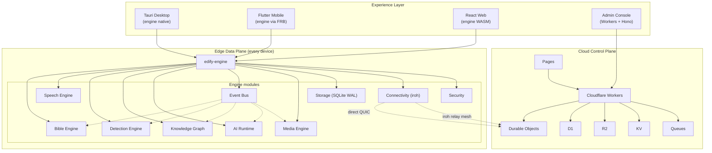
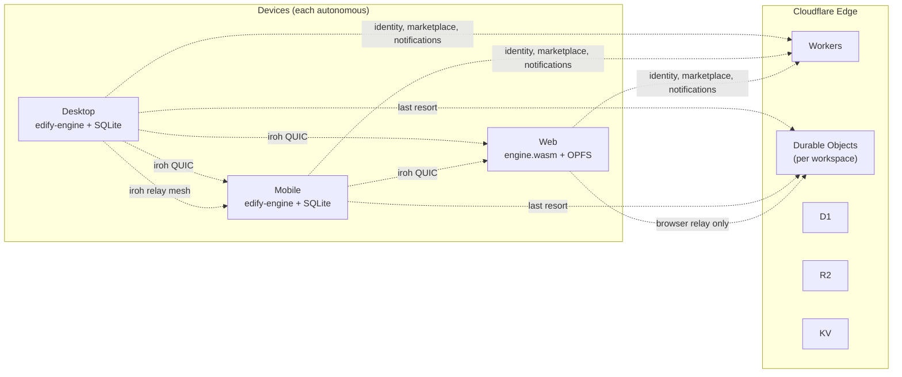
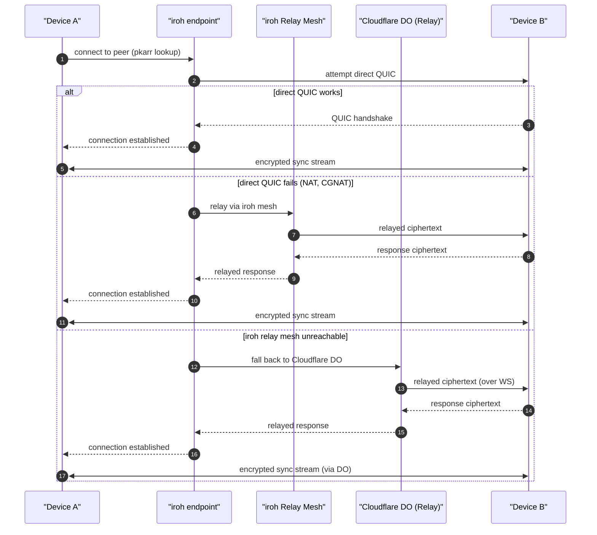
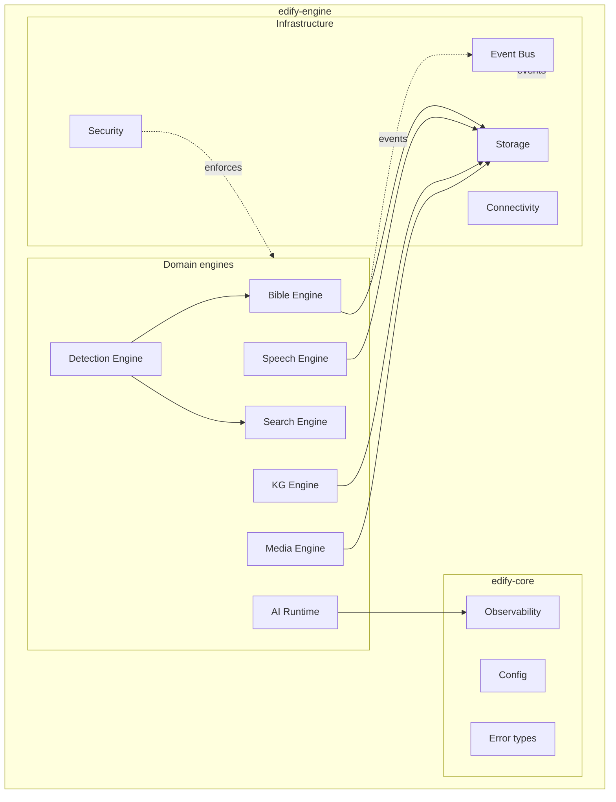
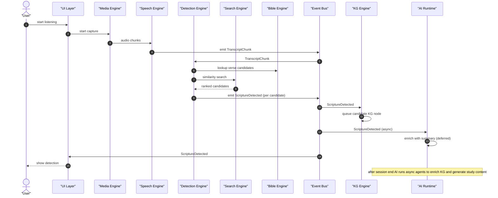

# Architecture diagrams

> System-level Mermaid diagrams for the Edify platform. These diagrams are referenced from `architecture/overview.md` and the various architecture specs.

---

# Three-layer architecture

The Experience Layer embeds the Data Plane (engine). The Data Plane talks to the Control Plane only for coordination (identity, sync relay, marketplace, notifications).

---

# Deployment topology

Each device is an autonomous execution node. Devices sync directly via iroh QUIC when possible; relay through iroh's mesh when NAT prevents direct connection; fall back to a Cloudflare Durable Object only when both fail. The Control Plane handles identity, marketplace, and notifications.

---

# Sync topology

All three paths carry only encrypted ciphertext. The cloud relay sees opaque data. Direct QUIC is preferred; iroh mesh is the standard fallback; Cloudflare DO is the last resort.

---

# Edge module map

Domain engines depend on infrastructure ports. Infrastructure is event-driven. Security enforces capability boundaries across the engine.

---

# Event flow: detection pipeline

The critical path is deterministic: Audio → Speech → Detection → UI. AI enrichment is async and deferred.

---

# References

- `docs/architecture/overview.md` — three-layer architecture overview
- `docs/architecture/platform.md` — platform composition
- `docs/architecture/data-plane.md` — local execution layer
- `docs/architecture/control-plane.md` — cloud coordination layer
- `docs/architecture/runtime.md` — engine module structure
- `docs/architecture/synchronization.md` — sync protocol (referenced by sync topology)
- ADR-0001 (local-first)
- ADR-0003 (P2P-first)
- ADR-0006 (event-driven)
- ADR-0009 (cloudflare control plane)
- ADR-0012 (iroh sync)
