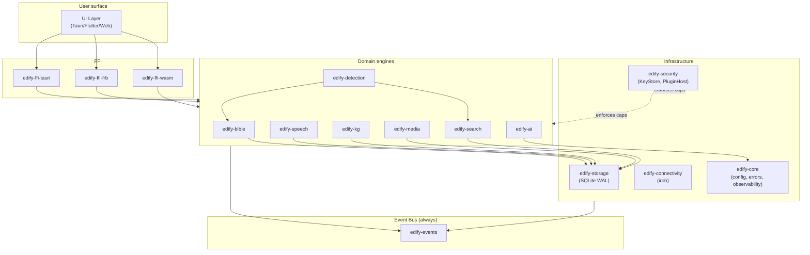
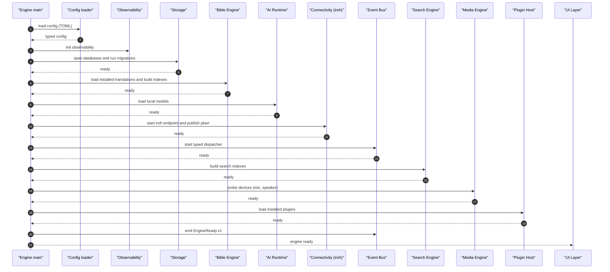
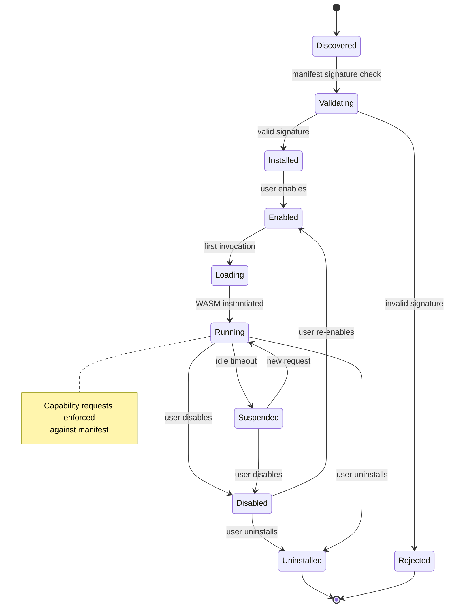
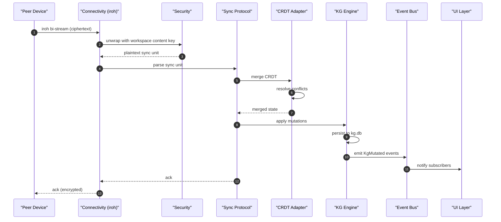
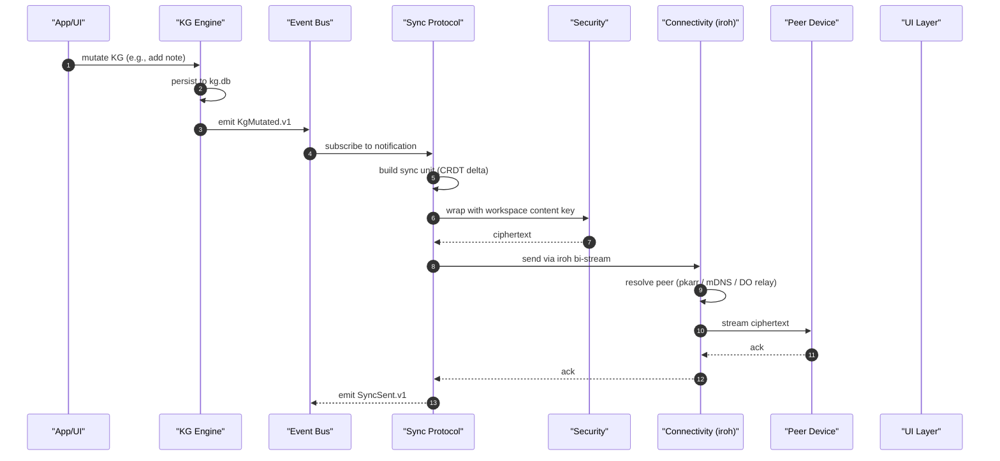
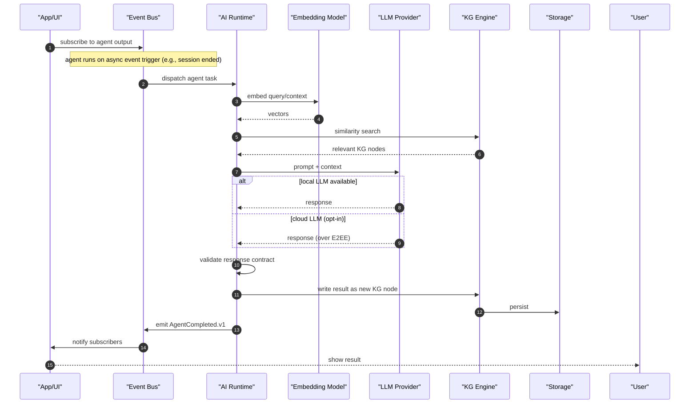
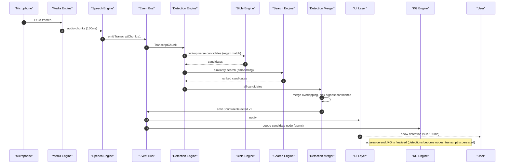

# Runtime diagrams

> Mermaid diagrams for the internal architecture of `edify-engine`: module graph, event flow, plugin lifecycle, sync sequence, AI agent execution.

---

# Module dependency graph

---

# Engine initialization sequence

Initialization is sequential and ordered; failures halt startup with a clear error. The engine never starts partially initialized.

---

# Plugin lifecycle

The plugin host enforces capability manifests throughout the lifecycle. Plugins in `Suspended` state hold resources but are not executing.

---

# Sync sequence: receive

---

# Sync sequence: send

---

# AI agent execution

AI agents run asynchronously off the critical path. They never block user interactions. Latency budgets are defined per agent.

---

# Detection pipeline

The critical path (MIC → UI) is fully deterministic. KG writes are async. UI shows the detection before the KG is updated.

---

# References

- `docs/architecture/overview.md` — three-layer architecture overview
- `docs/architecture/runtime.md` — engine module structure (canonical reference)
- `docs/architecture/data-plane.md` — local execution layer
- `docs/architecture/control-plane.md` — cloud coordination layer
- `docs/architecture/plugin-sdk.md` — plugin SDK (referenced by plugin lifecycle)
- `docs/architecture/synchronization.md` — sync protocol details
- ADR-0004 (deterministic before generative) — critical path is deterministic
- ADR-0006 (event-driven) — event flow patterns
- ADR-0007 (rust runtime) — module structure
- ADR-0011 (plugin WASM sandbox) — plugin lifecycle
- ADR-0012 (iroh sync) — sync sequences
