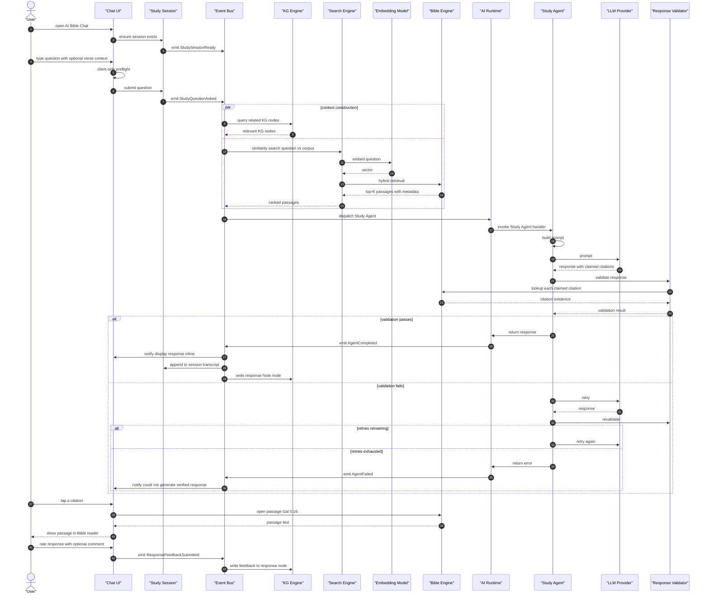
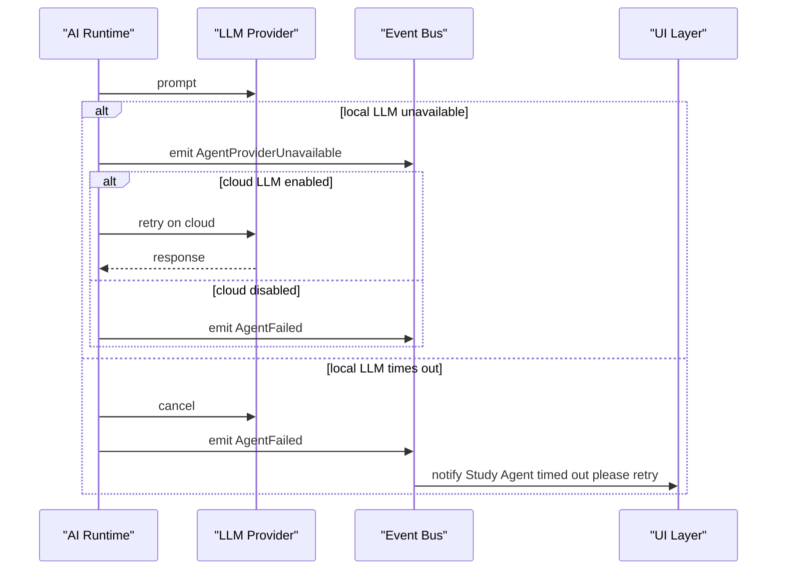

# Ask a Bible question (AI Bible Chat view)

> Engine behavior trace for the AI Bible Chat capability receiving and responding to a user question. Pure Mermaid sequence diagram with annotations.

This flow is the AI Bible Chat view of "ask a Bible question." Personal Bible Study (`docs/features/intelligence/personal-bible-study/flow.md`) owns its view of the same flow with different framing (focused on Bible reading context); this view focuses on the conversational chat surface and the Study Agent.

---

---

# Annotations

- **client-side preflight (length check, profanity filter)**: defensive; not a substitute for server-side validation but reduces wasted LLM calls
- **hybrid retrieval (vector + verse index)**: combines semantic search (vector) with deterministic verse lookup (regex + Bible Engine index) for the best of both
- **citation requirement**: the system prompt explicitly requires at least one citation to an installed passage; the validator enforces this
- **forbidden content**: doctrinal assertions presented as Scripture facts; the validator checks against the theological neutrality guardrails
- **retries remaining (max 2)**: bounded retries; the agent does not loop indefinitely
- **append to session transcript**: the question and response are part of the StudySession for later review
- **write feedback to response node**: feedback is persisted for future model improvement and per-user personalization

---

# Failure branches

---

# Latency budgets

| Step | Budget |
|------|--------|
| Context construction | under 500ms |
| Embedding generation | under 100ms |
| Hybrid retrieval | under 200ms |
| LLM response (local) | 5-15s p95 |
| LLM response (cloud) | 2-10s p95 |
| Citation validation | under 100ms |
| End-to-end | 30s |

---

# References

- Capability spec: `README.md`
- Persona narrative: `journey.md`
- Related flow (Personal Bible Study view): `docs/features/intelligence/personal-bible-study/flow.md`
- AI runtime: `docs/architecture/ai-runtime.md`
- Knowledge graph: `docs/architecture/knowledge-graph.md`
- Event model: `docs/architecture/event-model.md`
- Bible Engine: `docs/architecture/runtime.md`
- StudySession lifecycle: `docs/features/intelligence/live-sermon-engine/lifecycle.md`
