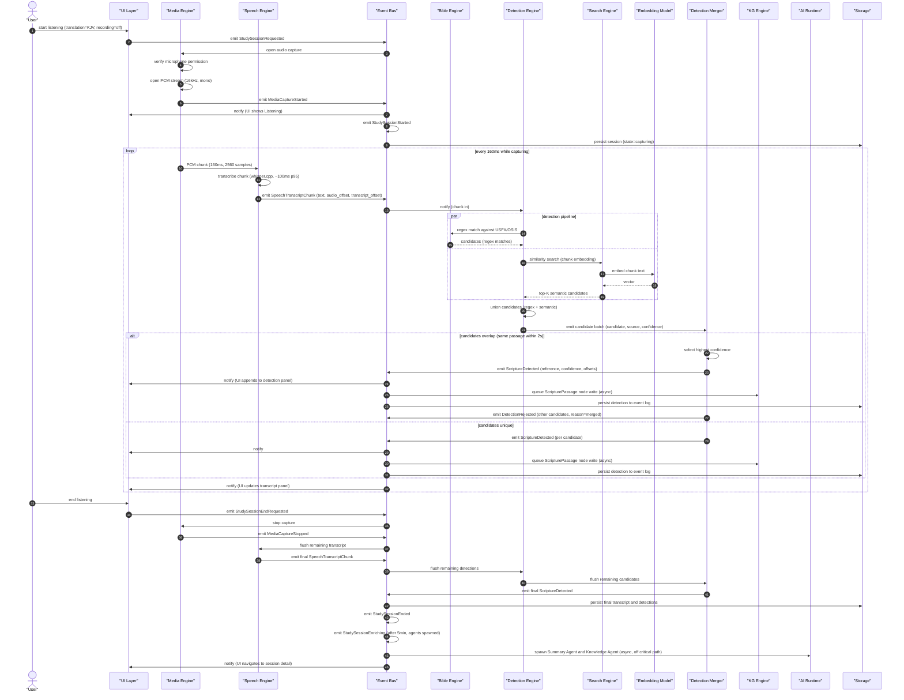
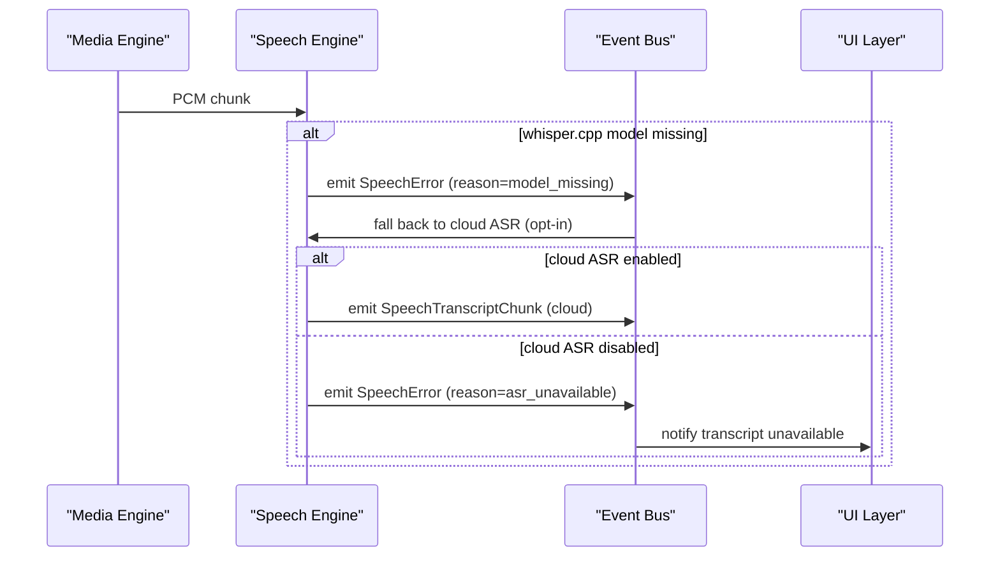

# Detection pipeline flow

> Engine behavior trace for one detection cycle in the Live Sermon Engine. Pure Mermaid sequence diagram with annotations on the arrows.

This flow is the canonical engine behavior for one cycle of the detection pipeline: audio chunk in, detection events out. The pipeline shape (`Audio → Speech → Detection → Merger → KG Events → UI`) is the same regardless of session type.

---

---

# Annotations

- **PCM chunk (160ms)**: standard window for whisper.cpp streaming inference; balances latency vs. accuracy
- **transcribe chunk (whisper.cpp, ~100ms p95)**: local inference latency; budget per ADR-0010
- **regex match against USFX/OSIS**: deterministic; fast; catches explicit references like "John 3:16"
- **similarity search (chunk embedding)**: catches paraphrased references and concepts; slower than regex
- **union candidates (regex + semantic)**: both sources may fire on the same passage; deduplication happens in the merger
- **top-K semantic candidates**: K=10 by default; configurable
- **select highest confidence**: when multiple sources fire on the same passage, the one with the highest confidence wins; lower-confidence duplicates are rejected
- **queue ScripturePassage node write (async)**: KG writes are off the critical path; the detection is emitted to the UI before the KG is updated
- **persist detection to event log**: durable; supports replay and audit
- **flush remaining transcript**: when the session ends, the Speech Engine flushes any pending audio
- **spawn Summary Agent and Knowledge Agent (async, off critical path)**: AI enrichment happens after the session ends; the user can navigate away while agents run

---

# Failure branches

Note over SE: chunk not lost; error surfaced; engine continues

---

# Latency budgets

| Step | Budget | Type |
|------|--------|------|
| Audio chunk capture | 160ms wall time | hard (PCM stream rate) |
| Speech recognition | under 100ms p95, under 300ms p99 | hard |
| Regex detection | under 5ms per chunk | hard |
| Embedding generation | under 50ms per chunk | hard |
| Similarity search | under 50ms per chunk | hard |
| Detection merge | under 5ms per batch | hard |
| End-to-end (chunk to UI) | under 500ms p95 | soft (user perceives) |

The end-to-end budget is the user-perceived budget. The downstream UI update is synchronous; the KG write is async.

---

# References

- Capability spec: `README.md`
- Lifecycle: `lifecycle.md`
- Workflow: `workflow.md`
- Persona narrative: `journey.md`
- Event model: `docs/architecture/event-model.md`
- Knowledge graph: `docs/architecture/knowledge-graph.md`
- AI runtime: `docs/architecture/ai-runtime.md`
- Runtime (engine module structure): `docs/architecture/runtime.md`
- Reference app (validates this shape): `docs/reference-apps/rhema.md`
