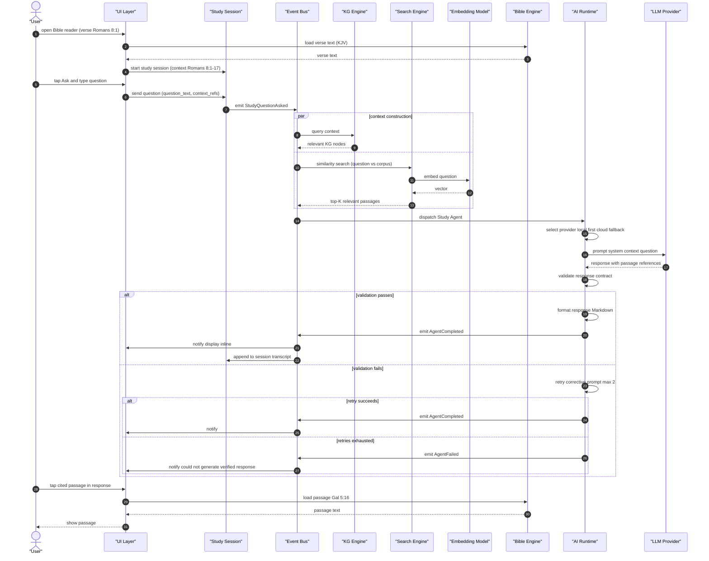
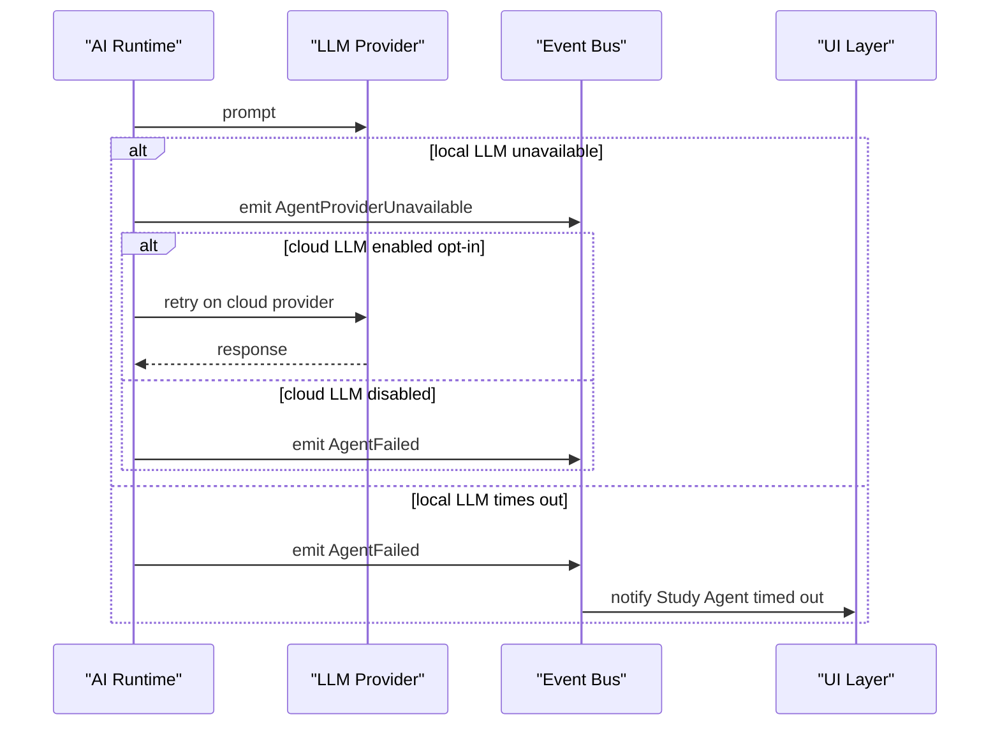

# Ask a Bible question (Personal Bible Study view)

> Engine behavior trace for the user asking a Bible question during a Personal Bible Study session. Pure Mermaid sequence diagram with annotations on the arrows.

This flow is the Personal Bible Study view of "ask a Bible question." The AI Bible Chat cluster (`docs/features/intelligence/ai-bible-chat/`) owns its view of the same flow with different framing.

---

---

# Annotations

- **dispatch Study Agent**: the agent is registered with the AI Runtime; it picks up the event and runs async (but the user perceives it as inline because the latency budget is short)
- **select provider (local llama.cpp first, cloud fallback)**: per ADR-0010; local is preferred for privacy and latency
- **validate response (output contract; verify passage refs exist in corpus)**: the agent's response must reference actual installed passages; fabricated references are rejected
- **retry with corrective prompt**: the agent retries with a prompt that emphasizes the constraint; max 2 retries
- **append response to session transcript**: the response is part of the study session; the user can review it later

---

# Failure branches

---

# Latency budgets

| Step | Budget |
|------|--------|
| Context construction (KG query + search) | under 500ms |
| Embedding generation | under 100ms |
| LLM response (local) | 5-15s p95 |
| LLM response (cloud) | 2-10s p95 |
| Response validation | under 100ms |
| End-to-end | 30s |

The end-to-end budget is the latency budget the user perceives. The UI shows a Thinking... indicator during the response.

---

# References

- Capability spec: `README.md`
- Lifecycle: `docs/features/intelligence/live-sermon-engine/lifecycle.md` (StudySession aggregate)
- Workflow: `workflow.md`
- Persona narrative: `journey.md`
- Related cluster: `docs/features/intelligence/ai-bible-chat/`
- AI runtime: `docs/architecture/ai-runtime.md`
- Knowledge graph: `docs/architecture/knowledge-graph.md`
- Event model: `docs/architecture/event-model.md`
