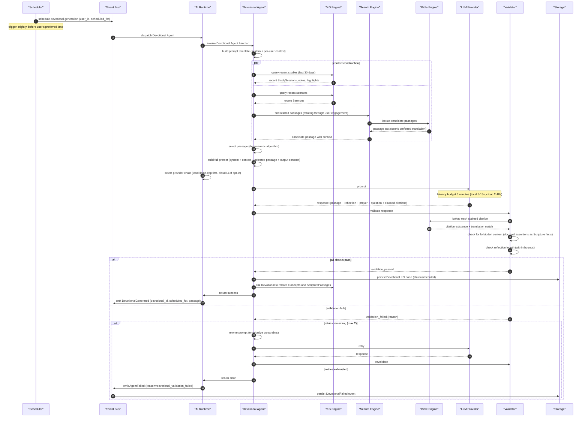
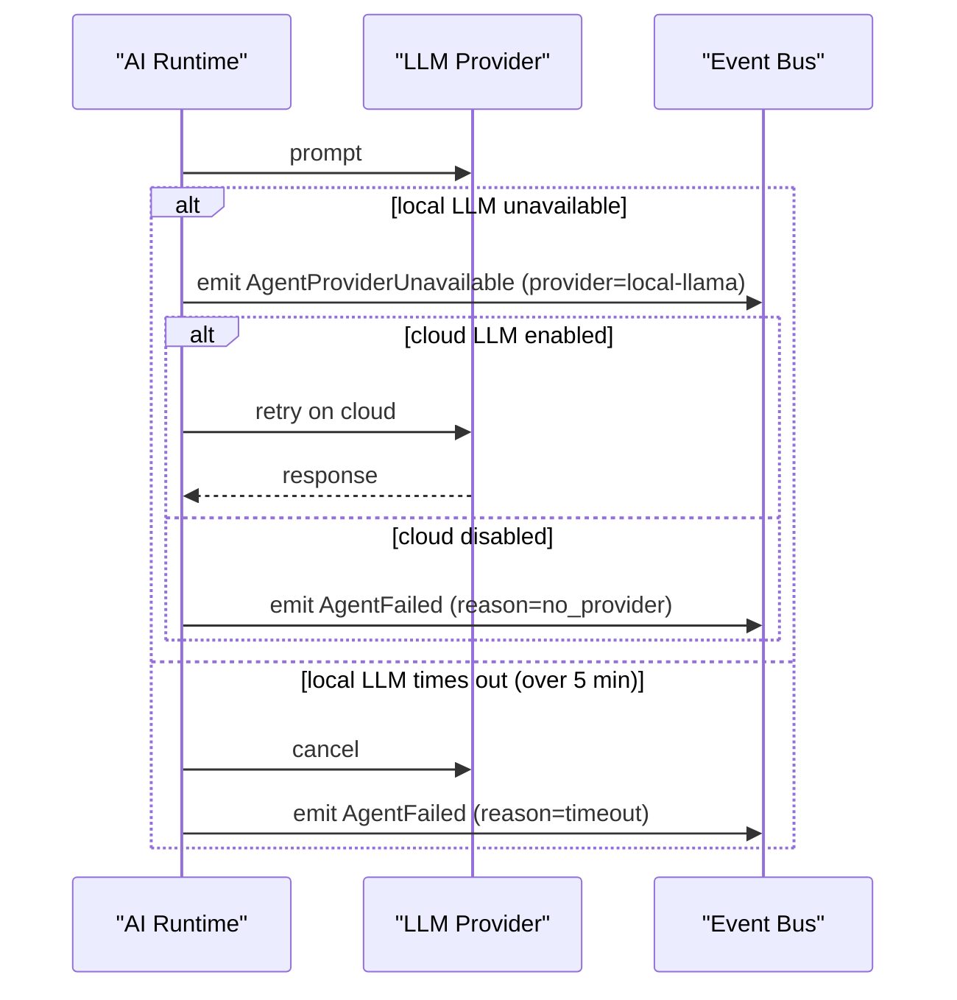

# Generate devotional flow

> Engine behavior trace for the Devotional Agent generating a devotional. Pure Mermaid sequence diagram with annotations.

This flow covers one cycle of devotional generation: from agent dispatch through context construction, LLM call, validation, and persistence.

---

Note over EB: user is notified; no devotional that day

---

# Annotations

- **schedule devotional generation**: the scheduler fires before the user's preferred devotional time; the exact time is per-user
- **build prompt template (system + per-user context)**: the system prompt enforces citation + neutrality + length; the per-user context is the KG
- **rotating through user engagement**: deterministic passage selection that rotates through what the user has been studying; avoids repeating the same passage too often
- **select passage (deterministic algorithm)**: this is NOT a probabilistic selection; the algorithm is deterministic given the user's KG
- **select provider chain (local llama.cpp first, cloud LLM opt-in)**: per ADR-0010; local preferred for privacy
- **link Devotional to related Concepts and ScripturePassages**: the Knowledge Graph is enriched with the new devotional

---

# Failure branches

Note over AI: devotional is missing that day; next day's generation proceeds normally

---

# Latency budgets

| Step | Budget |
|------|--------|
| Context construction | under 1s |
| Passage selection (deterministic) | under 100ms |
| LLM response (local) | 5-15s p95 |
| LLM response (cloud) | 2-10s p95 |
| Validation | under 500ms |
| Persistence | under 100ms |
| End-to-end | 5 minutes |

The end-to-end budget is generous because the devotional is pre-generated; the user does not wait.

---

# References

- Capability spec: `README.md`
- Lifecycle: `lifecycle.md`
- Workflow: `workflow.md`
- Persona narrative: `journey.md`
- AI runtime: `docs/architecture/ai-runtime.md`
- Knowledge graph: `docs/architecture/knowledge-graph.md`
- Event model: `docs/architecture/event-model.md`
- Bible Engine: `docs/architecture/runtime.md`
- Related cluster: `docs/features/intelligence/personal-bible-study/`
