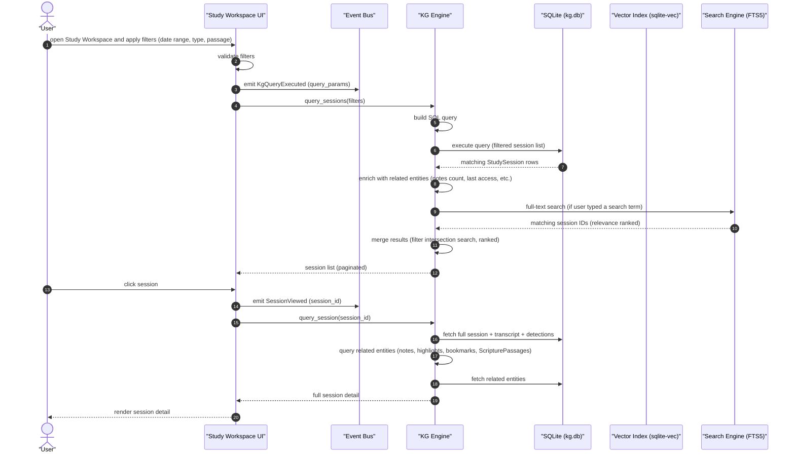
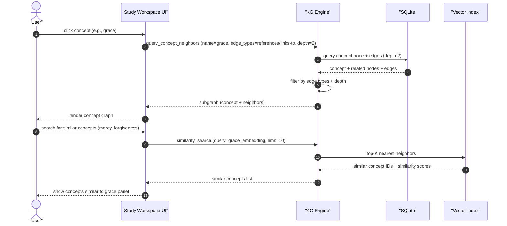
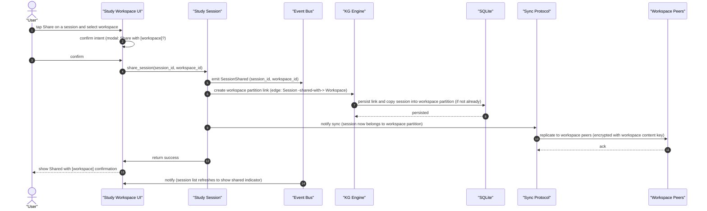
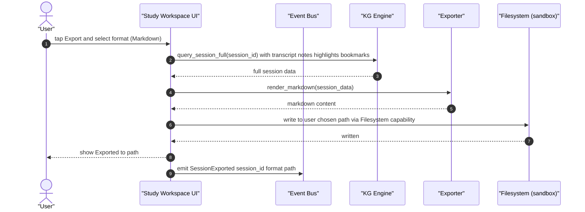
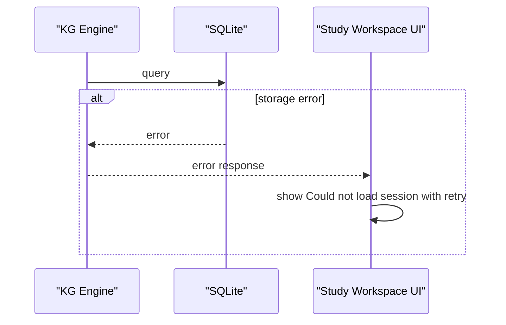
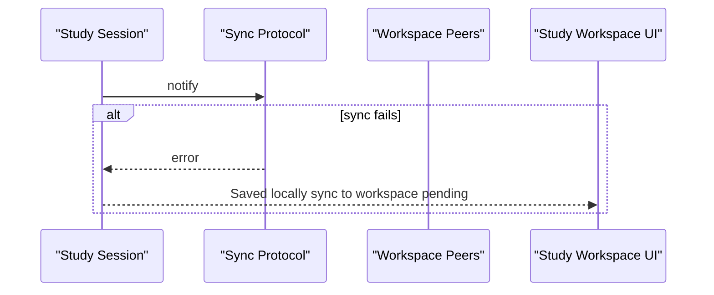

# Study Workspace flows (KG query and KG write)

> Engine behavior traces for the Study Workspace's primary operations: querying the Knowledge Graph and writing to it. Pure Mermaid sequence diagrams.

The Study Workspace is primarily a read surface over the KG. This file documents the two main flows: KG query (read) and KG write (when the user shares or exports).

---

# Flow 1: KG query (session list with filters)

---

# Flow 2: KG query (concept graph traversal)

---

# Flow 3: KG write (session share with workspace)

---

# Flow 4: Session export (Markdown)

---

# Annotations

- **build SQL query**: filters are translated to a parameterized SQL query; no string interpolation
- **enrich with related entities**: notes count, last access time, related sessions; pre-computed or cached
- **merge results (filter intersection search, ranked)**: when both filters and search are applied, results are the intersection ranked by relevance
- **copy session into workspace partition (if not already)**: the session may be in personal partition; sharing moves it to workspace partition (the user may also be a member of both)
- **encrypted with workspace content key**: E2EE per ADR-0012
- **render_markdown**: deterministic; no AI involvement for export; the user gets exactly what they captured

---

# Failure branches

For share flow:

Note over SS: session is shared locally; sync retries on next opportunity

---

# Latency budgets

| Operation | Budget |
|-----------|--------|
| Session list (with filters) | under 200ms p95 |
| Session detail | under 300ms p95 |
| Search (full-text) | under 200ms p95 |
| Search (semantic) | under 500ms p95 |
| Concept graph (depth 2) | under 500ms p95 |
| Concept similarity (top-10) | under 300ms p95 |
| Share (local) | under 100ms p95 |
| Share (sync) | under 2s p95 |
| Export (Markdown) | under 500ms p95 |

---

# References

- Capability spec: `README.md`
- Persona narrative: `journey.md`
- Knowledge graph: `docs/architecture/knowledge-graph.md`
- Event model: `docs/architecture/event-model.md`
- Search engine (FTS5 + sqlite-vec): `docs/architecture/runtime.md`
- Synchronization: `docs/architecture/synchronization.md`
- Related clusters: `personal-bible-study`, `devotionals`, `live-sermon-engine`, `ai-bible-chat`, `peer-sync`
