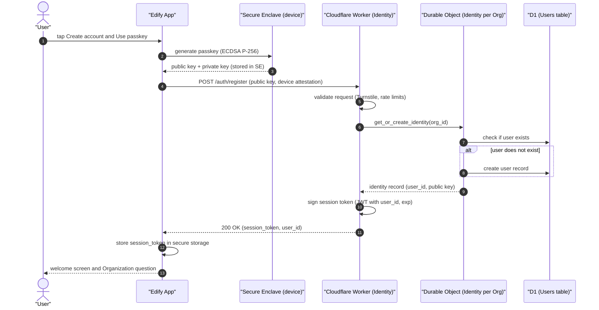
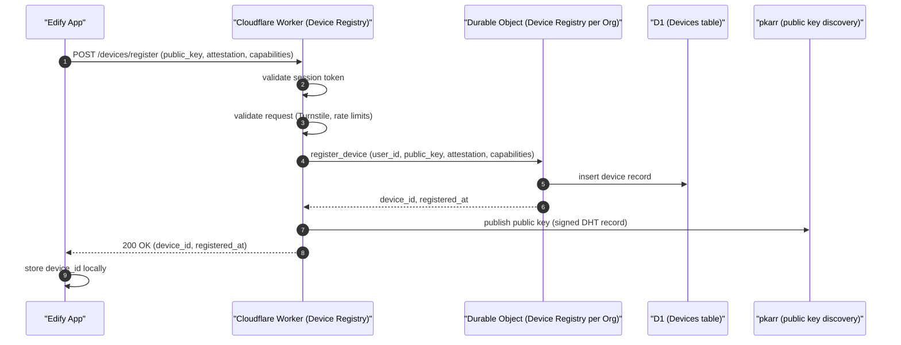
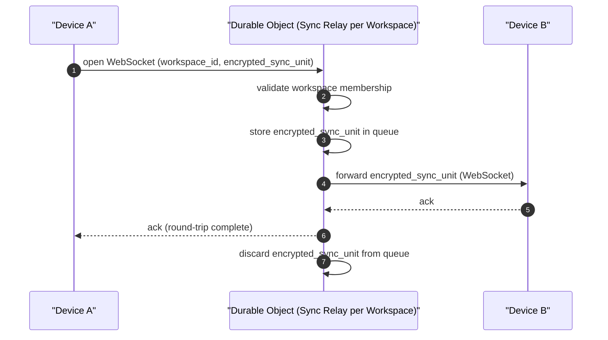
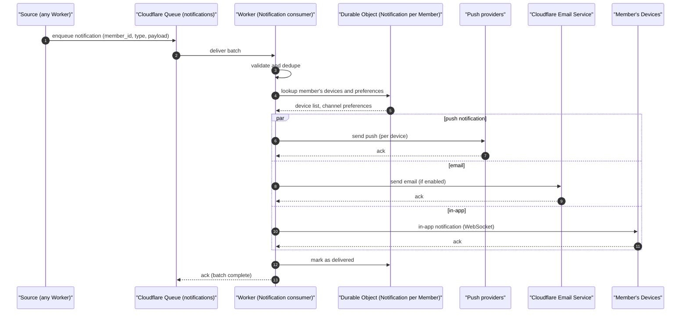
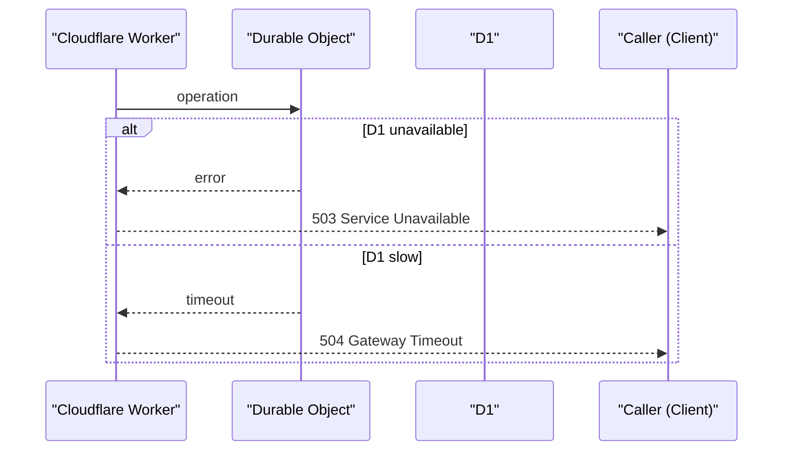
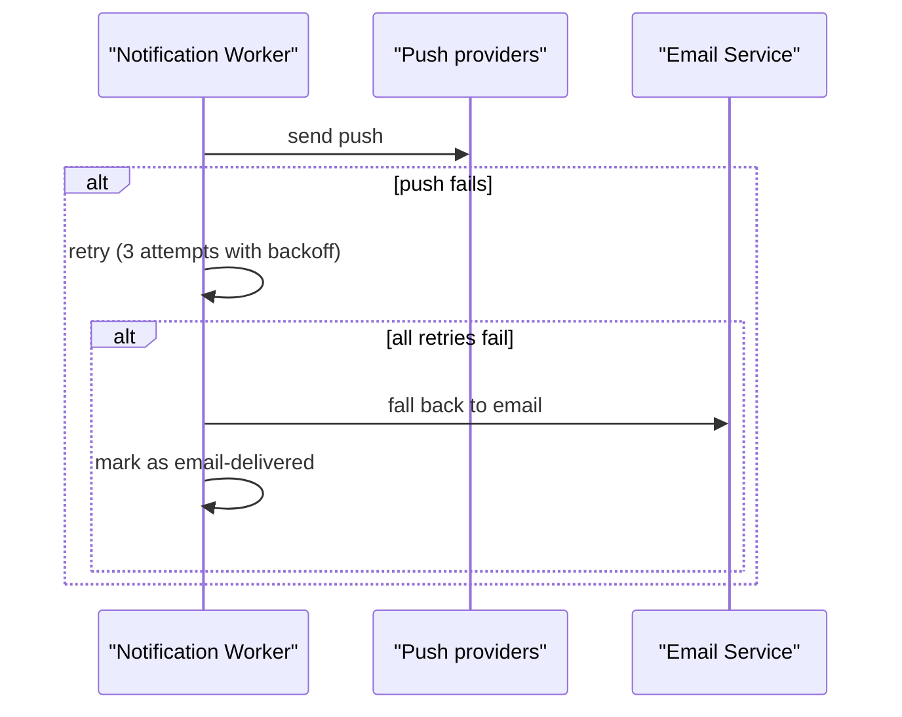

# Control Plane flows (identity, device registration, sync relay, notifications)

> Engine behavior traces for the Control Plane's primary operations: identity, device registration, sync relay, and notification fan-out. Pure Mermaid sequence diagrams.

The Control Plane flows implement the serverless coordination described in `docs/architecture/control-plane.md` and `docs/decisions/ADR-0002-serverless.md` and `docs/decisions/ADR-0009-cloudflare-control-plane.md`. This file documents the four most important flows.

---

# Flow 1: Identity (passkey-based authentication)

---

# Flow 2: Device registration

---

# Flow 3: Sync relay (Cloudflare DO as last-resort relay)

Note over DO: relay is dumb pipe; never decrypts; never persists plaintext

---

# Flow 4: Notification fan-out

---

# Annotations

- **validate request (Turnstile, rate limits)**: bot protection and rate limiting on all public APIs
- **sign session token (JWT with user_id, exp)**: short-lived session token (1 hour by default)
- **validate workspace membership**: the DO checks that the user is a Member of the workspace
- **store encrypted_sync_unit in queue**: brief queueing for efficiency; units are discarded after delivery
- **dumb pipe**: the relay has no ability to decrypt; it only routes ciphertext
- **dedupe**: notifications may be sent multiple times (e.g., on retry); the consumer dedupes
- **par push / email / in-app**: notifications fan out in parallel per the member's channel preferences

---

# Failure branches

Note over W: caller retries with backoff

For notification delivery:

---

# Latency budgets

| Operation | Budget |
|-----------|--------|
| Identity (passkey auth) | under 300ms p95 |
| Device registration | under 200ms p95 |
| Sync relay (per unit) | under 100ms p95 |
| Notification fan-out | under 5s p95 (push) or under 30s (email) |
| Public API read | under 200ms p95 |
| Public API write | under 500ms p95 |

---

# References

- Capability spec: `README.md`
- Lifecycle: `lifecycle.md`
- Workflow: `workflow.md`
- Persona narrative: `journey.md`
- Control plane architecture: `docs/architecture/control-plane.md` (canonical reference)
- Security: `docs/architecture/security.md`
- Synchronization: `docs/architecture/synchronization.md`
- Event model: `docs/architecture/event-model.md`
- ADR-0002 (serverless control plane)
- ADR-0009 (Cloudflare control plane stack)
- ADR-0012 (iroh sync) — DO relay as last-resort
- Peer Sync: `docs/features/platform-services/peer-sync/`
