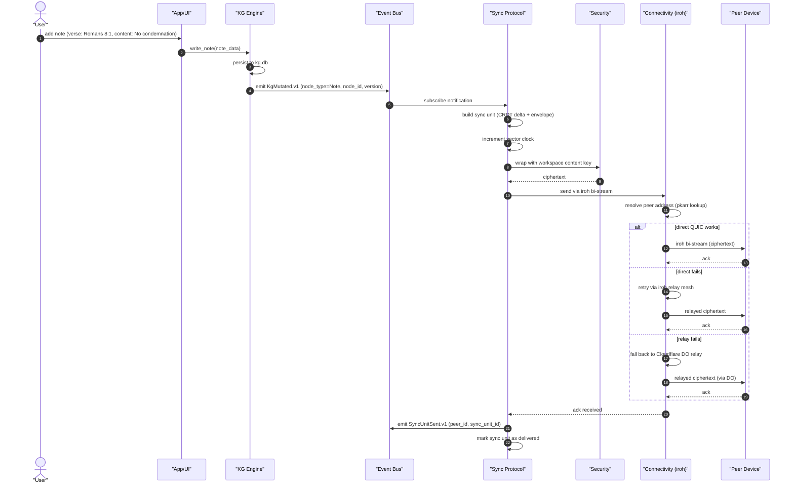
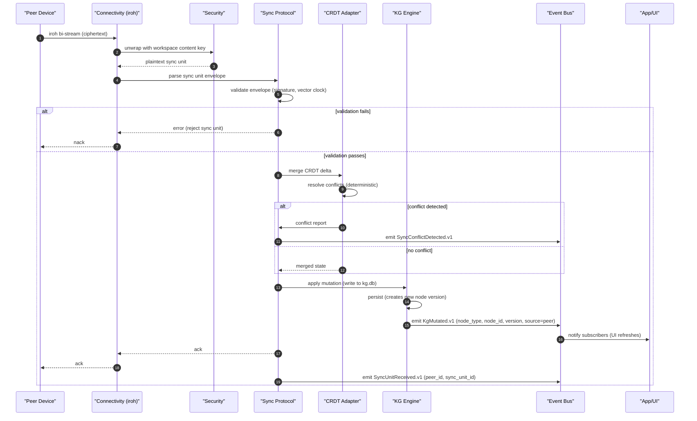
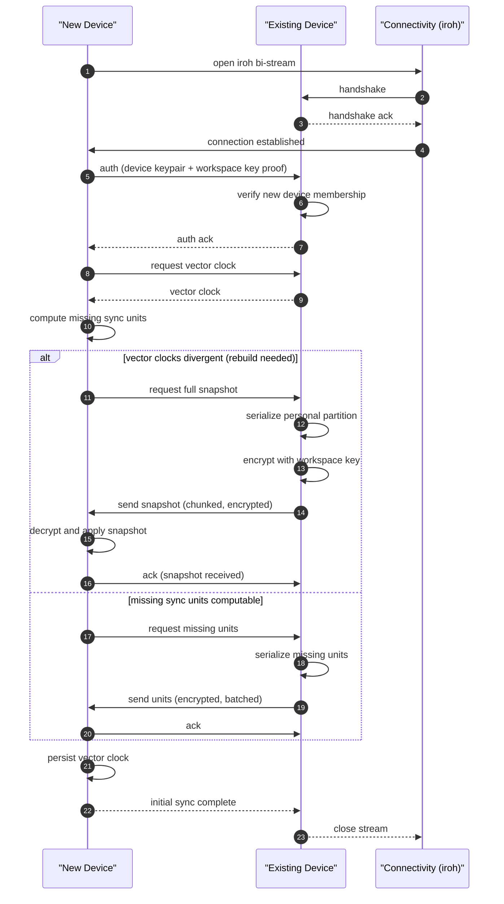
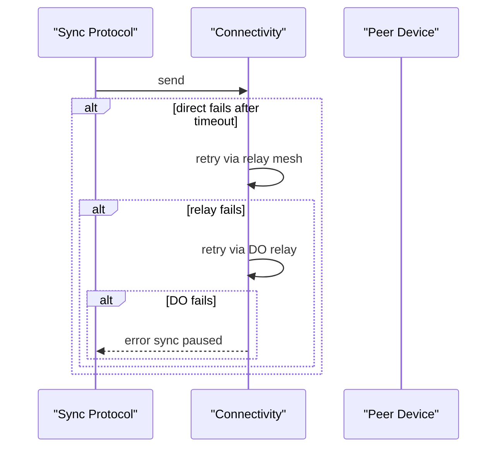
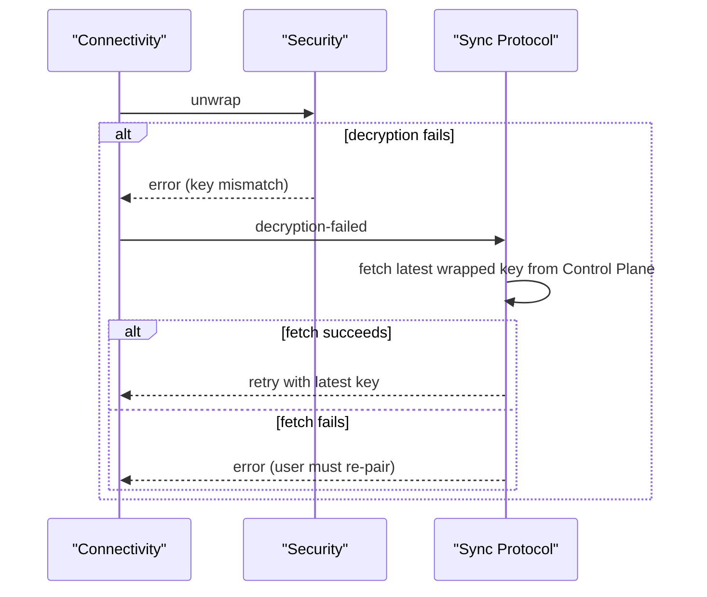

# Peer Sync flows (sync send and sync receive)

> Engine behavior traces for the two primary sync operations: sending sync units to a peer and receiving sync units from a peer. Pure Mermaid sequence diagrams.

The Peer Sync flows implement the sync protocol defined in `docs/architecture/synchronization.md` and the iroh transport from `docs/decisions/ADR-0012-iroh-sync.md`. Two flows are documented: sync send (when a local mutation propagates to peers) and sync receive (when a peer's mutation arrives).

---

# Flow 1: Sync send (local mutation propagates to peer)

---

# Flow 2: Sync receive (peer mutation arrives)

---

# Annotations

- **build sync unit (CRDT delta + envelope)**: the sync protocol serializes the CRDT delta with metadata (vector clock, signature, timestamp)
- **wrap with workspace content key**: E2EE per ADR-0012
- **resolve peer address (pkarr lookup)**: per ADR-0012, peers are addressed by their public key on pkarr; mDNS for LAN
- **direct QUIC works, then relay mesh, then DO relay**: three-tier fallback per ADR-0012
- **merge CRDT delta (deterministic)**: concurrent edits are merged deterministically per the CRDT model
- **source=peer**: the emitted event distinguishes peer mutations from local mutations (useful for UI feedback like synced from your phone)
- **notify subscribers (UI refreshes)**: the UI updates without the user taking action; sync is invisible

---

# Flow 3: Initial sync (new device)

---

# Failure branches

Note over SS: sync unit marked as pending; retry on next sync trigger

For receive flow with decryption failure:

---

# Latency budgets

| Operation | Budget |
|-----------|--------|
| Send: encrypt + envelope | under 50ms |
| Send: iroh bi-stream (direct) | under 200ms p95 |
| Send: iroh bi-stream (relay) | under 1s p95 |
| Send: DO relay | under 2s p95 |
| Receive: unwrap + parse | under 100ms |
| Receive: CRDT merge | under 50ms |
| Receive: KG write | under 50ms |
| End-to-end (direct) | under 500ms p95 |
| End-to-end (relay) | under 2s p95 |
| End-to-end (DO) | under 3s p95 |
| Initial sync (1 GB) | under 5 min p95 |

---

# References

- Capability spec: `README.md`
- Lifecycle: `lifecycle.md`
- Workflow: `workflow.md`
- Persona narrative: `journey.md`
- Sync protocol: `docs/architecture/synchronization.md`
- Security: `docs/architecture/security.md`
- ADR-0012 (iroh sync) — transport choice
- ADR-0003 (P2P-first) — direct before relay before cloud
- ADR-0001 (local-first) — sync enhances collaboration
- Control plane: `docs/features/platform-services/control-plane/`
- Event model: `docs/architecture/event-model.md`
- Knowledge graph: `docs/architecture/knowledge-graph.md`
